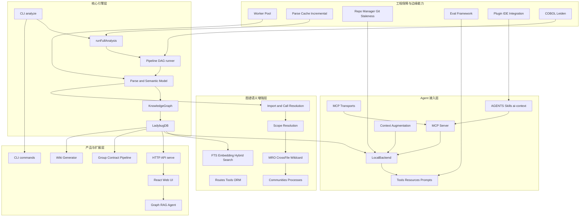

# GitNexus 五层源码架构地图

这份知识库按照五层来理解 GitNexus：核心引擎层、图谱语义增强层、Agent 接入层、产品与扩展层、工程保障与边缘能力。现场分享时可以人工挑选重点，但知识库本身要能完整回答“源码如何流动、图谱如何形成、Agent 如何被约束、Web/Group 如何扩展、工程上如何保证稳定”。

## 五层总图

## 第一层：核心引擎层

这一层回答“源码如何变成可查询图谱”。

| 模块 | 源码入口 | 讲解重点 | 文档 |
|---|---|---|---|
| CLI analyze | `gitnexus/src/cli/analyze.ts` | 堆管理、命令参数、错误分类 | [[analyze.ts 源码导读]] |
| runFullAnalysis | `gitnexus/src/core/run-analyze.ts` | 10 步总编排、早退、缓存、入库、AI 上下文 | [[runFullAnalysis 编排流程]] |
| Pipeline DAG runner | `gitnexus/src/core/ingestion/pipeline-runner/runner.ts` | Kahn 拓扑排序、依赖显式化、阶段隔离 | [[Pipeline DAG 实现]] |
| Parse 阶段 | `pipeline-phases/parse.ts`、`parse-impl.ts` | worker 池、chunk、AST、符号和边 | [[Tree-sitter 解析层]] |
| Semantic Model | `core/ingestion/model/` | SymbolTable + Type/Method/Field Registry | [[Semantic Model 与 Registry 解析模型]] |
| KnowledgeGraph | `core/graph/graph.ts` | 内存单图累加器、O(1) 节点边索引 | [[KnowledgeGraph 内存图模型实现]] |
| LadybugDB | `core/lbug/` | CSV 流式写入、COPY、WAL、连接池 | [[LadybugDB 图存储]]、[[LadybugDB 写入连接池与恢复机制]] |

## 第二层：图谱语义增强层

这一层回答“为什么图谱不只是 AST 节点列表”。

| 模块 | 源码入口 | 作用 |
|---|---|---|
| Import 解析 | `import-processor.ts`、`import-resolvers/` | 把 import/include/use 解析成 File -> File 和 named binding |
| Call Resolution | `call-processor.ts`、`call-types.ts` | 把调用点解析到目标函数、方法、构造器 |
| Scope Resolution | `scope-resolution/`、`gitnexus-shared/src/scope-resolution/` | 新一代全局作用域索引，registry-primary 语言使用 |
| MRO | `mro-processor.ts` | 按语言继承策略生成 METHOD_OVERRIDES / METHOD_IMPLEMENTS |
| crossFile | `pipeline-phases/cross-file-impl.ts` | 通过 import 拓扑传播跨文件类型绑定 |
| wildcard synthesis | `pipeline-phases/wildcard-synthesis.ts` | C/C++、Go、Ruby 等 whole-module import 的合成绑定 |
| Routes / Tools / ORM | `pipeline-phases/routes.ts`、`tools.ts`、`orm.ts` | 从框架语义里抽取 Route、Tool、QUERIES |
| Communities / Processes | `pipeline-phases/communities.ts`、`processes.ts` | 功能聚类和执行流 |
| Search | `core/search/`、`core/embeddings/` | BM25 + vector + RRF |

## 第三层：Agent 接入层

这一层回答“图谱如何进入 Agent 工作流”。MCP 提供工具协议，LocalBackend 执行工具逻辑，AGENTS.md/Skill/Prompt 约束 Agent 先探索、再分析影响、最后修改。

| 模块 | 源码入口 | 作用 |
|---|---|---|
| MCP transport | `mcp/compatible-stdio-transport.ts`、`server/mcp-http.ts` | STDIO / Streamable HTTP |
| MCP server | `mcp/server.ts` | 注册 Tools、Resources、Prompts |
| LocalBackend | `mcp/local/local-backend.ts` | 工具真正执行处 |
| tool descriptions | `mcp/tools.ts` | WHEN TO USE / AFTER THIS 即工具级 prompt |
| Resources | `mcp/resources.ts` | repo context、clusters、processes、schema、group status |
| ai-context | `cli/ai-context.ts`、`cli/skill-gen.ts` | 生成 AGENTS.md、CLAUDE.md、skills |
| Context Augmentation | `core/augmentation/engine.ts` | hook 快速补上下文 |

## 第四层：产品与扩展层

| 模块 | 源码入口 | 作用 |
|---|---|---|
| HTTP API | `server/api.ts`、`cli/serve.ts` | Web UI、REST、SSE、MCP HTTP |
| Web UI | `gitnexus-web/src/` | React SPA、Sigma 图可视化、右侧代码面板、设置 |
| Graph RAG Agent | `gitnexus-web/src/core/llm/` | LangChain agent + graph tools |
| Group Contract Pipeline | `core/group/` | 多仓库契约抽取、匹配、bridge.lbug |
| Wiki Generator | `core/wiki/` | LLM 分组、模块页、overview、HTML viewer |
| CLI 命令全集 | `cli/index.ts` | analyze、serve、mcp、wiki、group、direct tools |

## 第五层：工程保障与边缘能力

| 模块 | 源码入口 | 作用 |
|---|---|---|
| Worker Pool | `core/ingestion/workers/worker-pool.ts` | 并行解析、超时重试、slot respawn、quarantine |
| Parse Cache | `storage/parse-cache.ts` | chunk 级内容寻址缓存 |
| Repo Manager | `storage/repo-manager.ts` | .gitnexus 存储、meta、全局 registry |
| Git Staleness | `core/git-staleness.ts` | index stale / sibling clone drift |
| Eval | `eval/` | 不同模式和模型的评测框架 |
| Plugin / IDE | `gitnexus-claude-plugin/`、`gitnexus-cursor-integration/` | skills、hooks、MCP 配置 |
| COBOL | `core/ingestion/cobol/` | 特殊语言独立处理 |
| Leiden | `gitnexus-web/src/vendor/leiden/` | 社区发现算法依赖 |

## 讲解建议

如果是 30 分钟分享，只讲五条主线：GitNexus 不是 RAG；analyze 通过 Pipeline DAG 构图；Semantic Model、Import、Call、Scope、MRO、crossFile 提升静态解析准确性；MCP + AGENTS.md + Skill 把图谱能力注入 Agent 行为；LadybugDB、worker、cache、staleness、group 让它能落地到真实工程。
