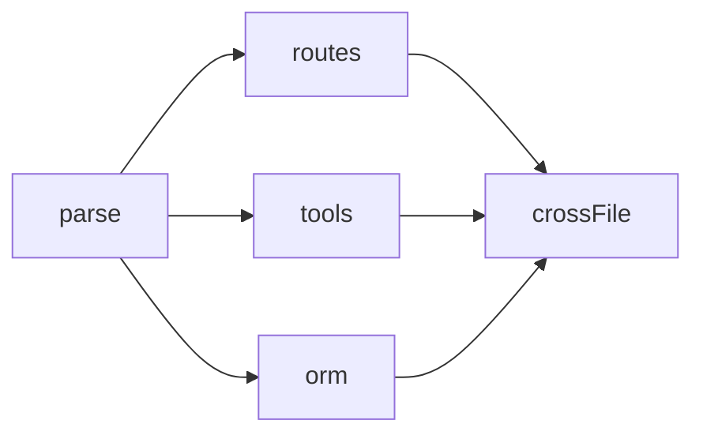

# API Route Tool ORM 提取实现

Routes、Tools、ORM 三个阶段说明 GitNexus 并不只解析语言语法，还会解析工程框架语义。它们把“一个函数”提升成“一个 API 路由处理器”“一个 MCP 工具处理器”“一次数据库查询关系”。

## 源码入口

| 阶段 | 文件 | 主要产出 |
|---|---|---|
| routes | `gitnexus/src/core/ingestion/pipeline-phases/routes.ts` | Route 节点、HANDLES_ROUTE 边、responseKeys、middleware |
| tools | `gitnexus/src/core/ingestion/pipeline-phases/tools.ts` | Tool 节点、HANDLES_TOOL 边 |
| orm | `gitnexus/src/core/ingestion/pipeline-phases/orm.ts` | CodeElement 节点、QUERIES 边 |

## 在 Pipeline 中的位置

这三个阶段都依赖 `parse`，并且在 `crossFile` 之前完成。它们读取 parse 阶段输出的结构化事实，再写入更高层语义节点和边。

## routes 阶段

`routes.ts` 识别 Next.js app/pages route、Express-style route、PHP/Laravel route、decorator route、Expo route、framework middleware、fetch consumer 和 route match。

| 图谱元素 | 含义 |
|---|---|
| `Route` node | HTTP path + method + framework |
| `HANDLES_ROUTE` edge | handler symbol 处理某个 route |
| `responseKeys` | handler JSON 返回顶层字段 |
| `errorKeys` | 错误返回字段 |
| `middleware` | route 被哪些 wrapper / middleware 保护 |

这就是 `api_impact` 和 `shape_check` 的基础：不是只知道“某函数被调用”，而是知道“某 API 被哪些前端消费者依赖、返回 shape 是什么”。

## tools 阶段

`tools.ts` 消费 parse 阶段收集的 `allToolDefs`，并对路径中带 `tool` 且包含 `inputSchema` 的 TS/JS 文件做补充扫描。输出 `Tool` 节点和 `HANDLES_TOOL` 边，让 GitNexus 能理解 MCP/RPC 工具本身，并暴露 `tool_map` 能力。

## orm 阶段

`orm.ts` 处理 parse 阶段收集的 `allORMQueries`。它会读取 query 的 model/table 名称；如果图中没有对应 Class / Interface / CodeElement，就创建一个 `CodeElement` 代表数据实体；然后从 File 指向该实体创建 `QUERIES` 边，并在 reason 中记录 Prisma / Supabase 等 ORM 和方法信息。

## 为什么这些是源码级知识库必须讲的

普通静态分析经常停在语言层：Function -> CALLS -> Method，Class -> EXTENDS -> BaseClass。GitNexus 会继续向工程语义扩展：Function -> HANDLES_ROUTE -> Route，Function -> HANDLES_TOOL -> Tool，File -> QUERIES -> DataModel，Component -> FETCHES -> Route。

这些边让 Agent 能回答更贴近开发的问题：改一个 API handler 会影响哪些页面？某 route 返回字段变了，消费者是否还访问旧字段？某 MCP tool 的 handler 在哪里？哪些文件会查某张表？

## 与 Agent 工具的对应关系

| 图谱语义 | 对应工具 |
|---|---|
| Route / HANDLES_ROUTE / FETCHES | `route_map`、`api_impact` |
| responseKeys / consumer accesses | `shape_check` |
| Tool / HANDLES_TOOL | `tool_map` |
| QUERIES | 可通过 `cypher` 或 context/impact 间接分析 |

## 讲解抓手

> Routes、Tools、ORM 阶段体现了 GitNexus 的工程视角：它不是只把代码解析成语言符号，而是把框架约定和运行入口也建模成图谱实体。
