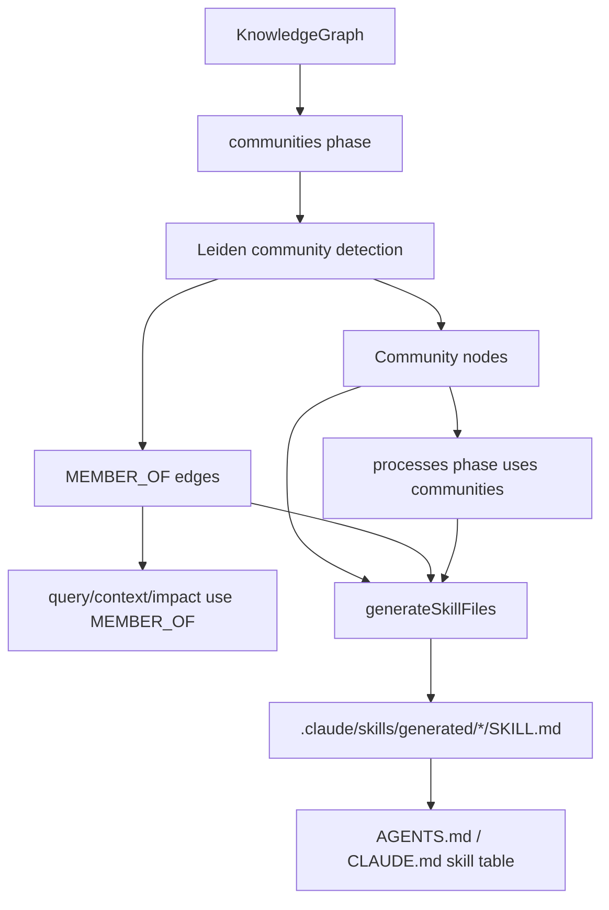
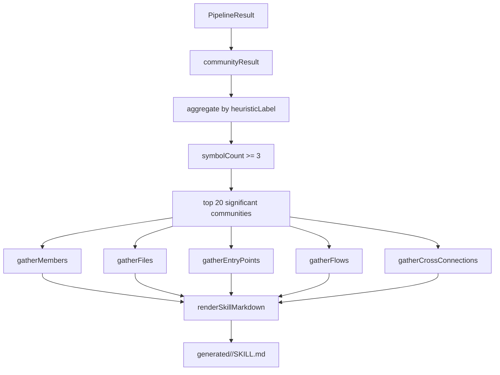

---
type: implementation-note
status: codex-generated
source:
  - gitnexus/src/core/ingestion/pipeline-phases/communities.ts
  - gitnexus/src/core/ingestion/community-processor.ts
  - gitnexus/src/cli/skill-gen.ts
  - gitnexus/src/cli/ai-context.ts
tags:
  - gitnexus
  - community
  - leiden
  - skill
  - prompt-engineering
---

# Community Detection 与 Skill 生成机制

> 关联：[[Process 执行流生成机制]]、[[Prompt Skill AGENTS 注入机制]]、[[工具层如何设计 Prompt]]、[[Pipeline DAG 实现]]

GitNexus 的 Skill 不是完全手写的。它先用 Leiden 算法从代码图中发现 Community，再把高价值 Community 转成 repo-specific `SKILL.md`。这条链路非常关键，因为它解释了 GitNexus 如何把“图谱结构”进一步变成“Agent 行为约束”。

## 一句话定义

Community Detection 是把调用、继承、实现关系聚成代码功能区；Skill Generation 是把这些功能区提炼成 Agent 可读的局部工作指南，包含关键文件、入口点、执行流和跨社区连接。

## 源码入口

Community：

```text
gitnexus/src/core/ingestion/pipeline-phases/communities.ts
gitnexus/src/core/ingestion/community-processor.ts
```

Skill：

```text
gitnexus/src/cli/skill-gen.ts
gitnexus/src/cli/ai-context.ts
```

## 整体链路



## communities phase 在 Pipeline 中的位置

`communities.ts`：

```text
name: communities
deps: mro, structure
```

它在 MRO 之后运行，因为需要完整的调用、继承、实现关系。

写入：

```text
Community nodes
MEMBER_OF edges
```

每个 membership：

```text
Symbol -[:MEMBER_OF { reason: leiden-algorithm }]-> Community
```

## Leiden 算法

`community-processor.ts` 使用 vendored Leiden：

```text
vendor/leiden/index.cjs
```

原因：

```text
graphology-communities-leiden 没有发布到 npm
```

GitNexus 使用 `createRequire` 在 ESM 中加载 vendored CommonJS 模块。

## 确定性随机种子

源码中定义：

```text
LEIDEN_SEED = 0xc0de
```

并使用 `mulberry32` 风格 PRNG。

为什么重要？

- Leiden 默认用 `Math.random`，结果不稳定。
- GitNexus 需要 incremental indexing 和 full rebuild 结果可比。
- Skill 生成也依赖 community label，如果每次 label 抖动，Agent 文档会不稳定。

## Graphology 图如何构建

GitNexus 不是把所有节点和边都丢给 Leiden。

节点类型只选：

```text
Function
Class
Method
Interface
```

聚类边只选：

```text
CALLS
EXTENDS
IMPLEMENTS
```

不使用：

```text
CONTAINS
DEFINES
IMPORTS
STEP_IN_PROCESS
```

原因：Community 表达的是“代码协作关系”，不是目录树或文件归属。

## 大图模式

如果 symbol 数量超过：

```text
10,000
```

进入 large graph mode。

大图模式会：

- 过滤 confidence < 0.5 的边。
- 跳过 degree < 2 的节点。
- Leiden resolution 调到 2.0。
- maxIterations 限制为 3。
- 60 秒 timeout。

如果 Leiden 超时，则 fallback：所有节点放到 community 0。

这是典型的工程折中：大仓库上宁可降级，也不能让 analyze 卡死。

## Community 节点字段

生成字段：

| 字段 | 含义 |
|---|---|
| `id` | `comm_<num>` |
| `label` | heuristic label |
| `heuristicLabel` | 人类可读标签 |
| `cohesion` | 内部边比例 |
| `symbolCount` | 社区内符号数量 |

## Heuristic label 如何生成

优先从成员文件路径中找最常见父目录。

会跳过通用目录：

```text
src
lib
core
utils
common
shared
helpers
```

如果找不到好目录，则看成员函数名的 common prefix。

最后 fallback：

```text
Cluster_<num>
```

所以文档中应该称为 heuristic label，不应把它说成准确业务模块名。

## Cohesion 计算

Cohesion 是内部边比例：

```text
internalEdges / totalEdges
```

对于大 community，最多 sample 50 个成员，避免 O(N²) 成本。

这个值被 `query` 等工具用作排序 boost，也被 skill 文件展示成百分比。

## Skill 生成入口

源码：

```text
generateSkillFiles(repoPath, projectName, pipelineResult)
```

输出目录：

```text
.claude/skills/generated/
```

输入来自 pipelineResult：

```text
communityResult
processResult
graph
```

也就是说 Skill 生成发生在 analyze 后，直接使用内存中的图谱结果。

## Skill 生成流程



## 为什么要 aggregate communities

Leiden 原始 community 可能很多，而且相同 heuristic label 可能出现多次。

`aggregateCommunities()` 会按 label 合并：

- rawIds 数组。
- symbolCount 求和。
- cohesion 加权平均。

这样生成的 skill 更接近“功能区”，而不是碎片化社区。

## Significant community 过滤

规则：

```text
symbolCount >= 3
sort by symbolCount desc
take top 20
```

如果没有 significant community，就不生成 repo-specific skills。

这避免把太小或噪声社区变成无用 Skill。

## gatherMembers

从 membership 找社区成员，再从 graph 节点读取：

```text
id
name
label
filePath
startLine
isExported
```

这些数据用于 Key Symbols 和 Entry Points。

## gatherFiles

按文件聚合符号名：

```text
relativePath -> symbols[]
```

排序：

```text
symbols.length desc
```

Skill 中的 Key Files 就来自这里。

## gatherEntryPoints

筛选：

```text
isExported === true
```

排序优先级：

```text
Function
Class
Method
Interface
```

它不是完整入口点检测，而是给 Agent 一个“探索这个区域从哪里开始”的轻量提示。

## gatherFlows

流程来自 `processResult.processes`。

如果 Process 的 `communities` 与当前 raw community ids 相交，就认为该流程触达此功能区。

排序：

```text
stepCount desc
```

这让 Skill 能告诉 Agent：这个模块参与哪些执行流。

## gatherCrossConnections

只统计 outgoing `CALLS`：

```text
source in current community
target in other community
```

按 target community label 聚合 count。

Skill 中的 Connected Areas 就来自这里。

这相当于给 Agent 一个“这个功能区常依赖哪些区域”的地图。

## Skill 文件内容

生成的 `SKILL.md` 包含：

```text
frontmatter:
  name
  description

# Community Label
symbol count | file count | cohesion

## When to Use
## Key Files
## Entry Points
## Key Symbols
## Execution Flows
## Connected Areas
## How to Explore
```

How to Explore 中会生成固定命令：

```text
gitnexus_context({name: "firstEntry"})
gitnexus_query({query: "community label"})
```

这就是把图谱聚类结果转化为 Agent workflow prompt。

## 与 AGENTS.md 的关系

`ai-context.ts` 生成 AGENTS.md / CLAUDE.md 时，会把 generated skills 插入表格：

```text
| Work in the Ingestion area (239 symbols) | .claude/skills/generated/ingestion/SKILL.md |
```

所以最终注入链路是：

```text
Leiden Community
  -> generated SKILL.md
  -> AGENTS.md skill table
  -> Agent reads relevant skill
  -> Agent follows area-specific workflow
```

## 为什么这属于 Prompt Engineering

这里的 prompt 不是人手写全部内容，而是图谱驱动生成。

人工定义的是模板：

- When to Use。
- Key Files。
- Entry Points。
- How to Explore。

机器填充的是：

- 社区名。
- 符号数量。
- 文件列表。
- 入口点。
- 流程。
- 跨社区连接。

这比纯人工文档更能贴合当前仓库结构。

## 边界

1. Community 依赖 `CALLS/EXTENDS/IMPLEMENTS` 质量。
2. label 是 heuristic，可能不等同业务名。
3. 大图模式会过滤低置信度边和低度节点，社区更偏核心结构。
4. Skill 只取 top 20 significant communities，不覆盖所有代码。
5. Entry Points 用 exported 近似，不等同 `process-processor` 的入口点评分。

## 技术分享讲法

可以这样讲：

> GitNexus 的 Skill 不是凭空写出来的。它先把调用图转换成 graphology 图，用 Leiden 找代码社区，再把社区成员、关键文件、导出入口、执行流和跨社区调用渲染成 SKILL.md。也就是说，GitNexus 把静态分析得到的结构知识进一步转成 Agent 可以遵守的局部工作指南。