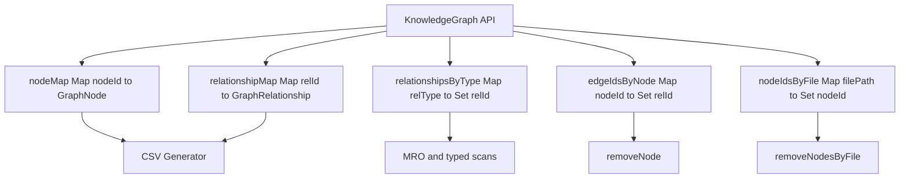
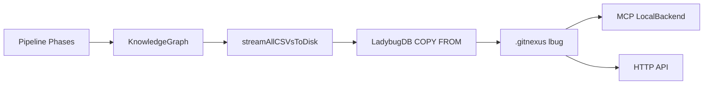

# KnowledgeGraph 内存图模型实现

KnowledgeGraph 是 ingestion 阶段的单图累加器。Pipeline 的各阶段不是直接写 LadybugDB，而是不断向内存图里添加节点和关系，最后由 LadybugDB adapter 一次性持久化。

## 源码入口

| 文件 | 职责 |
|---|---|
| `gitnexus/src/core/graph/types.ts` | `KnowledgeGraph` 接口定义 |
| `gitnexus/src/core/graph/graph.ts` | `createKnowledgeGraph` 实现 |
| `gitnexus-shared/src/graph/types.ts` | GraphNode、GraphRelationship、NodeLabel、RelationType 共享类型 |

## 核心接口

| 能力 | 典型方法 | 用途 |
|---|---|---|
| 增量写入 | `addNode`、`addRelationship` | pipeline 阶段累加图谱事实 |
| 快速读取 | `getNode`、`getRelationship` | 解析阶段反查节点/边 |
| 遍历 | `forEachNode`、`forEachRelationship`、`iterRelationshipsByType` | MRO、process、CSV 持久化 |
| 删除 | `removeNode`、`removeNodesByFile` | 增量索引替换某些文件的子图 |

## 内部数据结构

`graph.ts` 的实现重点是多索引，而不是裸数组。



| 索引 | 为什么需要 |
|---|---|
| `nodeMap` | `getNode(id)` O(1)，节点数统计 O(1) |
| `relationshipMap` | `getRelationship(id)` O(1)，边数统计 O(1) |
| `relationshipsByType` | MRO 等阶段只遍历 EXTENDS/IMPLEMENTS/HAS_METHOD，不必扫全图 |
| `edgeIdsByNode` | 删除某节点时只处理相关边，而不是扫描所有边 |
| `nodeIdsByFile` | 增量索引时按文件删除子图 |

## 单图累加器模式

Pipeline 的每个阶段都拿同一个 `ctx.graph`。structure 写 File/Folder/CONTAINS，parse 写 Function/Class/Method/IMPORTS/CALLS/DEFINES，routes 写 Route/HANDLES_ROUTE，tools 写 Tool/HANDLES_TOOL，orm 写 CodeElement/QUERIES，mro 写 METHOD_OVERRIDES/METHOD_IMPLEMENTS，communities 写 Community/MEMBER_OF，processes 写 Process/STEP_IN_PROCESS。

这种模式的优势是阶段之间可以通过图共享事实，但通过 Pipeline DAG 控制执行顺序，避免“谁先写谁后读”变成隐式约定。

## typed relationship iterator 的意义

`iterRelationshipsByType(type)` 是一个小但重要的优化。比如 MRO 阶段只关心 EXTENDS、IMPLEMENTS、HAS_METHOD。如果每次都 `forEachRelationship` 再判断类型，大仓库会反复扫全边集。类型桶让这些阶段只消费自己需要的边。

## 增量删除为什么需要 nodeIdsByFile

增量索引不是简单追加。某个文件变了，需要先删除这个文件旧的节点和边，再写入新子图。

```text
changed file
  -> nodeIdsByFile[filePath]
  -> remove each node
  -> edgeIdsByNode[nodeId]
  -> remove incident relationships
  -> parse new content
  -> add fresh nodes and relationships
```

## 与 LadybugDB 的关系



如果讲“GitNexus 如何构图”，应该先讲 KnowledgeGraph；如果讲“GitNexus 如何查询”，再讲 LadybugDB。

## 设计取舍

| 取舍 | 说明 |
|---|---|
| 先内存构图再批量入库 | 写入更快，阶段间共享简单；代价是 analyze 需要足够内存 |
| 多 Map 索引 | 提高删除和 typed traversal 性能；代价是写边时要维护多个索引 |
| id 由 generateId 生成 | 便于跨阶段引用同一节点；需要保证 id 规则稳定 |
| 关系只有一种表语义 | LadybugDB 侧用 `CodeRelation` + `type` 属性表达多种边 |
