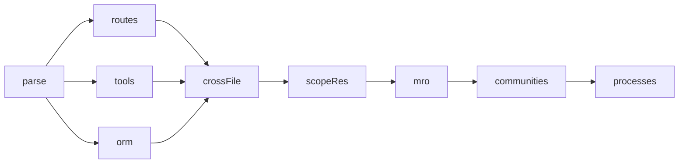
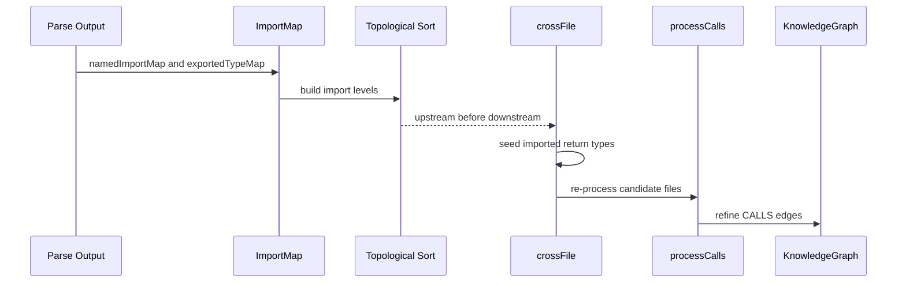

# MRO CrossFile 与 Wildcard Synthesis 实现

MRO、crossFile、wildcard synthesis 属于“图谱语义增强层”。它们的共同目标是：让 CALLS、METHOD_OVERRIDES、named bindings 更接近真实语言语义，而不是只停留在单文件 AST。

## 源码入口

| 模块 | 文件 | 作用 |
|---|---|---|
| MRO | `gitnexus/src/core/ingestion/mro-processor.ts`、`pipeline-phases/mro.ts` | 继承链方法解析，生成 METHOD_OVERRIDES / METHOD_IMPLEMENTS |
| crossFile | `pipeline-phases/cross-file.ts`、`cross-file-impl.ts` | 根据 import 拓扑传播类型绑定并二次解析 CALLS |
| wildcard synthesis | `pipeline-phases/wildcard-synthesis.ts` | 为 whole-module import 语言合成 namedImportMap |

## 三者在 Pipeline 中的位置

crossFile 等待 routes/tools/orm，是因为它拥有 parse 阶段产生的 BindingAccumulator 生命周期，必须等 post-parse 消费者结束后统一 dispose。

## MRO：继承关系不是一条边就够

`mro-processor.ts` 先从图中收集 EXTENDS、IMPLEMENTS、HAS_METHOD 三类边。然后对每个有父类的 class-like 节点：收集 direct parents，根据语言 provider 的 `mroStrategy` 计算 ancestor order，收集 ancestor methods，按方法名检测多父类冲突，用语言策略决议 winning method，最后生成 override / implements 关系。

| 策略 | 语言倾向 | 行为 |
|---|---|---|
| `leftmost-base` | C++ | 声明顺序左侧基类优先 |
| `implements-split` | Java / C# | class method 优先于 interface default；多个 interface default 可能 ambiguous |
| `c3` | Python | C3 linearization |
| `qualified-syntax` | Rust | 不自动决议，要求 qualified syntax |
| default | 单继承语言 | first definition wins |

## crossFile：跨文件类型传播

单文件 parse 很难解析“import factory -> 调用 factory -> receiver.method”这种关系。如果 factory 的返回类型在另一个文件，单文件内无法稳定知道 receiver 类型。crossFile 的做法是：

关键实现点包括 `topologicalLevelSort(ctx.importMap)`、`CROSS_FILE_SKIP_THRESHOLD = 0.03`、`MAX_CROSS_FILE_REPROCESS = 2000`、`AST_CACHE_CAP = 50`，并且 registry-primary 语言会跳过 legacy `processCalls`。

## wildcard synthesis：whole-module import 的补偿机制

C/C++ 的 `#include`、Go/Ruby/Swift 的 whole-module import 会让一个文件看到另一个文件暴露的多个符号。`wildcard-synthesis.ts` 单次扫描 graph nodes，建立 `exportedSymbolsByFile`，对 imported file 的 exported symbol 合成 named binding，写入 `ctx.namedImportMap`。

| importSemantics | 代表语言 | 策略 |
|---|---|---|
| `named` | TS/JS、Java、C#、Rust、PHP、Kotlin | 不需要合成 |
| `wildcard-transitive` | C / C++ | BFS 展开 include closure |
| `wildcard-leaf` | Go、Ruby、Swift、Dart | 只处理 direct import |
| `namespace` | Python | 构建 moduleAliasMap，调用处解析 |
| `explicit-reexport` | 预留 | 未来处理 `export *` / `pub use` |

## 为什么有上限

C/C++ include closure 可能非常大。源码里有 `MAX_SYNTHETIC_BINDINGS_PER_FILE = 1000` 和 `MAX_TRANSITIVE_CLOSURE_SIZE = 5000` 两个保护。这是典型工程取舍：静态分析要尽量捕获语义，但不能为了少数极端仓库把 analyze 拖垮。

## 讲解抓手

> MRO、crossFile、wildcard synthesis 是 GitNexus 从“语法图”走向“工程语义图”的关键补偿层。它们把继承、跨文件类型和语言 import 差异预计算进图谱里。
