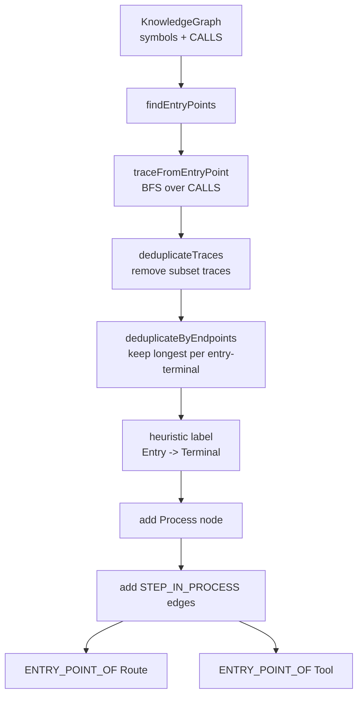

---
type: implementation-note
status: codex-generated
source:
  - gitnexus/src/core/ingestion/pipeline-phases/processes.ts
  - gitnexus/src/core/ingestion/process-processor.ts
  - gitnexus/src/core/ingestion/entry-point-scoring.ts
tags:
  - gitnexus
  - process
  - pipeline
  - knowledge-graph
---

# Process 执行流生成机制

> 关联：[[Pipeline DAG 实现]]、[[Query 与 Context 如何实现]]、[[Impact 影响分析实现]]、[[图谱 Schema 速览]]

GitNexus 的 `Process` 节点是它区别于普通调用图工具的重要设计。普通调用图只告诉你 A 调 B，GitNexus 还会把一组调用链抽象成“执行流”，供 Agent 按业务流程理解代码。

## 一句话定义

`Process` 是 GitNexus 从调用图中自动挖掘出的执行路径：从入口点出发，沿 `CALLS` 边向前追踪，过滤、去重、打标签后写成 `Process` 节点，并用 `STEP_IN_PROCESS` 把流程步骤连接到符号。

## Pipeline Phase 位置

`processes` 是 12 阶段 Pipeline DAG 的后段阶段，依赖：

```text
communities
routes
tools
structure
```

代码入口：

```text
gitnexus/src/core/ingestion/pipeline-phases/processes.ts
```

它运行在社区发现之后，因为流程需要知道每个符号属于哪个 Community，从而判断流程是 intra-community 还是 cross-community。

## 整体流程



## process phase 做了什么

`processes.ts` 主要负责把 processor 的结果写回图：

1. 统计当前图里的非 File 符号数量。
2. 动态计算 `maxProcesses`：

```text
max(20, min(300, round(symbolCount / 10)))
```

3. 调用：

```text
processProcesses(graph, communityResult.memberships, progress, {
  maxProcesses,
  minSteps: 3
})
```

4. 添加 `Process` 节点。
5. 添加每一步的 `STEP_IN_PROCESS` 边。
6. 将 Route/Tool 与对应 Process 用 `ENTRY_POINT_OF` 连接。

## Process 节点字段

写入的 `Process` 节点包含：

| 字段 | 含义 |
|---|---|
| `name` | 流程名称 |
| `heuristicLabel` | 启发式标签 |
| `processType` | `intra` 或 `cross` |
| `stepCount` | 步数 |
| `communities` | 涉及的社区 |
| `entryPointId` | 入口符号 id |
| `terminalId` | 终点符号 id |

## STEP_IN_PROCESS 边

每个流程步骤会生成：

```text
Symbol -[:STEP_IN_PROCESS { step }]-> Process
```

字段：

```text
type: STEP_IN_PROCESS
confidence: 1.0
reason: trace-detection
step: 1..N
```

方向是从 Symbol 指向 Process，这让查询很方便：

```cypher
MATCH (n)-[r:CodeRelation {type:'STEP_IN_PROCESS'}]->(p:Process)
WHERE n.id = $symbolId
RETURN p, r.step
```

这正是 `query/context/impact/detect_changes` 映射流程的基础。

## process-processor 的核心算法

核心源码：

```text
gitnexus/src/core/ingestion/process-processor.ts
```

默认配置：

```text
maxTraceDepth: 10
maxBranching: 4
maxProcesses: 75
minSteps: 3
```

最小调用边置信度：

```text
MIN_TRACE_CONFIDENCE = 0.5
```

也就是说，流程追踪不会把所有低置信度启发式边都拿来扩散。

## Step 1：构建调用图

processor 从 `KnowledgeGraph` 中读取 `CALLS` 边，构建：

```text
callsGraph: caller -> callees
reverseGraph: callee -> callers
```

只使用：

```text
CALLS confidence >= 0.5
```

这避免低置信度边污染流程。

## Step 2：寻找入口点

入口点候选要求：

- 节点类型是 `Function` 或 `Method`。
- 不是测试文件。
- 有 outgoing calls。
- 内部 caller 较少或没有。

然后用 `calculateEntryPointScore()` 排序，取高分候选。

### 入口点评分

源码在：

```text
gitnexus/src/core/ingestion/entry-point-scoring.ts
```

评分大致考虑：

```text
calleeCount / (callerCount + 1)
* exported multiplier
* name multiplier
* framework multiplier
```

### 加分模式

入口点名字常见模式：

```text
main
init
bootstrap
start
run
setup
configure
handle*
on*
*Handler
*Controller
process*
execute*
perform*
dispatch*
trigger*
fire*
emit*
```

### 降权模式

工具函数会被降权：

```text
get*
set*
is*
has*
format
parse
validate
convert
transform
log
debug
to*
from*
encode
decode
serialize
deserialize
clone
copy
merge
filter
map
reduce
sort
find
Helper / Util / Utils
```

这不是说这些函数不重要，而是它们通常不是流程入口。

## Step 3：从入口点 BFS 追踪

`traceFromEntryPoint` 从每个入口点沿 `CALLS` 边做 BFS。

限制：

| 限制 | 作用 |
|---|---|
| `maxTraceDepth` | 防止无限深 |
| `maxBranching` | 防止高 fan-out 工具函数爆炸 |
| visited path | 防止环 |
| `minSteps` | 太短的链不算流程 |

当遇到 terminal、达到最大深度，或路径长度足够时，会保存为 trace。

## Step 4：去重

两层去重：

### deduplicateTraces

删除被其他 trace 完全包含的子路径。

例如：

```text
A -> B -> C
B -> C
```

如果 `B -> C` 是 `A -> B -> C` 的子集，就可以删除。

### deduplicateByEndpoints

对于相同 entry 和 terminal 的流程，只保留最长路径。

```text
entry::terminal -> longest trace
```

这样避免流程列表里出现大量微小变体。

## Step 5：流程命名

流程标签格式：

```text
CapEntry -> CapTerminal
```

process id 形态：

```text
proc_${idx}_${sanitizeId(entryName)}
```

这是启发式命名，不是人工业务名。因此文档中应写“heuristicLabel”，不要说它一定是准确业务流程名。

## Step 6：判断 intra / cross

根据流程里的符号所属 Community：

- 只在一个社区内：`intra`
- 跨多个社区：`cross`

这让 Agent 能区分“模块内部流程”和“跨模块流程”。

## Route / Tool 与 Process 的连接

`processes.ts` 会把 Route 和 Tool 节点连接到流程。

### Route

按 filePath 把路由注册表分组。如果某个 Process 的 entry point 所在文件有 Route，则添加：

```text
Route -[:ENTRY_POINT_OF]-> Process
reason: route-handler-entry-point
confidence: 0.85
```

### Tool

Tool 同理，按 handlerNodeId 或 filePath 找 entry point：

```text
Tool -[:ENTRY_POINT_OF]-> Process
reason: tool-handler-entry-point
confidence: 0.85
```

这使得 API route、MCP tool、RPC handler 不只是孤立节点，而能和执行流关联起来。

## Process 被哪些工具使用

| 工具 | 如何使用 Process |
|---|---|
| `query` | 搜索命中符号后，通过 `STEP_IN_PROCESS` 聚合流程 |
| `context` | 显示某个符号参与哪些流程、第几步 |
| `impact` | 把受影响符号映射到 affected_processes |
| `detect_changes` | 把 diff 命中的符号映射到流程风险 |
| `route_map` / `api_impact` | 路由和流程联动 |

这说明 `Process` 是 GitNexus 从“代码图谱”走向“Agent 可理解工作流”的核心抽象。

## 为什么不是运行时 tracing

GitNexus 的 Process 是静态分析生成的，不是运行时链路追踪。

优点：

- 不需要运行应用。
- 不需要测试覆盖。
- 可以在任意仓库上离线生成。
- 默认本地优先。

边界：

- 动态分发、反射、运行时插件可能漏掉。
- 启发式入口点可能误判。
- 流程名是 heuristic，不等同业务文档。
- CALLS 边质量决定流程质量。

## 技术分享中的讲法

可以这样讲：

> Process 是 GitNexus 对调用图的二次抽象。它先用静态分析得到 CALLS，再从高分入口点出发 BFS 追踪路径，去掉重复和过短路径，最后写成 Process 节点和 STEP_IN_PROCESS 边。这样 Agent 查询时拿到的不只是“相关函数”，而是“这个函数处在哪条执行流的第几步”。