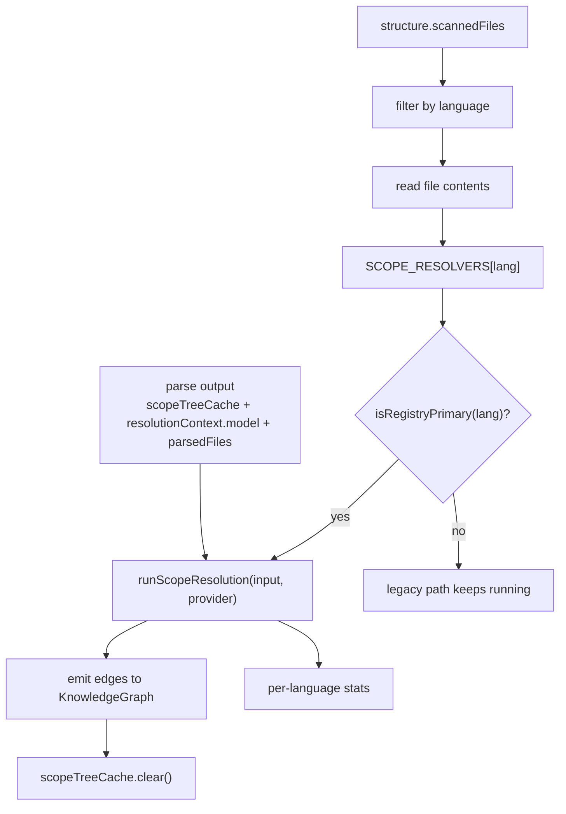
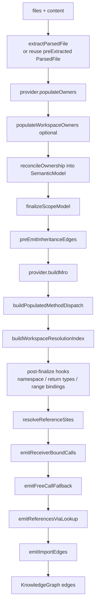

---
type: implementation-note
status: codex-generated
source:
  - gitnexus/src/core/ingestion/scope-resolution/pipeline/phase.ts
  - gitnexus/src/core/ingestion/scope-resolution/pipeline/run.ts
  - gitnexus/src/core/ingestion/scope-resolution/contract/scope-resolver.ts
  - gitnexus/src/core/ingestion/scope-resolution/workspace-index.ts
  - gitnexus/src/core/ingestion/registry-primary-flag.ts
tags:
  - gitnexus
  - scope-resolution
  - rfc-909
  - static-analysis
---

# Scope Resolution 作用域解析机制

> 关联：[[Pipeline DAG 实现]]、[[Tree-sitter 解析层]]、[[图谱 Schema 速览]]、[[Process 执行流生成机制]]

Scope Resolution 是 GitNexus 新一代引用解析管线。它的目标是替代 legacy call-resolution DAG 中逐文件、逐调用点的解析方式，把引用解析统一成“先构建全局作用域与语义索引，再查表解析引用，再发射图边”的流程。

## 一句话定义

Scope Resolution 是 GitNexus 的 registry-primary 引用解析管线：它复用 parse 阶段生成的 `ParsedFile` 和 `SemanticModel`，通过 `ScopeResolver` 语言适配器完成 import、binding、MRO、receiver、overload 等解析，最后向 KnowledgeGraph 发射 `IMPORTS/CALLS/ACCESSES/EXTENDS/USES` 边。

## 为什么需要 Scope Resolution

Legacy call-resolution DAG 的思想是：

```text
看到一个调用 -> 分类 -> 推断 receiver -> 分发策略 -> 查目标 -> 发 CALLS 边
```

这个方式能工作，但多语言扩展时会出现几个问题：

1. 语言特有规则容易散落在共享代码里。
2. 跨文件类型传播和 import 可见性难统一。
3. overload、MRO、namespace、wildcard、泛型等规则越来越复杂。
4. 每个语言如果单独写一套 emit pipeline，会产生复制粘贴。

Scope Resolution 的新思想是：

```text
ParsedFile[] -> ScopeResolutionIndexes -> ReferenceIndex -> graph edges
```

先把作用域、绑定、引用点、语义模型建好，再用统一管线解析和发边。

## Pipeline Phase 位置

源码入口：

```text
gitnexus/src/core/ingestion/scope-resolution/pipeline/phase.ts
```

phase 名称：

```text
scopeResolution
```

依赖：

```text
parse
crossFile
structure
```

为什么依赖 `parse`：

- parse 已经创建 Function/Method/Class 等图节点。
- scope-resolution 只替换 import + call/reference 解析层。
- 发边时需要连接到已存在符号节点。

为什么依赖 `crossFile`：

- `crossFile` 可能已经写入 `EXTENDS` 边。
- scope-resolution 的 MRO 构建会读取这些继承边。
- 如果顺序错了，MRO 会漏掉 heritage 信息。

## phase 执行流程



## MIGRATED_LANGUAGES

迁移开关在：

```text
gitnexus/src/core/ingestion/registry-primary-flag.ts
```

当前默认 registry-primary 的语言包括：

```text
Python
CSharp
TypeScript
Go
C
CPlusPlus
PHP
JavaScript
```

`isRegistryPrimary(lang)` 的规则：

1. 如果环境变量 `REGISTRY_PRIMARY_<LANG>` 显式设置，则环境变量优先。
2. 否则看语言是否在 `MIGRATED_LANGUAGES` 集合中。

支持的 truthy 值：

```text
true
1
yes
```

这让 CI 和开发者能强制切换 legacy / registry-primary 路径。

## SCOPE_RESOLVERS 注册表

源码：

```text
gitnexus/src/core/ingestion/scope-resolution/pipeline/registry.ts
```

它是一个：

```text
Map<SupportedLanguages, ScopeResolver>
```

注册了：

```text
Python
CSharp
TypeScript
Go
Java
C
CPlusPlus
PHP
JavaScript
Kotlin
```

注意：注册 resolver 不等于默认启用。是否启用由 `MIGRATED_LANGUAGES` 决定。

这是一种很好的渐进式迁移设计：

```text
先实现 resolver -> 注册 -> shadow/parity 验证 -> 加入 MIGRATED_LANGUAGES
```

## ScopeResolver 契约

源码：

```text
gitnexus/src/core/ingestion/scope-resolution/contract/scope-resolver.ts
```

它是每种语言接入通用解析管线的接口。

必需能力包括：

| 字段/方法 | 作用 |
|---|---|
| `language` | 语言标识 |
| `languageProvider` | 复用 parsing-side 语言能力 |
| `importEdgeReason` | IMPORTS 边 reason |
| `resolveImportTarget` | import 字符串解析到文件路径 |
| `mergeBindings` | 同一 scope 下多来源 binding 的优先级 |
| `arityCompatibility` | 调用参数数量兼容性 |
| `buildMro` | 构建类继承方法分发顺序 |
| `populateOwners` | 给方法/字段补 ownerId |
| `isSuperReceiver` | 判断 super/parent/base 接收者 |

可选能力包括：

| Hook | 作用 |
|---|---|
| `loadResolutionConfig` | 加载 tsconfig、go.mod、composer 等 |
| `expandsWildcardTo` | 处理 wildcard import |
| `populateNamespaceSiblings` | C# 等同 namespace 跨文件可见性 |
| `mirrorNamespaceTypeBindings` | namespace type binding 镜像 |
| `populateRangeBindings` | 基于源码范围补充 binding |
| `buildExtendsOnlyMro` | PHP trait 等需要区分继承和 mixin |
| `constraintCompatibility` | C++ requires/SFINAE 等约束匹配 |
| `conversionRankFn` | overload 转换排序 |
| `fieldFallbackOnMethodLookup` | receiver 方法找不到时是否查字段类型 |

## ScopeResolver vs LanguageProvider

源码注释明确区分了两个接口：

| 接口 | 生命周期 | 作用 |
|---|---|---|
| `LanguageProvider` | parsing-side，每文件运行 | tree-sitter capture、scope 分类、import/type binding 抽取 |
| `ScopeResolver` | emit-side，每 workspace 运行 | 引用解析、MRO、receiver dispatch、边发射策略 |

它们共享一些函数引用，比如：

```text
resolveImportTarget
mergeBindings
arityCompatibility
```

但不会合并成一个大接口，因为 parsing 和 resolving 的生命周期不同。

## runScopeResolution 总流程

源码：

```text
gitnexus/src/core/ingestion/scope-resolution/pipeline/run.ts
```

文件顶部的注释给了最清晰的管线：

```text
ParsedFile[]
  -> finalizeScopeModel()
  -> ScopeResolutionIndexes
  -> resolveReferenceSites()
  -> ReferenceIndex
  -> emitReceiverBoundCalls()
  -> emitFreeCallFallback()
  -> emitReferencesViaLookup()
  -> emitImportEdges()
  -> KnowledgeGraph
```

标准流程图：



## Phase 1：ParsedFile 抽取与复用

`runScopeResolution` 接收：

```text
files: { path, content }[]
treeCache
preExtractedParsedFiles
model
provider
```

对于每个文件：

1. 如果 parse worker 已经产出 `ParsedFile`，直接复用。
2. 否则尝试从 `treeCache` 拿 tree。
3. 如果 cache miss，再调用 `extractParsedFile()`。
4. 调用 `provider.populateOwners(parsed)`。
5. 加入 `parsedFiles`。

这个设计避免 warm-cache 路径重复 tree-sitter parse。

## SemanticModel 是单一符号事实源

Scope Resolution 不重新维护一套 symbol index。

代码中的 invariant I9 明确规定：

```text
SemanticModel is the single authoritative symbol store.
```

符号索引走：

```text
model.symbols
model.types
model.methods
model.fields
```

`WorkspaceResolutionIndex` 只保存 `Scope` 形态的 lookup，因为 `SemanticModel` 不存 scope 对象。

## reconcileOwnership

解析阶段可能有些语言无法在 parse-time 正确给 class body method / field 标 ownerId。Scope Resolution 会在 `populateOwners()` 后调用 `reconcileOwnership(parsedFiles, model)`。

作用：

- 把修正后的 ownerId 同步进 `SemanticModel`。
- 让后续 `lookupOwnedMembersByOwner()` 能查到正确方法。
- 保持 parse 产物和 resolver 视角一致。

## Phase 2：finalizeScopeModel

`finalizeScopeModel(parsedFiles, hooks)` 会构建 `ScopeResolutionIndexes`。

重要 hooks：

```text
resolveImportTarget
expandsWildcardTo
mergeBindings
```

它处理：

- module scope。
- class/function/local scope。
- imports。
- bindings。
- typeBindings。
- referenceSites。
- SCC 拓扑信息。

## preEmitInheritanceEdges

继承引用需要提前发 `EXTENDS` 边。

原因：

- MRO 构建依赖 `EXTENDS`。
- 如果继承 site 交给 generic reference bridge，可能会把 class heritage 错映射成 method-owned EXTENDS。

所以代码会：

1. 遍历 `referenceSites` 中 kind 为 `inherits` 的 site。
2. 找到目标 class binding。
3. 找到当前 enclosing class。
4. 发 `EXTENDS` 边。
5. 把该 site 加入 `handledSites`，阻止后续重复处理。

## MRO 与 MethodDispatch

`provider.buildMro()` 构建每个 Class 的方法解析顺序。

然后：

```text
buildPopulatedMethodDispatch(mroByClassDefId, extendsOnlyMroByClassDefId)
```

将其变成 MethodDispatchIndex。

这对 receiver method call 很关键，例如：

```text
user.getName()
```

需要知道 `user` 的类型、该类型的 MRO、方法在父类/接口/trait 中的解析顺序。

## WorkspaceResolutionIndex

源码：

```text
gitnexus/src/core/ingestion/scope-resolution/workspace-index.ts
```

它构建三个 lookup：

| Index | 作用 |
|---|---|
| `classScopeByDefId` | class def id -> class Scope |
| `classScopeIdToDefId` | class Scope id -> class def id |
| `moduleScopeByFile` | file path -> Module Scope |

为什么不放进 SemanticModel？

因为这些 lookup 返回的是 `Scope` 对象，而 SemanticModel 只负责 symbol-indexed lookup。

## Post-finalize hooks

finalize 后、resolve 前，会跑一些语言扩展 hook：

### populateNamespaceSiblings

例如 C# 同 namespace 跨文件可见性。

### mirrorNamespaceTypeBindings

跨包 namespace typeBinding 镜像。

### propagateImportedReturnTypes

跨文件传播 return type。它必须：

```text
after finalize
before resolveReferenceSites
```

因为 resolve 阶段需要看到传播后的类型。

### populateRangeBindings

基于源码范围补充 binding。

## Phase 3：resolveReferenceSites

这里把所有 reference sites 解析为 `ReferenceIndex`。

输入：

```text
scopes: ScopeResolutionIndexes
providers: RegistryProviders
ownedMembersByOwner: lookupOwnedMembersByOwner(model)
```

输出：

```text
ReferenceIndex
resolveStats:
  sitesProcessed
  referencesEmitted
  unresolved
```

这里仍然只是“解析引用”，还没有真正写图边。

## Phase 4：发射图边

发边顺序是 load-bearing，源码 invariant I1 强调不能随意调整：

```text
1. emitReceiverBoundCalls
2. emitFreeCallFallback
3. emitReferencesViaLookup
4. emitImportEdges
```

原因是 receiver-bound pass 更精确，必须先运行，避免 generic resolver 的同名 fallback 抢先发错边。

## emitReceiverBoundCalls

源码：

```text
scope-resolution/passes/receiver-bound-calls.ts
```

这是处理显式 receiver 的核心 pass。

它的 case 顺序也不能乱：

1. super branch。
2. compound receiver，例如 `a.b().c`。
3. namespace receiver。
4. class-name/static receiver。
5. dotted typeBinding namespace prefix。
6. chain typeBinding。
7. simple typeBinding + MRO walk。
8. value-receiver bridge，例如对象字面量服务。

每个 site 第一个成功发边的 case 获胜，并写入 `handledSites`，后续 pass 不再重复处理。

## emitFreeCallFallback

处理没有显式 receiver 的调用，例如：

```text
validateUser()
```

它会结合：

- local scope。
- imports。
- file-local def。
- global fallback。
- overload narrowing。
- ADL / conversion / constraint hooks。

这是 receiver-bound 之后的兜底层。

## emitReferencesViaLookup

这是通用 bridge，把 `ReferenceIndex` 中的 reference 转换成图边。

映射规则：

| Reference kind | Graph edge |
|---|---|
| `call` | `CALLS` |
| `read` | `ACCESSES` |
| `write` | `ACCESSES` |
| `inherits` | `EXTENDS` |
| `type-reference` | `USES` |
| `import-use` | 无图边，来源体现在 IMPORTS |

发边时会解析：

- caller graph id。
- target graph id。
- edge type。
- confidence。
- reason。

## emitImportEdges

`emitImportEdges()` 把 finalized imports 发成 File -> File 的 `IMPORTS` 边。

它按：

```text
sourceFile -> targetFile
```

去重。多个 symbol 从同一文件 import，只发一条文件级 IMPORTS 边，保持和 legacy schema 一致。

## Same-graph guarantee

Scope Resolution 的目标不是改变下游图谱形状，而是替换内部解析方式。

契约里明确说，registry-primary 和 legacy DAG 发出的图应满足：

- 同一套 node id。
- 同一套 node label。
- 同一套 edge vocabulary。
- 同一套 reason 语义。
- overload id 规则一致。

这就是 Same-graph guarantee。

对下游工具而言：

```text
query/context/impact/processes
```

不需要知道某条 `CALLS` 边来自 legacy 还是 scope-resolution。

## CI parity gate

`MIGRATED_LANGUAGES` 中的语言会在 CI 中跑两次 resolver integration test：

```text
REGISTRY_PRIMARY_<LANG>=0  legacy path
REGISTRY_PRIMARY_<LANG>=1  registry-primary path
```

两条路径都必须通过。

这让迁移不是“相信新管线”，而是“用相同 fixture 验证同图语义”。

## 和 legacy call-resolution DAG 的关系

两条管线并存：

```text
if isRegistryPrimary(lang):
  legacy import/call processor skips this language
  scopeResolution emits edges
else:
  legacy DAG emits edges
```

这让 GitNexus 可以逐语言迁移，而不是一次性重写所有语言。

## 技术分享中的讲法

可以这样讲：

> Scope Resolution 是 GitNexus 从“逐调用点启发式解析”升级到“全局作用域注册表解析”的关键重构。它把解析过程拆成 ParsedFile、ScopeResolutionIndexes、ReferenceIndex、Graph Edges 四层，并用 ScopeResolver 把语言差异限制在接口后面。最终它仍然发同一套 CALLS/IMPORTS/ACCESSES/EXTENDS/USES 边，所以 query、context、impact 等上层工具不需要感知底层迁移。