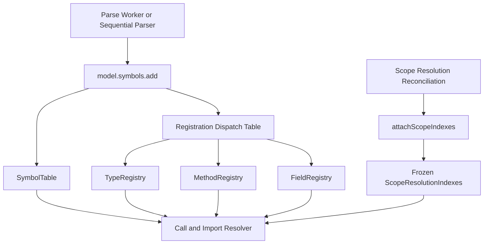

# Semantic Model 与 Registry 解析模型

Semantic Model 是 GitNexus 解析层的“符号语义中枢”。它不是最终图数据库，而是 parse、call、scope-resolution 阶段共享的一组内存索引，用来回答“某个文件里有没有这个符号”“某个类型有哪些方法”“某个字段属于哪个 owner”“legacy call-resolution 和 scope-resolution 如何共享同一套符号事实”。

## 源码入口

| 文件 | 职责 |
|---|---|
| `gitnexus/src/core/ingestion/model/semantic-model.ts` | 创建 SemanticModel，组合 symbol table 和各 registry |
| `symbol-table.ts` | file-indexed + callable-name 符号表 |
| `registration-table.ts` | NodeLabel 到 registry hook 的 O(1) 分发表 |
| `type-registry.ts` | class-like 类型、impl block、heritage 解析 |
| `method-registry.ts` | owner-scoped method / constructor 查找 |
| `field-registry.ts` | owner-scoped property / field 查找 |
| `resolution-context.ts` | importMap、namedImportMap、moduleAliasMap、model 等解析上下文 |
| `resolve.ts` | MRO、owner lookup、candidate 解析工具 |

## 总体结构

## SymbolTable：最底层纯存储

`symbol-table.ts` 明确是 ingestion dependency hierarchy 的 leaf，不依赖 `model/` 下的 registry。它维护两个主要索引：

| 索引 | 结构 | 用途 |
|---|---|---|
| `fileIndex` | `Map<filePath, Map<name, SymbolDefinition[]>>` | 同文件精确查找，支持重载 |
| `callableByName` | `Map<name, SymbolDefinition[]>` | free callable 的全局名称查找 |

它暴露 reader / writer 两种视图：`SymbolTableReader` 只能 lookup，`SymbolTableWriter` 可以 add，内部 `InternalSymbolTable` 才有 clear。这样调用方拿到什么接口，就只能做什么事。

## NodeLabel 行为分类

`registration-table.ts` 把所有 `NodeLabel` 分成三类：

| 分类 | 代表 label | 行为 |
|---|---|---|
| `dispatch` | Class、Struct、Interface、Enum、Record、Trait、Method、Constructor、Property、Impl | 写入 owner-scoped registry |
| `callable-only` | Function、Macro、Delegate | 只进入 callableByName |
| `inert` | File、Folder、Route、Tool、Community、Process、CodeElement 等 | 只作为图谱/元数据节点 |

关键点是 `LABEL_BEHAVIOR` 使用 `satisfies Record<NodeLabel, LabelBehavior>` 做编译期完整性约束。新增一种 NodeLabel 时，如果没有在这里分类，TypeScript 会报错。

## createSemanticModel 的三步

1. 创建原始索引：`rawSymbols = createSymbolTable()`，再创建 `types`、`methods`、`fields` 三个 registry。
2. 包装 `symbols.add`：先写入 SymbolTable；如果是 `Function + ownerId`，归一化为 Method 行为；再通过 dispatch table 写入对应 registry。
3. 挂载 scope indexes：Scope Resolution pipeline 生成 workspace 级索引后，通过 `attachScopeIndexes` 一次性挂入模型，避免后续阶段看到半更新状态。

## 它解决的问题

普通 AST 提取只知道“这里有一个函数、这里有一个类”，但代码解析需要回答“这个调用到底指向谁”。Semantic Model 把这个问题拆成多个稳定索引：

| 问题 | 使用的索引 |
|---|---|
| 同文件符号查找 | SymbolTable.fileIndex |
| free function 查找 | SymbolTable.callableByName |
| class-like owner 查找 | TypeRegistry |
| 方法按 owner 查找 | MethodRegistry |
| 字段按 owner 查找 | FieldRegistry |
| 新作用域模型查找 | ScopeResolutionIndexes |

## 与 KnowledgeGraph 的关系

Semantic Model 不是持久化图，也不是 LadybugDB。它是 ingestion 阶段的“解析索引”：AST / Worker Output -> Semantic Model -> Call Resolution / Scope Resolution -> KnowledgeGraph nodes and relationships -> LadybugDB。

## 讲解抓手

> Semantic Model 把“代码符号”从普通列表升级成按文件、按名称、按 owner、按类型语义组织的多索引模型，是调用解析和作用域解析的基础设施。
