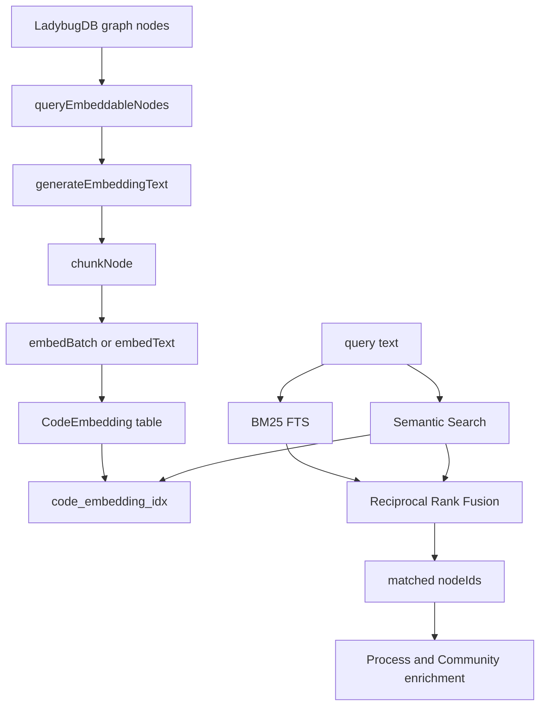
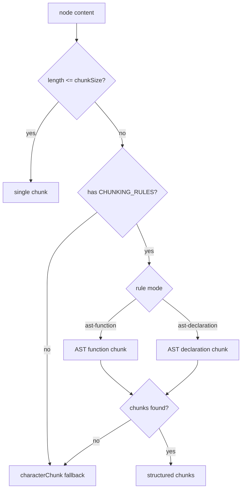

---
type: implementation-note
status: codex-generated
source:
  - gitnexus/src/core/embeddings/embedding-pipeline.ts
  - gitnexus/src/core/embeddings/text-generator.ts
  - gitnexus/src/core/embeddings/chunker.ts
  - gitnexus/src/core/embeddings/types.ts
  - gitnexus/src/core/search/bm25-index.ts
  - gitnexus/src/core/search/hybrid-search.ts
  - gitnexus/src/mcp/local/local-backend.ts
tags:
  - gitnexus
  - embedding
  - hybrid-search
  - bm25
  - vector-search
---

# Embedding Pipeline 与 Hybrid Search 实现

> 关联：[[Query 与 Context 如何实现]]、[[图谱 Schema 速览]]、[[LadybugDB 图存储]]、[[FTS 与 BM25]]、[[Embedding 语义搜索]]

GitNexus 不是普通 RAG，但它仍然有 Embedding 和 Hybrid Search。关键差异在于：GitNexus 的 embedding 不是把源文件粗暴切片后塞进向量库，而是从知识图谱中选择可嵌入的符号节点，生成带结构元数据的文本，按代码结构 chunk，再把向量挂回图数据库里的 `CodeEmbedding` 表。

## 一句话定义

Embedding Pipeline 是 GitNexus 的语义召回补充层；Hybrid Search 是 BM25 和向量检索的融合层。它们服务于 `query/search` 的候选召回，但最终结果仍然会绑定回 KnowledgeGraph 节点，再通过 `Process`、`Community`、`CALLS` 等关系获得工程语义。

## 源码入口

核心文件：

```text
gitnexus/src/core/embeddings/embedding-pipeline.ts
gitnexus/src/core/embeddings/text-generator.ts
gitnexus/src/core/embeddings/chunker.ts
gitnexus/src/core/embeddings/types.ts
gitnexus/src/core/search/bm25-index.ts
gitnexus/src/core/search/hybrid-search.ts
gitnexus/src/mcp/local/local-backend.ts
```

辅助文件：

```text
gitnexus/src/core/embeddings/embedder.ts
gitnexus/src/core/embeddings/exact-search.ts
gitnexus/src/core/embeddings/structural-extractor.ts
gitnexus/src/core/embeddings/character-chunk.ts
gitnexus/src/core/search/fts-indexes.ts
gitnexus/src/core/search/fts-schema.ts
```

## 整体链路



这张图要强调两件事：

- embedding 的输入来自图谱节点，而不是原始文件切片。
- search 的输出会回到图谱节点，而不是停留在文本片段。

## Embeddable labels

可嵌入节点定义在 `types.ts`。

### Chunkable labels

这些节点可能有较长代码体，需要 chunk：

```text
Function
Method
Constructor
Class
Interface
Struct
Enum
Trait
Impl
Macro
Namespace
```

### Short labels

这些节点通常较短，直接嵌入：

```text
TypeAlias
Typedef
Const
Property
Record
Union
Static
Variable
```

### Structural labels

这些节点会提取结构成员：

```text
Class
Struct
Interface
```

也就是说，类的 embedding 文本不只是类源码，还会包含方法名、字段名、声明结构等信息。

## 默认 embedding 配置

默认配置在 `DEFAULT_EMBEDDING_CONFIG`：

```text
modelId: Snowflake/snowflake-arctic-embed-xs
batchSize: 16
subBatchSize: 8
threads: 2
dimensions: 384
device: auto
maxSnippetLength: 500
chunkSize: 1200
overlap: 120
maxDescriptionLength: 150
```

这里能看出 GitNexus 的设计偏本地和轻量：384 维小模型、分批处理、支持 CPU/GPU/WASM fallback。

## Embedding 文本如何生成

入口：

```text
generateEmbeddingText(node, codeBody, config, chunkIndex, prevTail)
```

生成文本时会拼接：

```text
Label: Name
Repo: repoName
Server: serverName
Path: filePath
Export: true/false
Description

Code content
```

对于结构类型，还会加入：

```text
Container: class/interface/struct declaration first line
Methods: methodA, methodB, methodC
Properties: fieldA, fieldB
declarationOnly
chunk content
```

对于后续 chunk，还可能加入：

```text
[preceding context]: ...previous tail
```

## 为什么 embedding 文本要加 metadata

如果只嵌入代码体：

```ts
return userRepository.findById(id)
```

模型不一定知道它属于哪个类、哪个文件、是否导出、所在路径代表什么业务模块。

GitNexus 加入 metadata 后，语义空间里会出现更多工程信号：

- `Path` 带来模块上下文。
- `Label` 区分函数、类、方法、属性。
- `Export` 帮助入口点排序。
- `Methods/Properties` 帮助类节点表达结构职责。
- `Description` 帮助注释良好的代码被更好召回。

这也是它比普通文本切片更适合代码库搜索的原因。

## 内容 hash 与版本

`embedding-pipeline.ts` 中有：

```text
EMBEDDING_TEXT_VERSION = v2
contentHashForNode()
```

hash 由以下内容决定：

```text
EMBEDDING_TEXT_VERSION
generated embedding text
```

作用：

- embedding 文本模板变化时，可以通过 bump version 让旧向量失效。
- 节点内容没变时，可以复用旧向量。
- 避免 stale vector 与新代码不一致。

源码中特别排除了运行中补充的 `methodNames/fieldNames`，保证 hash 稳定；如果结构提取规则变化，需要 bump `EMBEDDING_TEXT_VERSION`。

## Chunking 规则

入口：

```text
chunkNode(label, content, filePath, startLine, endLine, chunkSize, overlap)
```

基本逻辑：



### Function / Method / Constructor

使用 `ast-function`：

- tree-sitter 解析 snippet。
- 找 function/method node。
- 找 body。
- 按 statement 边界切分。
- 保留 prefix/suffix。

这比固定字符切片更适合函数，因为 chunk 边界尽量落在语句边界。

### Class / Interface / Struct

使用 `ast-declaration`：

- 找 declaration node。
- 找 class body/interface body/declaration list。
- 收集成员单位。
- class/struct 可以把字段分组。
- 保留 declaration prefix，不一定保留 suffix。

这让类的长定义按成员结构切开，而不是把方法体和字段混成随机片段。

### fallback

如果 AST 解析失败：

```text
characterChunk(content, startLine, endLine, chunkSize, overlap)
```

也就是说，AST-aware 是优化路径，不是单点失败。

## Embedding 写入 CodeEmbedding

写入函数：

```text
batchInsertEmbeddings()
```

写入表：

```text
CodeEmbedding
```

字段：

```text
id: nodeId:chunkIndex
nodeId
chunkIndex
startLine
endLine
embedding
contentHash
```

这里的关键设计是 chunk-aware：同一个代码节点可以对应多个 embedding chunk，但仍然通过 `nodeId` 回到原始图谱节点。

## Vector index

创建向量索引：

```text
CREATE_VECTOR_INDEX_QUERY
code_embedding_idx
```

创建前会调用：

```text
loadVectorExtension()
```

如果 LadybugDB 当前运行时没有 VECTOR extension，会返回 false。系统不会崩溃，而是降级到 exact scan 或语义搜索不可用。

## BM25 FTS 实现

入口：

```text
searchFTSFromLbug(query, limit, repoId?)
```

它会查询多个 FTS index：

```text
File
Function
Class
Method
...
```

对于 MCP 场景，如果传入 `repoId`，会通过 connection pool 执行：

```text
executeParameterized(repoId, cypher, params)
```

为了避免连接争用，FTS 查询是 sequential，不是并发。

## FTS 结果如何合并

FTS 返回的是 node 命中。代码会按 filePath 聚合：

1. 收集每个 filePath 下命中的 node score。
2. 对每个文件取 top 3 节点。
3. top 3 分数求和作为文件分。
4. 同时保留这些 nodeIds。

源码注释解释了为什么只取 top 3：如果把一个文件里所有中等匹配都累加，测试文件或大文件会因为命中多而虚高。

## Hybrid Search 与 RRF

入口：

```text
mergeWithRRF(bm25Results, semanticResults, limit)
```

RRF 常量：

```text
RRF_K = 60
```

分数：

```text
1 / (RRF_K + rank)
```

融合逻辑：

- BM25 命中先进入 map。
- Semantic 命中如果 filePath 已存在，就叠加 RRF 分数。
- Semantic 命中会补充 nodeId、name、label、startLine、endLine。
- 最终按 RRF score 排序。

## LocalBackend 中的 query 搜索

`LocalBackend.query()` 并不只是调用 `hybridSearch.ts`，它自己也做了 BM25 和 semantic 的并行搜索、RRF 融合，然后把结果映射到流程。

原因是 MCP query 需要更强的结构化输出：

```text
processes
process_symbols
definitions
warning
timing
```

所以搜索只是第一步。命中的 nodeId 还会查：

```text
STEP_IN_PROCESS
MEMBER_OF
```

这一步让搜索结果从“相关片段”变成“相关执行流”。

## 降级路径

GitNexus 的搜索有多层降级：

| 故障 | 降级 |
|---|---|
| FTS index 缺失 | semantic-only，并返回 warning |
| embedding 表为空 | BM25-only |
| VECTOR extension 不可用 | exact scan，若数据量太大则跳过 |
| AST chunk 失败 | character chunk |
| 某 label 查询失败 | 跳过该 label，不中断全部 embedding |

这是一种非常工程化的设计：搜索质量可以下降，但系统尽量不中断。

## 为什么它不是普通 RAG

普通代码 RAG：

```text
file chunks -> embeddings -> retrieve chunks -> feed LLM
```

GitNexus：

```text
symbol graph -> embeddable graph nodes -> structured embedding text
-> hybrid retrieval -> graph node ids -> process/community/call graph enrichment
-> structured tool result
```

核心差异：

- embedding 是召回补充，不是主知识结构。
- 检索结果必须回到图谱节点。
- 最终上下文来自图关系，而不是纯文本相似度。

## 技术分享讲法

可以这样讲：

> GitNexus 不是不用向量，而是不把向量当作代码理解的主体。它先用静态分析把代码变成图谱，再从图谱节点生成结构化 embedding 文本。搜索时 BM25 和向量用 RRF 融合，只负责召回候选；真正给 Agent 的上下文来自节点、关系、流程和社区。