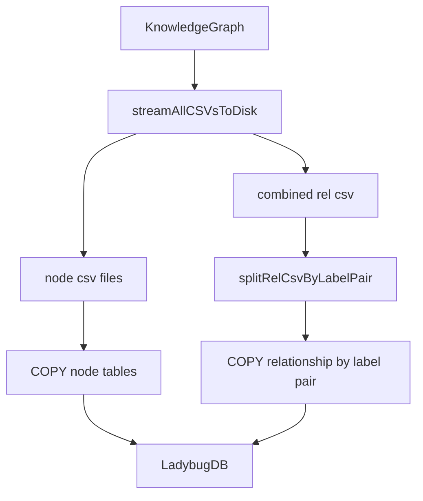

# LadybugDB 写入连接池与恢复机制

这篇补充 [[LadybugDB 图存储]]，重点讲源码里的工程细节：批量写入、连接池、WAL / sidecar 恢复、FTS/vector extension 加载。

## 源码入口

| 文件 | 职责 |
|---|---|
| `core/lbug/lbug-adapter.ts` | 单例写连接、schema、COPY、FTS、WAL close、delete |
| `core/lbug/csv-generator.ts` | KnowledgeGraph -> CSV 流式生成 |
| `core/lbug/pool-adapter.ts` | MCP/HTTP 查询连接池 |
| `core/lbug/sidecar-recovery.ts` | shadow / wal / checkpoint sidecar 预检和恢复 |
| `core/lbug/lbug-config.ts` | open/close 连接、错误识别 |
| `core/lbug/schema.ts` | Node table、relation table、embedding table schema |

## 写入路径

逐条 Cypher MERGE/CREATE 会非常慢。GitNexus 选择先遍历内存图流式写 CSV，再使用 LadybugDB `COPY FROM` 批量导入。这是典型 bulk loading 思路：构图时重 CPU，入库时重吞吐。

## csv-generator 的关键点

| 机制 | 说明 |
|---|---|
| `BufferedCSVWriter` | 每 500 行 flush，减少 write promise 开销 |
| `FileContentCache` | LRU 缓存源码内容，避免一个文件多个符号反复读盘 |
| snippet 截断 | File 最多 10000 字符，symbol snippet 最多 5000 字符 |
| UTF-8 sanitize | 删除控制字符、孤立 surrogate、非法字符 |
| RFC 4180 escape | 字段统一 quote，双引号转义 |

## 关系拆分为什么按 label pair

LadybugDB 的关系通常需要明确 from/to label。GitNexus 先用一个 `CodeRelation` 逻辑类型承载所有边，再在 COPY 时按 `rel_Function_Method.csv`、`rel_File_File.csv`、`rel_Class_Method.csv` 这类 fromLabel/toLabel 拆分，让导入更贴合图数据库的物理模型。

## 单例写连接与 session lock

`lbug-adapter.ts` 使用模块级 `db` / `conn` 作为 analyze 写路径的单例连接。为避免同时切换 DB path 或并发初始化，它有 `sessionLock`、`runWithSessionLock`、`acquireInitLock`。`acquireInitLock` 使用 `O_CREAT | O_EXCL` 创建 `${dbPath}.init.lock`，防止多进程同时清理 sidecar 或初始化同一个 DB。

## 查询连接池

`pool-adapter.ts` 面向 MCP、HTTP、wiki、search 等查询路径。LadybugDB Connection 不是线程安全的，所以它提供一个 Database、多 Connection 的 checkout/return pool。

| 机制 | 说明 |
|---|---|
| per-repo pool | 一个 Database，多 Connection |
| `MAX_CONNS_PER_REPO = 8` | 限制单仓库并发连接 |
| `MAX_POOL_SIZE = 5` | 最多保留 5 个 repo pool |
| LRU eviction | pool 满时关闭最久未用且未 checkout 的 repo |
| idle timeout | 5 分钟空闲自动关闭 |
| shared DB cache | 多 repoId 指向同 dbPath 时共享 Database，refCount 管理 |

## WAL 和 sidecar 恢复

涉及 `.gitnexus/lbug`、`.gitnexus/lbug.wal`、`.gitnexus/lbug.lock`、`.gitnexus/lbug.shadow`、`.gitnexus/lbug.wal.checkpoint`。主 DB 缺失但 sidecar 残留时在 init lock 内清理 orphan sidecar；WAL corruption 会抛出带恢复建议的错误；missing shadow sidecar 时小 WAL 可 quarantine，大 WAL 拒绝自动丢弃；close 时执行 CHECKPOINT + close + Windows handle release wait。

## FTS / Vector extension

FTS 和 vector extension 通过 `extensionManager.ensure` 加载。查询池路径不在 query time 安装 extension；FTS 不可用时搜索模块可以 fallback；read-only DB 上不能 `CREATE_FTS_INDEX`，所以创建索引由 analyze 写路径负责。

## 讲解抓手

> LadybugDB 层不是“把图塞进数据库”这么简单。它包括批量导入、关系物理拆分、查询连接池、WAL 恢复、Windows 文件句柄处理和 extension 生命周期。
