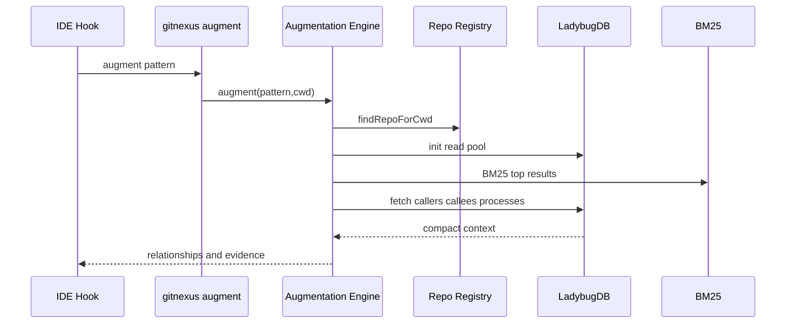

# Context Augmentation 快速上下文增强机制

Context Augmentation 是 GitNexus 给 hooks / IDE 集成用的快速上下文补充能力。它不同于完整的 `query/context/impact`，目标是低延迟地根据一个 pattern 找到相关符号、调用关系和流程信息。

## 源码入口

| 文件 | 职责 |
|---|---|
| `gitnexus/src/core/augmentation/engine.ts` | augmentation 主引擎 |
| `gitnexus/src/cli/augment.ts` | CLI 命令入口 |
| `gitnexus-claude-plugin/hooks/` | Claude plugin hooks |
| `gitnexus-cursor-integration/hooks/` | Cursor hooks |
| `core/search/bm25-index.ts` | BM25 查询 |
| `core/lbug/pool-adapter.ts` | 查询连接池 |

## 设计目标

源码注释里强调 performance target：cold < 500ms，warm < 200ms。这说明它不是完整 Agent 深度分析，而是一个“快速补上下文”的 hook 能力。

## 总体流程

## Repo 选择和输入过滤

`findRepoForCwd` 会从全局 registry 中找当前 cwd 对应 repo，采用 longest matching path。输入方面，pattern length < 3 或 first word length < 2 直接返回空，避免 hook 在用户输入非常短时触发大量无意义搜索。

## 搜索策略

Context Augmentation 使用 BM25 为主：`searchFTSFromLbug` top 10，找 file/symbol 结果，优先匹配 name 包含 first word 的符号；FTS 不可用时 fallback 到直接 name contains 扫描。它没有默认走 embedding，因为 hook 场景更重视稳定低延迟。

## 输出内容

输出会包含 matched symbols/files、callers、callees、processes、cluster/cohesion 等。文档中可以把它定位成“轻量版 context 工具”。

## 与 MCP 工具的区别

| 维度 | augment | MCP query/context/impact |
|---|---|---|
| 调用场景 | hooks 自动触发 | Agent 主动调用 |
| 延迟目标 | 极低 | 可以更重 |
| 搜索方式 | BM25 快速路径 | hybrid、graph traversal、process ranking |
| 输出 | 简短上下文 | 结构化深度结果 |
| 行为约束 | 提示/增强 | 工作流步骤 |

## 讲解抓手

> Context Augmentation 是 GitNexus 的低延迟上下文注入层：用 BM25 和图谱一跳关系快速给 hooks 补充证据，但把深度分析留给 MCP tools。
