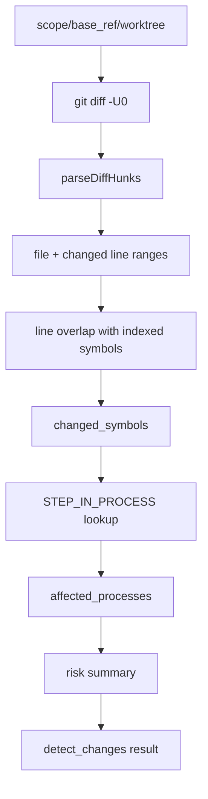
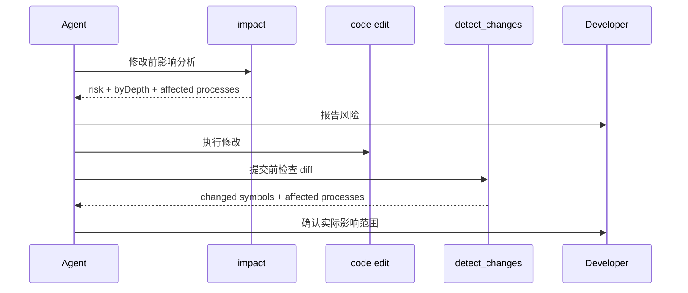

---
type: implementation-note
status: codex-generated
source:
  - gitnexus/src/mcp/local/local-backend.ts
tags:
  - gitnexus
  - detect_changes
  - git
  - agent-safety
---

# Detect Changes 提交前影响验证实现

> 关联：[[Impact 影响分析实现]]、[[LocalBackend 工具执行层实现]]、[[Agent 工作流]]

`detect_changes` 是 GitNexus 的提交前验证工具。`impact` 是“改之前看风险”，`detect_changes` 是“改之后确认实际影响是否符合预期”。

AGENTS.md 中有明确规则：

```text
MUST run gitnexus_detect_changes() before committing.
```

## 一句话定义

`detect_changes` 把 git diff hunk 映射到知识图谱中的符号，再通过 `STEP_IN_PROCESS` 找到受影响执行流，并给出提交风险摘要。

它解决的问题是：Agent 改完代码后，如何知道自己实际动到了哪些符号、影响了哪些流程，而不是只看文件名。

## 整体流程



## scope 参数

支持几种 diff 范围：

| scope | git 命令 | 使用场景 |
|---|---|---|
| `unstaged` | `git diff -U0` | 默认，看未暂存修改 |
| `staged` | `git diff --staged -U0` | commit 前检查已暂存内容 |
| `all` | `git diff HEAD -U0` | 看工作区相对 HEAD 的全部修改 |
| `compare` | `git diff <base_ref> -U0` | 和指定分支/commit 对比 |

使用 `-U0` 是关键：diff 只保留变更行，不带上下文行。这样后续 hunk 到 symbol 的 overlap 更精确。

## worktree 安全解析

`detect_changes` 会解析 diff 的工作目录。

默认通过当前进程 cwd 和 repoPath 自动判断 worktree。若用户显式传 `worktree`：

- 必须是绝对路径。
- 必须 canonical 后仍属于同一个仓库。

这防止 Agent 在错误目录下跑 git diff，把别的仓库改动误映射到当前图谱。

## Diff hunk 解析

`parseDiffHunks` 会把 git diff 解析成：

```text
filePath
changedRanges:
  - startLine
    endLine
```

只关心实际变更行。对新增、修改、删除都会转换成可比较的行区间。

## 从 hunk 到 symbol

关键查询逻辑是：找同一文件中，符号范围和 diff hunk 有重叠的节点。

形态类似：

```cypher
MATCH (n)
WHERE n.filePath ENDS WITH $filePath
  AND n.startLine IS NOT NULL
  AND n.endLine IS NOT NULL
  AND overlap(n.startLine, n.endLine, changedRanges)
RETURN n.id, n.name, labels(n)[0], n.filePath, n.startLine, n.endLine
```

这说明 `detect_changes` 不是按文件粗粒度判断，而是按符号范围判断。

例如一个文件里有 20 个函数，diff 只改了第 8 个函数，那么结果会定位到那个函数，而不是整文件所有函数。

## 从 symbol 到 process

拿到 changed symbols 后，会批量查询：

```cypher
MATCH (n)-[r:CodeRelation {type:'STEP_IN_PROCESS'}]->(p:Process)
WHERE n.id IN $ids
RETURN n.id, p.id, p.heuristicLabel, p.processType, p.stepCount, r.step
```

这样可以知道：

- 改动符号属于哪些执行流。
- 在流程中是第几步。
- 流程长度是多少。
- 哪些流程被多个改动命中。

## 风险等级

`detect_changes` 的风险是基于受影响流程数量的提交前风险：

```text
processCount = 0   -> low
processCount <= 5  -> medium
processCount <= 15 -> high
otherwise          -> critical
```

如果没有文件 diff，则风险为 `none`。

这和 `impact` 的风险公式不同：

- `impact` 关注潜在传播面，综合 direct/process/module/total。
- `detect_changes` 关注实际 diff 命中的流程数量。

两者互补。

## 返回结构

典型返回：

```text
scope
changed_symbols:
  - id
    name
    type
    filePath
    startLine
    endLine

affected_processes:
  - id
    heuristicLabel
    processType
    stepCount
    changedSymbols
    earliestStep

risk:
  level
  processCount
  symbolCount
```

## 为什么提交前还需要 detect_changes

即使修改前跑过 `impact`，改完后仍可能出现：

- Agent 顺手改了别的函数。
- 格式化影响了多个文件。
- 重命名导致更多引用变化。
- 测试或辅助文件被修改。
- 用户在同一工作区已有未提交改动。

`detect_changes` 用实际 diff 校验：

```text
预期影响面 vs 实际改动面
```

这正是 Agent 编程需要的闭环。

## 与 impact 的组合工作流



## 技术分享中的讲法

可以这样讲：

> `detect_changes` 是 GitNexus 给 Agent 工作流补上的“事后验收”。它不是重新做一遍 impact，而是把 git diff 的行级 hunk 映射回符号节点，再映射到执行流。这样 Agent 不仅知道“我打算影响什么”，还知道“我实际上改到了什么”。