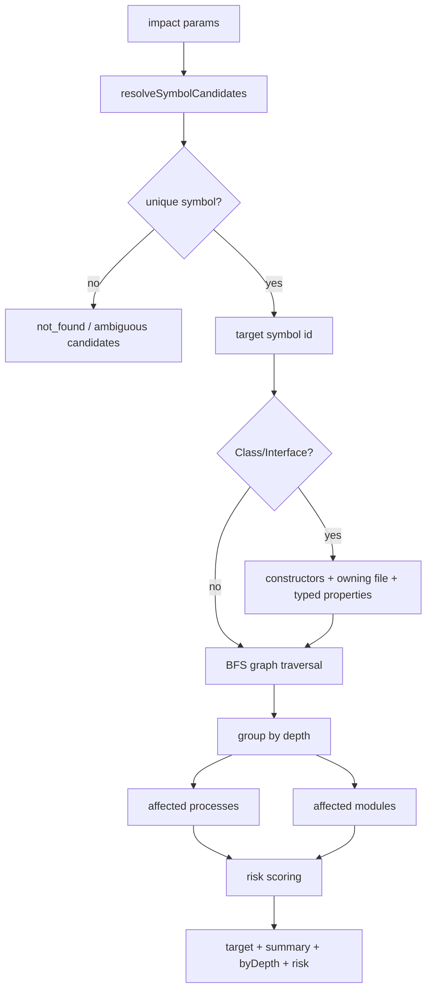

---
type: implementation-note
status: codex-generated
source:
  - gitnexus/src/mcp/local/local-backend.ts
tags:
  - gitnexus
  - impact
  - callgraph
  - agent-safety
---

# Impact 影响分析实现

> 关联：[[LocalBackend 工具执行层实现]]、[[Query 与 Context 如何实现]]、[[Detect Changes 提交前影响验证实现]]、[[图谱 Schema 速览]]

`impact` 是 GitNexus 面向 Agent 编程最关键的安全工具。它回答的问题不是“这个符号是什么”，而是“如果我改它，谁会被影响，风险有多大”。

AGENTS.md 中的核心规则：

```text
MUST run impact analysis before editing any symbol.
```

最终执行的就是 `LocalBackend.impact()` 和内部的 `_runImpactBFS()`。

## 一句话定义

`impact` 是一个基于代码知识图谱的定向 BFS 影响面分析：从目标符号出发，沿调用、导入、继承、实现、重写、字段访问等关系向上游或下游遍历，并把结果映射到受影响流程、模块和风险等级。

## upstream 与 downstream

`impact` 有两个方向：

| direction | 含义 | 典型问题 |
|---|---|---|
| `upstream` | 查“谁依赖我” | 改这个函数会影响哪些调用方？ |
| `downstream` | 查“我依赖谁” | 这个函数内部依赖哪些组件？ |

修改函数前通常用 `upstream`，因为风险来自调用方和上层流程。

## 整体流程



## 参数解析

核心参数：

| 参数 | 作用 |
|---|---|
| `target` | 函数/类/方法/file 名称 |
| `target_uid` | 精确符号 id，避免歧义 |
| `direction` | `upstream` 或 `downstream` |
| `maxDepth` | 图遍历深度，默认 3 |
| `relationTypes` | 参与遍历的关系类型 |
| `includeTests` | 是否包含测试文件，默认 false |
| `minConfidence` | 最低关系置信度 |
| `file_path` | 辅助 disambiguation |
| `kind` | 辅助 disambiguation |

## 默认关系类型

如果不传 `relationTypes`，默认遍历：

```text
CALLS
IMPORTS
EXTENDS
IMPLEMENTS
USES
METHOD_OVERRIDES
OVERRIDES
METHOD_IMPLEMENTS
```

对于 `Class` / `Interface`，如果没有显式传关系类型，会额外加入 `ACCESSES`。原因是类变动不仅会影响调用，也会影响字段类型和属性访问。

## 兼容旧关系类型

代码里对 `OVERRIDES` 做兼容：

```text
OVERRIDES -> OVERRIDES + METHOD_OVERRIDES
```

这说明 GitNexus 的图谱 schema 有演进历史，工具层需要对旧索引或旧客户端保持一定兼容。

## 符号解析与歧义处理

`impact` 先调用 `resolveSymbolCandidates()`。

可能返回：

```text
status: not_found
status: ambiguous
status: found
```

当名称歧义时，它不会盲目分析第一个，而是返回 candidates。对 Agent 来说，这是防止误改的第一层保护。

推荐调用方式：

```json
{
  "target": "validateUser",
  "direction": "upstream",
  "file_path": "src/auth/validate.ts",
  "kind": "Function"
}
```

或者直接使用 `context` 返回的 `uid`：

```json
{
  "target_uid": "Function:src/auth/validate.ts:validateUser",
  "direction": "upstream"
}
```

## Class / Interface 的额外种子

对于类和接口，`_runImpactBFS()` 不只从类节点本身开始，还会加入额外种子。

### 1. Constructors

类的实例化通常指向构造函数节点，而不是类节点本身。所以需要把类通过 `HAS_METHOD` 连到的 constructor 也作为种子。

### 2. Owning File

类由某个 File 定义，文件级 `IMPORTS` 也可能是影响路径。将 owning File 加入内部 frontier 可以捕获文件导入影响。

### 3. Typed Properties

如果属性声明类型是该类，或者泛型中包含该类，也会被作为影响种子。

例如：

```text
user: User
users: List<User>
cache: Map<string, User>
```

这些属性并不一定直接 `CALLS` 类，但类结构变化可能影响它们。

## BFS 遍历实现

核心是分层 BFS：

```text
visited = { target }
frontier = { target }

for depth in 1..maxDepth:
  rows = graph query(frontier, direction, relationTypes)
  filter tests
  filter confidence
  dedupe visited
  grouped[depth].append(rows)
  frontier = new nodes
```

### upstream 查询形态

查“谁指向我”：

```cypher
MATCH (caller)-[r:CodeRelation]->(n)
WHERE n.id IN $frontier
  AND r.type IN $relationTypes
RETURN caller, r
```

### downstream 查询形态

查“我指向谁”：

```cypher
MATCH (n)-[r:CodeRelation]->(callee)
WHERE n.id IN $frontier
  AND r.type IN $relationTypes
RETURN callee, r
```

## depth 的意义

`impact` 返回结果按深度分组：

| depth | 解释 |
|---|---|
| 1 | 直接影响，通常是直接调用方、直接导入方、直接继承/实现方 |
| 2 | 间接影响，依赖 depth 1 的符号 |
| 3 | 更远的传递影响，通常需要测试覆盖但不一定直接修改 |

工具描述里也把它解释成：

```text
d=1: WILL BREAK
d=2: LIKELY AFFECTED
d=3: MAY NEED TESTING
```

## 置信度处理

图上的关系可能有 `confidence`。如果没有，则根据关系类型给默认置信度。

`minConfidence` 可以过滤低置信度边。这样对于动态语言或启发式边，可以在高风险场景下提高阈值。

静态分析不是 100% 精准，所以 GitNexus 用 confidence 暴露不确定性，而不是假装所有边都一样确定。

## 测试文件过滤

默认：

```text
includeTests = false
```

也就是影响面优先看生产代码。测试文件可以在需要时打开。

这符合修改前风险评估的常规视角：先看生产流程，再看测试覆盖。

## Affected Processes 映射

BFS 得到的是一组受影响符号。为了让结果更接近业务语义，代码会把 impacted ids 映射到 `Process`：

```cypher
MATCH (s)-[r:CodeRelation {type:'STEP_IN_PROCESS'}]->(p:Process)
WHERE s.id IN $ids
RETURN p.id, p.heuristicLabel, p.processType,
       p.entryPointId, COUNT(DISTINCT s.id) AS hits,
       MIN(r.step) AS minStep, p.stepCount
```

然后按 entry point 聚合为：

```text
affected_processes:
  - name
    type
    filePath
    affected_process_count
    total_hits
    earliest_broken_step
```

`earliest_broken_step` 很有价值：如果一个流程第 1 步就受影响，风险通常比第 8 步才受影响更高。

## Affected Modules 映射

模块来自 `Community` 节点，即社区发现结果。代码查：

```cypher
MATCH (s)-[:CodeRelation {type:'MEMBER_OF'}]->(c:Community)
WHERE s.id IN $ids
RETURN c.heuristicLabel, COUNT(DISTINCT s.id) AS hits
```

然后区分：

```text
impact: direct | indirect
```

直接模块是 depth=1 命中的模块，间接模块来自更深层传播。

这让影响分析不止告诉你“有多少节点”，还能告诉你“哪些功能区域被波及”。

## 分块查询与 partial

受影响节点很多时，Process 和 Module enrichment 会分块查询：

```text
CHUNK_SIZE = 100
MAX_CHUNKS = env controlled, default 10
```

如果 impacted 数量超过分块上限，会设置：

```text
partial: true
```

这是非常重要的边界表达：工具不把截断结果伪装成完整结果。

## 风险评分规则

代码中的风险等级：

```text
LOW
MEDIUM
HIGH
CRITICAL
```

规则大致是：

```text
CRITICAL:
  directCount >= 30
  OR processCount >= 5
  OR moduleCount >= 5
  OR impacted.length >= 200

HIGH:
  directCount >= 15
  OR processCount >= 3
  OR moduleCount >= 3
  OR impacted.length >= 100

MEDIUM:
  directCount >= 5
  OR impacted.length >= 30

LOW:
  otherwise
```

这里的风险是启发式，不是形式化证明。它综合了：

- 直接调用方数量。
- 受影响流程数量。
- 受影响模块数量。
- 总影响节点数量。

## 返回结构

典型结果：

```text
target:
  id
  name
  type
  filePath

direction
impactedCount
risk
partial?

summary:
  direct
  processes_affected
  modules_affected

affected_processes:
  - name
    affected_process_count
    total_hits
    earliest_broken_step

affected_modules:
  - name
    hits
    impact

byDepth:
  1: [...]
  2: [...]
  3: [...]
```

这比“调用链文本”更适合 Agent：它能直接基于 `risk`、`byDepth[1]`、`affected_processes` 决定是否需要向用户汇报、是否扩大阅读范围、是否先写测试。

## cross-repo impact

`impactByUid()` 是跨仓库 fan-out 的内部入口。它接收 repoId 和 uid，直接定位符号，再调用同一个 `_runImpactBFS()`。

group 模式的大致流程：

```text
impact(repo="@group")
  -> GroupService
  -> 当前仓库本地 impact
  -> bridge.lbug 找跨仓库 ContractLink
  -> 对消费者仓库 impactByUid
  -> 合并结果
```

设计上，跨仓库影响分析没有另造一套 BFS，而是复用单仓库 BFS，并在仓库边界用 Contract Bridge 扇出。

## 为什么 impact 是 Agent 安全的关键

普通 Agent 修改代码容易出问题，是因为它的默认行为是：

```text
看当前文件 -> 猜调用方 -> 修改
```

`impact` 把这个流程变成：

```text
定位符号 -> 图遍历依赖方 -> 聚合流程和模块 -> 给出风险 -> 再决定是否修改
```

这就是 GitNexus 和普通 RAG 的核心差异之一：它不是只帮 Agent “找到相关代码”，而是约束 Agent 在修改前必须获得影响面。

## 技术分享中的讲法

可以这样讲：

> Impact 本质上是对工程知识图谱做方向可控的 BFS。它把静态分析预计算出的调用、导入、继承、实现、字段访问等边作为可遍历关系，再把遍历结果映射回 Process 和 Community，最后给出风险等级。它让 Agent 从“凭上下文窗口猜影响”变成“基于图谱报告影响”。