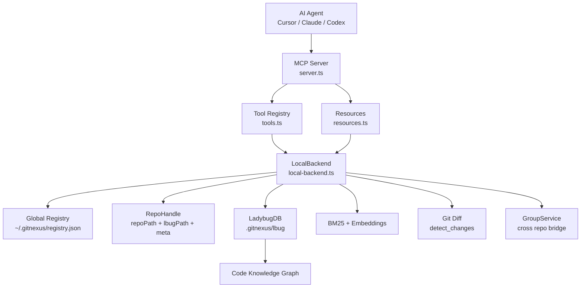
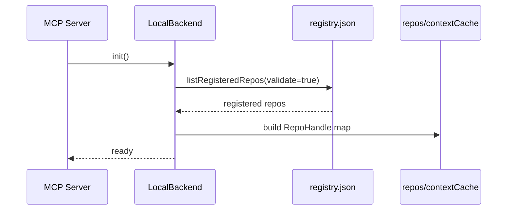
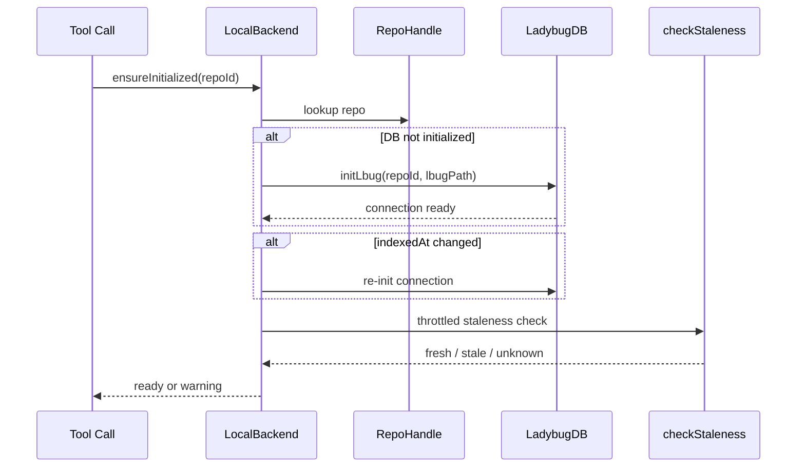

---
type: implementation-note
status: codex-generated
source:
  - gitnexus/src/mcp/local/local-backend.ts
  - gitnexus/src/mcp/local/registry.ts
  - gitnexus/src/mcp/local/staleness.ts
tags:
  - gitnexus
  - mcp
  - localbackend
  - agent
---

# LocalBackend 工具执行层实现

> 关联：[[MCP Server 实现]]、[[工具层如何设计 Prompt]]、[[Query 与 Context 如何实现]]、[[Impact 影响分析实现]]、[[Detect Changes 提交前影响验证实现]]

`LocalBackend` 是 GitNexus MCP 工具真正落地执行的核心类。MCP Server 负责协议层注册工具、资源、Prompt，而 `LocalBackend` 负责把一次工具调用变成对本地 `.gitnexus/lbug` 图数据库、全局 registry、group bridge、git diff 和搜索索引的实际查询。

如果把 GitNexus 看成 Agent 的代码情报系统：

- MCP Server 是“对外接口层”。
- Tool descriptions 是“工具说明书”。
- `LocalBackend` 是“工具执行引擎”。
- LadybugDB 是“知识图谱存储”。
- registry 是“本机已索引仓库目录”。

## 一句话定义

`LocalBackend` 把 Agent 发来的结构化 MCP tool call，路由到本地已索引仓库，懒加载 LadybugDB，检查索引新鲜度，并执行 `query/context/impact/detect_changes/rename/route_map/shape_check/tool_map/api_impact` 等代码智能操作。

它不是简单的 controller，而是一个带有仓库解析、资源生命周期、降级策略、跨仓库桥接和安全保护的本地代码情报后端。

## 文件入口

核心源码在：

```text
gitnexus/src/mcp/local/local-backend.ts
```

相关文件：

```text
gitnexus/src/mcp/server.ts                 # MCP Server 协议层
gitnexus/src/mcp/tools.ts                  # tool schema + WHEN TO USE prompt
gitnexus/src/mcp/resources.ts              # MCP resource 定义
gitnexus/src/mcp/local/registry.ts         # 全局仓库注册表
gitnexus/src/mcp/local/staleness.ts        # 索引新鲜度检查
gitnexus/src/mcp/local/group-service.ts    # group 模式服务
gitnexus/src/mcp/local/rename.ts           # rename 实现
```

## 在整体架构中的位置



这张图的重点是：Agent 并不直接查数据库，也不直接读源码；它只调用 MCP 工具。工具进入 `LocalBackend` 后，才会被解析到具体仓库和具体查询实现。

## 核心职责分层

`LocalBackend` 可以分成 6 层看：

| 层级 | 主要方法 | 做什么 |
|---|---|---|
| 仓库发现层 | `init()`、`refreshRepos()`、`listRepos()` | 从全局 registry 加载已索引仓库 |
| 仓库解析层 | `resolveRepo()` | 根据 repo name/path/id/partial 匹配目标仓库 |
| 生命周期层 | `ensureInitialized()` | 懒加载 LadybugDB、检查 meta 变化、做 staleness 检查 |
| 工具路由层 | `callTool()` | 把 MCP method 分发到 query/context/impact 等实现 |
| 查询执行层 | `query()`、`context()`、`impact()`、`cypher()` | 执行图查询、搜索、影响分析 |
| 安全与诊断层 | stale warning、FTS degraded warning、ambiguous candidates | 防止 Agent 在错误上下文里盲改 |

## RepoHandle：本地仓库句柄

`LocalBackend` 内部维护一个 `Map<string, RepoHandle>`。每个 `RepoHandle` 对应一个已索引仓库，包含：

```text
id
name
repoPath
lbugPath
indexedAt
lastCommit
remoteUrl
stats
```

这个设计避免每次工具调用都重新扫描文件系统。`LocalBackend` 先从 registry 读到仓库元信息，再按需打开图数据库。

## init 与 refreshRepos

初始化入口是 `init()`，内部会调用 `refreshRepos()`。

逻辑大致是：



几个关键点：

- registry 是全局发现机制，不是每次从当前目录猜。
- `validate: true` 会过滤掉不存在或不可用的索引路径。
- `contextCache` 用来缓存 repo overview/resource 相关内容。
- 后续 `resolveRepo()` 失败或发现歧义时，会再次 `refreshRepos()`，避免 registry 被外部更新后后端还用旧缓存。

## resolveRepo：Agent 的 repo 参数如何落到具体仓库

MCP 工具通常允许传入 `repo`。`LocalBackend.resolveRepo()` 负责把这个参数解析成唯一仓库。

支持的匹配方式包括：

| 输入 | 解析方式 |
|---|---|
| 不传 repo | 如果只有一个仓库，默认使用它 |
| repo id | 精确匹配 |
| repo name | 精确匹配仓库名 |
| repo path | 精确匹配路径 |
| partial | 在已注册仓库中做部分匹配 |
| 重名仓库 | 返回歧义提示，而不是随便选一个 |

这里体现出 Agent 工具设计的一条重要原则：不确定时返回结构化歧义，而不是猜。

对于重名仓库，`LocalBackend` 还会结合 remoteUrl 检测 sibling clone drift，也就是同一个远端仓库的多个本地 clone 是否索引状态不一致。这对 Agent 很重要，因为它可能在错误 clone 上做影响分析。

## ensureInitialized：懒加载与新鲜度检查

`ensureInitialized(repoId)` 是工具调用前的关键保护层。

它做几件事：

1. 如果这个 repo 的 LadybugDB 还没打开，则调用 `initLbug(repoId, handle.lbugPath)`。
2. 如果 registry 里的 `meta.indexedAt` 和 handle 中记录不一致，说明索引被重新生成过，需要重新初始化。
3. 对每个 repo 做节流的新鲜度检查，避免每次 tool call 都跑 git 检查。
4. 如果索引 stale，会把 warning 透传给工具结果或日志，让 Agent 知道“图谱可能不是最新代码”。

时序图：



## callTool：统一工具路由

`callTool(method, params)` 是 MCP tool execution 的总入口。

核心分发逻辑：

```text
list_repos
  -> listRepos()

group_* tools
  -> handleGroupTool()

impact/query/context with repo="@group"
  -> callToolAtGroupRepo()

normal repo tools
  -> resolveRepo()
  -> ensureInitialized()
  -> switch method
```

工具映射：

| MCP method | LocalBackend 方法 | 说明 |
|---|---|---|
| `query` | `query()` | 混合搜索 + 流程聚合 |
| `context` | `context()` | 单符号 360 度上下文 |
| `impact` | `impact()` | 上游/下游影响分析 |
| `detect_changes` | `detectChanges()` | diff 到符号，再映射流程 |
| `rename` | `rename()` | 图谱 + 文本搜索协同重命名 |
| `cypher` | `cypher()` | 直接执行图查询 |
| `route_map` | `routeMap()` | API 路由消费者映射 |
| `shape_check` | `shapeCheck()` | API response shape 对齐检查 |
| `tool_map` | `toolMap()` | MCP/RPC tool 定义映射 |
| `api_impact` | `apiImpact()` | API route 修改前影响报告 |

旧工具名也保留了兼容：

```text
search  -> query
explore -> context
overview -> overview
```

这说明 GitNexus 的工具层是演进式设计：对 Agent 暴露的是稳定语义，不要求所有客户端一次性迁移。

## group repo 路由

当 `repo` 以 `@` 开头，比如：

```json
{
  "repo": "@my-group/api-gateway"
}
```

`LocalBackend` 不会走普通单仓库路径，而是进入 group 逻辑：

```text
callTool()
  -> callToolAtGroupRepo()
  -> GroupService
  -> group bridge / member repo backend
```

这让 `query/context/impact` 能在 group 模式下跨仓库工作，而不是额外暴露一套 `group_query`、`group_context`、`group_impact` 工具。AGENTS.md 里也记录了旧 group tools 被移除，推荐使用 `repo: "@<group>"`。

## 为什么要把逻辑放在 LocalBackend，而不是 MCP Server

MCP Server 最好保持薄：

- 注册 tool schema。
- 注册 resource。
- 处理 JSON-RPC transport。
- 调用 backend。

而 `LocalBackend` 承担本地工程知识相关复杂度：

- 仓库发现。
- DB 初始化。
- 图查询。
- 搜索降级。
- staleness warning。
- group fan-out。
- git diff 映射。

这样协议层和业务层分离。后续 HTTP bridge、Web UI 或 CLI 也可以复用类似 backend 能力，而不是重复实现一遍图查询逻辑。

## 与 Agent 工作流的关系

`LocalBackend` 本身不写 prompt，但它是 prompt 约束能执行的前提。

例如工具描述里写：

```text
WHEN TO USE: Before making code changes...
AFTER THIS: Review d=1 items...
```

AGENTS.md 写：

```text
MUST run impact analysis before editing any symbol.
```

这些规则最终都会落到：

```text
Agent -> MCP tool call -> LocalBackend.callTool("impact") -> _runImpactBFS()
```

所以 GitNexus 的 Agent 编排不是单纯“提示词提醒”，而是“提示词 + 结构化工具 + 可执行后端”的组合。

## 设计亮点

### 1. 懒加载而不是启动时全量打开

MCP Server 启动时不必打开所有仓库的 DB。只有具体工具调用命中某个 repo 时，`ensureInitialized()` 才打开对应 LadybugDB。这降低了启动成本，也适合多仓库 registry。

### 2. repo 歧义显式返回

对于多个同名仓库，后端不会随便挑一个。它会返回候选，让 Agent 或用户指定更精确的 repo。这比普通脚本的 cwd 猜测更适合 Agent，因为 Agent 一旦猜错，后面所有影响分析都会错。

### 3. degraded warning 不让失败变成沉默

`query()` 中如果 FTS 索引缺失，会返回 warning：

```text
FTS indexes are missing; results used semantic search only...
```

这类 warning 对 Agent 非常重要。它让 Agent 知道“结果可能不完整”，而不是把降级结果当成完整事实。

### 4. group 能力复用单仓库工具

跨仓库不是平行造一套工具，而是让普通工具接受 `repo: "@group"`。这保持了工具认知模型稳定：Agent 学会 `impact/query/context`，就能自然升级到 group 模式。

### 5. 结构化错误适合 Agent 处理

`impact()`、`context()` 遇到 not_found 或 ambiguous 不直接抛异常，而是返回结构化状态：

```text
status: "not_found" | "ambiguous" | "found"
candidates: [...]
```

这比纯文本错误更适合 Agent 做下一步决策。

## 可讲给程序员听的总结

`LocalBackend` 是 GitNexus MCP 体系里的“执行内核”。它把 Agent 的工具请求从协议世界带到本地代码知识图谱世界：先解析仓库，再保证数据库可用，再执行图遍历、混合搜索、影响分析或 diff 映射，最后返回结构化结果。它解决的不是“怎么把结果展示给人”，而是“怎么让 Agent 可靠地拿到当前仓库的工程上下文”。