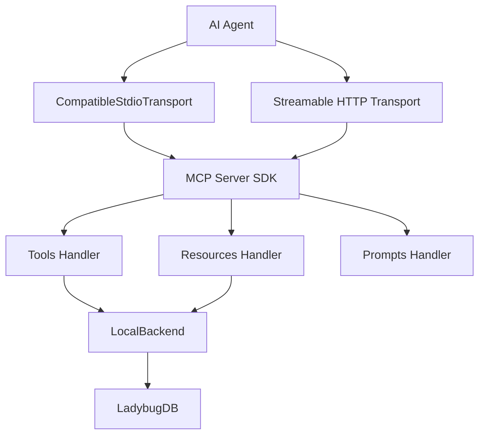

# MCP Resources 与 Transport 协议实现

MCP 层把 LadybugDB 里的图谱能力暴露给 AI Agent。除了 Tools，GitNexus 还实现了 Resources、Prompts，以及两种 transport：STDIO 和 Streamable HTTP。

## 源码入口

| 文件 | 职责 |
|---|---|
| `gitnexus/src/mcp/server.ts` | MCP Server 注册 Tools / Resources / Prompts |
| `mcp/compatible-stdio-transport.ts` | STDIO transport，兼容 Content-Length 和 newline framing |
| `server/mcp-http.ts` | Streamable HTTP MCP endpoint |
| `mcp/resources.ts` | MCP resources 和 resource templates |
| `mcp/prompts.ts` | prompt 模板 |
| `mcp/tools.ts` | tool definition 和 description |
| `mcp/local/local-backend.ts` | 后端实现 |
| `mcp/stdio-context.ts`、`stdio-capture.ts` | stdout 哨兵和写入上下文 |

## Transport 总图

## STDIO framing

`compatible-stdio-transport.ts` 支持 Content-Length 和 newline 两种 framing。实现会从输入 buffer 前几个字节判断 framing：如果看到 `Content-Length:`，按 header 读取 body；否则尝试 newline JSON。buffer 最大 10MB，防止无界增长。响应写 stdout 时会用 `withMcpWrite` 标记写入上下文，配合 stdout 哨兵防止第三方库日志污染协议流。

## stdout 哨兵

STDIO MCP 最怕普通日志写到 stdout，因为 stdout 是协议通道。GitNexus 通过 `stdio-context.ts` 和 `stdio-capture.ts` 包装 stdout：只有 MCP transport 自己标记的写入能进入 stdout，普通日志会被重定向到 stderr，并做截断和限流。

## Resources 设计

| URI | 用途 |
|---|---|
| `gitnexus://repos` | 列出 indexed repos |
| `gitnexus://setup` | MCP/setup 指南 |
| `gitnexus://repo/{name}/context` | 仓库概览和索引新鲜度 |
| `gitnexus://repo/{name}/clusters` | 功能社区列表 |
| `gitnexus://repo/{name}/processes` | 执行流列表 |
| `gitnexus://repo/{name}/schema` | 图谱 schema |
| `gitnexus://repo/{name}/cluster/{id}` | 单个社区详情 |
| `gitnexus://repo/{name}/process/{name}` | 单个执行流 trace |
| `gitnexus://group/{name}/contracts` | group contract registry |
| `gitnexus://group/{name}/status` | group 状态 |

## Resources 和 Tools 的区别

Tools 适合需要参数、会计算、返回结构化结果的动作，比如 query/context/impact。Resources 适合仓库背景、schema、流程列表、cluster 列表等上下文资源。Prompts 则适合固定工作流或指导模板。

## Streamable HTTP

HTTP MCP 由 `server/mcp-http.ts` 挂到 `/api/mcp`。STDIO 适合本地编辑器进程直接启动 CLI；HTTP 适合 `gitnexus serve` 暴露服务，客户端按 session 连接。

## 讲解抓手

> MCP 层不是只注册几个函数。GitNexus 通过 transport 兼容、stdout 哨兵、resources/templates、prompts 和 LocalBackend，把本地图谱能力包装成 Agent 可稳定调用的协议接口。
