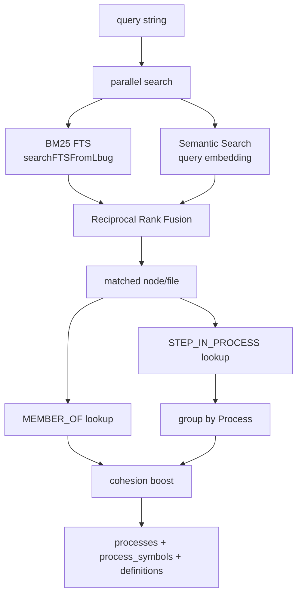
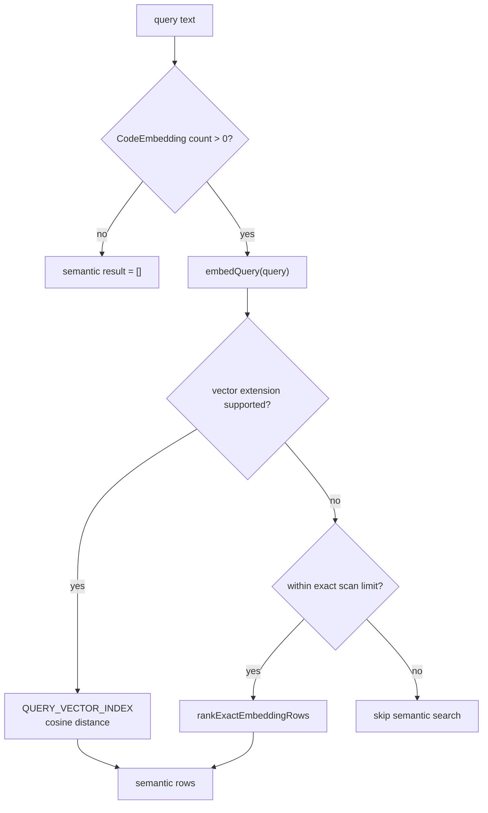
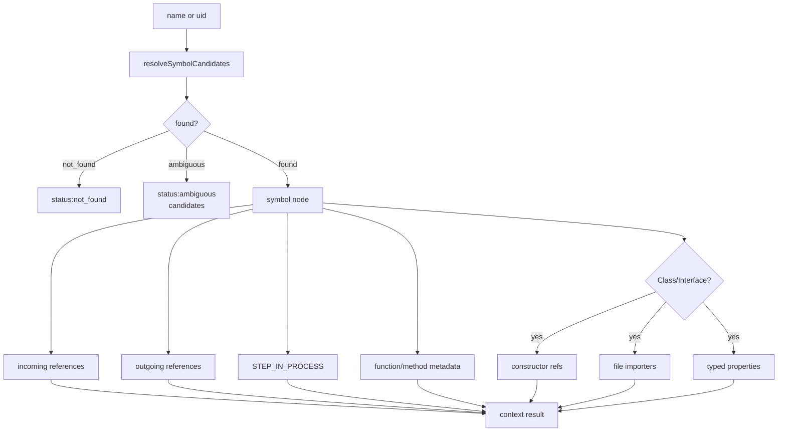
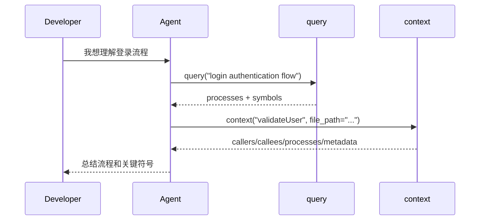

---
type: implementation-note
status: codex-generated
source:
  - gitnexus/src/mcp/local/local-backend.ts
  - gitnexus/src/core/search/bm25-index.ts
  - gitnexus/src/core/embedder.ts
tags:
  - gitnexus
  - query
  - context
  - mcp
---

# Query 与 Context 如何实现

> 关联：[[LocalBackend 工具执行层实现]]、[[工具层如何设计 Prompt]]、[[图谱 Schema 速览]]、[[Agent 工作流]]

GitNexus 给 Agent 的两个基础理解工具是 `query` 和 `context`：

- `query` 用来从自然语言或关键词出发，找到相关执行流、符号和定义。
- `context` 用来围绕一个确定符号，查看它的调用方、被调用方、继承关系、字段访问和参与的流程。

可以把二者的关系理解为：

```text
query   = 从问题到候选流程
context = 从一个符号到完整上下文
impact  = 从一个改动点到影响面
```

## 一句话定义

`query` 是“搜索 + 流程聚合”工具；`context` 是“单符号图谱展开”工具。前者解决“我应该看哪里”，后者解决“这个东西和谁有关”。

## Query 的实现主线

源码入口在 `LocalBackend.query()`。

代码注释中已经把它拆成四步：

1. Hybrid search：BM25 + semantic search 找匹配符号。
2. Trace to processes：把匹配符号映射到 `STEP_IN_PROCESS` 所属流程。
3. Group and rank：按流程聚合，结合相关度和社区 cohesion 排序。
4. Return：返回 `processes`、`process_symbols`、`definitions`。

流程图：



## Query 输入参数

常见参数：

| 参数 | 作用 |
|---|---|
| `query` | 必填，自然语言或关键词 |
| `repo` | 指定仓库，group 模式可传 `@group` |
| `limit` | 返回流程数量，默认 5 |
| `max_symbols` | 每个流程最多返回多少符号，默认 10 |
| `include_content` | 是否带源码片段 |
| `goal` | 辅助排序或意图描述 |
| `task_context` | 当前任务背景 |

关键点：`query` 不是简单文件搜索，它的返回目标不是“文本片段列表”，而是“执行流程和流程里的符号”。

## BM25 搜索实现

`bm25Search()` 动态导入：

```text
../../core/search/bm25-index.js
```

然后调用：

```text
searchFTSFromLbug(query, limit, repo.id)
```

BM25 命中后优先使用 FTS 返回的 `nodeIds`。如果没有 node id，则按 filePath 回退查找该文件里的前几个符号。

这说明 GitNexus 的 FTS 不是普通全文搜索结果，它会尽量把搜索命中绑定回图谱节点，后续才能继续走 `STEP_IN_PROCESS` 和 `MEMBER_OF`。

### FTS 降级

如果 FTS 索引缺失，`query()` 不会直接失败，而是：

- 继续尝试 semantic search。
- 设置 `ftsUsed = false`。
- 在结果中返回 warning。

这类 degraded warning 是面向 Agent 的安全设计：告诉 Agent 当前结果不是完整能力下的结果。

## Semantic Search 实现

`semanticSearch()` 会先检查 `CodeEmbedding` 表是否有数据。没有嵌入时，直接返回空结果，不加载模型。

如果有嵌入：

1. 调用 `embedQuery()` 生成查询向量。
2. 检查维度是否匹配。
3. 如果 vector extension 可用，用向量索引查询。
4. 如果 vector extension 不可用，并且数据量小于 exact scan 上限，则回退为精确扫描。
5. 使用 cosine distance，并设置距离阈值。

简化流程：



这和普通 RAG 的差异很明显：语义搜索只是候选召回的一部分，不是最终答案。命中的节点还会继续映射到流程和社区。

## RRF 融合排序

BM25 和 semantic 结果通过 Reciprocal Rank Fusion 融合。

代码中的分数形式是：

```text
score += 1 / (60 + rankIndex)
```

RRF 的好处是：

- 不要求 BM25 分数和向量距离在同一尺度。
- 排名靠前的结果自然加权更高。
- 两路都命中的节点会得到更高总分。

这是一种非常适合混合搜索的工程折中：稳定、简单、无需训练。

## Query 如何从符号变成流程

对于融合后的每个命中项，`query()` 会查询：

```cypher
MATCH (n {id: $nodeId})-[r:CodeRelation {type:'STEP_IN_PROCESS'}]->(p:Process)
RETURN p.id, p.heuristicLabel, p.processType, p.stepCount, r.step
```

如果符号属于某个执行流，就把它聚合到该流程下。

如果命中项没有 nodeId，或者找不到流程，就进入 `definitions`。这通常用于：

- 文件级命中。
- 独立类型定义。
- 不在流程中的工具函数。

## Query 如何使用社区信息

对每个命中节点还会查：

```cypher
MATCH (n {id:$nodeId})-[:CodeRelation {type:'MEMBER_OF'}]->(c:Community)
RETURN c.cohesion, c.heuristicLabel
```

排序时会把社区 cohesion 做一个 boost。

这背后的思想是：如果一个命中节点处在一个高内聚模块里，那么围绕这个节点的流程更可能代表一个完整功能，而不是偶然文本命中。

## Query 返回结构

返回结构大致包含：

```text
processes:
  - id
    name / heuristicLabel
    processType
    stepCount
    score

process_symbols:
  - processId
    symbols:
      - id
        name
        type
        filePath
        line
        step
        score

definitions:
  - id/filePath/name/type/score

warning:
  - FTS degraded 等
```

对 Agent 来说，`query` 的结果已经被组织成“可以继续探索的路线图”：先看哪个流程，再看流程中的哪个符号。

## Context 的实现主线

`context` 的目标不是搜索，而是围绕一个具体 symbol 做图展开。

源码入口是：

```text
LocalBackend.context()
LocalBackend._contextImpl()
```

执行主线：



## Symbol 解析：为什么需要 candidates

`context` 支持通过 `uid` 或 `name` 查找。

如果传 `uid`，可以唯一定位。

如果传 `name`，可能出现：

- 多个文件里都有 `validateUser`。
- 函数和方法同名。
- 类和接口同名。
- 测试文件和生产文件同名。

所以 `resolveSymbolCandidates()` 会结合：

- `file_path`
- `kind`
- 名称匹配
- 评分

最终可能返回：

```text
status: ambiguous
candidates:
  - uid
    name
    kind
    filePath
    line
    score
```

这对 Agent 特别重要：在不确定时应该要求更精确定位，而不是盲查第一个。

## Incoming references

`context` 查 incoming 时使用一组关系类型：

```text
CALLS
IMPORTS
EXTENDS
IMPLEMENTS
USES
HAS_METHOD
HAS_PROPERTY
METHOD_OVERRIDES
OVERRIDES
METHOD_IMPLEMENTS
ACCESSES
```

它查询“谁指向当前符号”：

```cypher
MATCH (caller)-[r:CodeRelation]->(n {id:$symId})
WHERE r.type IN [...]
RETURN r.type, caller.id, caller.name, caller.filePath, labels(caller)[0]
```

这回答：

- 谁调用它？
- 谁导入它？
- 谁继承它？
- 谁实现它？
- 谁访问它？
- 哪个类拥有这个方法或属性？

## Outgoing references

Outgoing 是反方向：

```cypher
MATCH (n {id:$symId})-[r:CodeRelation]->(target)
WHERE r.type IN [...]
RETURN r.type, target.id, target.name, target.filePath, labels(target)[0]
```

这回答：

- 它调用谁？
- 它依赖哪些文件？
- 它访问哪些字段？
- 它继承或实现谁？
- 它属于哪个类或社区？

## Class / Interface 的特殊扩展

如果目标是 `Class` 或 `Interface`，`context` 会额外做几类展开。

### 1. Constructor references

类本身被调用时，很多语言实际调用的是构造函数。代码会查类通过 `HAS_METHOD` 连接的 `Constructor`，再找指向构造函数的 incoming refs。

这能避免“查类没有调用方，但其实构造函数被很多地方 new 了”的漏报。

### 2. File importers

类通常由文件导出。代码会先找定义该类的 File，再找导入该 File 的调用方。

这能补上文件级 import 和符号级引用之间的差异。

### 3. Typed properties

如果某些 `Property.declaredType` 是这个类，或者包含泛型形式：

```text
User
User<T>
List<User>
```

`context` 会把这些 typed properties 找出来，并加入相关引用。

这体现出 GitNexus 不只看 `CALLS`，还把类型关系也纳入上下文。

## Process participation

`context` 会查询当前符号参与了哪些流程：

```cypher
MATCH (n {id:$symId})-[r:CodeRelation {type:'STEP_IN_PROCESS'}]->(p:Process)
RETURN p.id, p.heuristicLabel, r.step, p.stepCount
```

这回答：

- 这个函数在哪些执行流中出现？
- 是第几步？
- 所在流程有多长？

对 Agent 来说，这比“谁调用它”更接近业务语义。一个函数可能有很多调用方，但只有某些调用方在用户要改的业务流程里。

## Metadata 展开

对于 `Function`、`Method`、`Constructor`，`context` 还会读取元数据：

```text
visibility
isStatic
isAbstract
isFinal
isVirtual
isOverride
isAsync
isPartial
returnType
parameterCount
requiredParameterCount
parameterTypes
annotations
```

这些字段让 Agent 在重构或改签名时更安全：

- `isOverride` 表示可能受继承约束。
- `isAsync` 表示调用方可能需要 await。
- `parameterTypes` 可辅助 overload 区分。
- `annotations` 可辅助框架语义判断。

## Context 返回结构

结果通常包含：

```text
status: found
symbol:
  uid/name/type/filePath/line/content?
incoming:
  calls/imports/extends/implements/accesses/...
outgoing:
  calls/imports/extends/implements/accesses/...
typed_properties?
processes:
  - process name
    step
metadata:
  - function/method flags
```

注意：incoming/outgoing 会按关系类型分组。这是面向 Agent 的结构化结果，不是长文本解释。

## Query 和 Context 的协作方式

推荐工作流：



修改代码前则继续接 `impact`：

```text
query -> context -> impact -> edit -> detect_changes
```

## 为什么这比 grep 更适合 Agent

`grep` 返回的是文本行，Agent 还要自己判断：

- 这是定义还是调用？
- 是同名函数还是目标函数？
- 调用是否跨文件？
- 属于哪个业务流程？
- 影响哪些模块？

GitNexus 的 `query/context` 返回的是图谱结构：

- 符号有类型。
- 关系有方向。
- 调用和继承是边。
- 流程是 `Process`。
- 模块是 `Community`。
- 不确定时返回 candidates。

所以它不是“搜索更多文本”，而是“把搜索结果提升为工程上下文”。

## 边界与注意点

1. `query` 的召回依赖 FTS 和嵌入索引。如果 FTS 缺失或嵌入未生成，结果会降级。
2. `context` 的准确度依赖索引新鲜度。代码改了但未重新 analyze，图谱会落后。
3. 静态分析对动态调用、反射、字符串拼接路由、运行时 monkey patch 会有边界。
4. `context(name)` 可能歧义，最好结合 `file_path` 或直接使用 `uid`。
5. `include_content` 会增加返回体积，Agent 上下文预算有限时应谨慎使用。

## 技术分享中的讲法

可以这样讲：

> Query 负责把自然语言问题映射到流程，Context 负责把一个符号展开成关系网络。它们共同完成了 Agent 编程里的“先定位、再理解”。和普通 RAG 不同，GitNexus 不把代码片段直接喂给模型，而是先把命中结果绑定到 KnowledgeGraph 节点，再通过 `STEP_IN_PROCESS` 和 `MEMBER_OF` 还原工程语义。