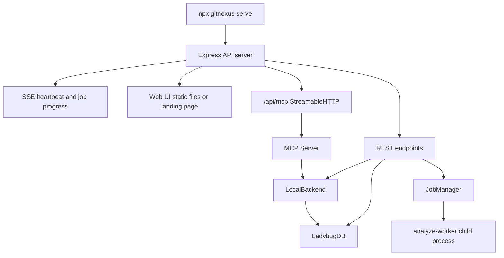
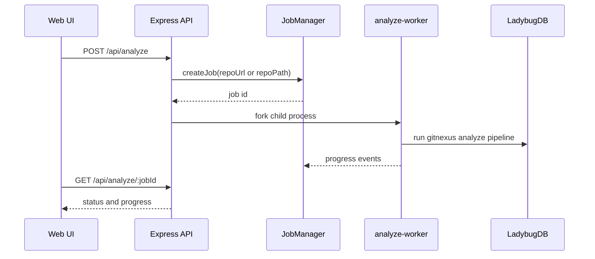
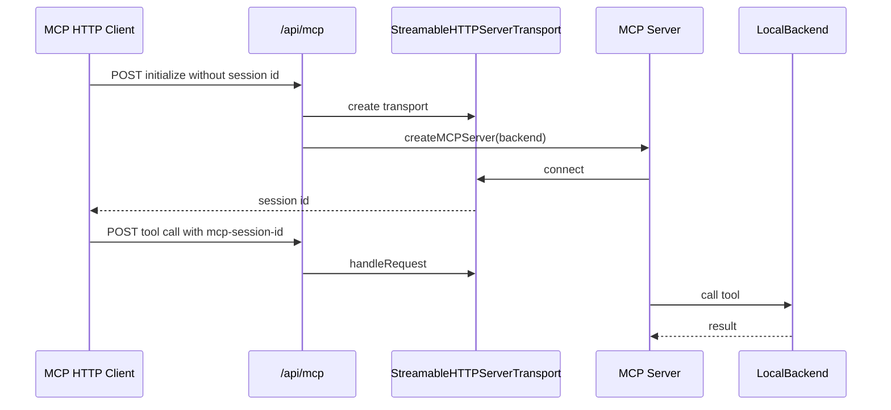

---
type: implementation-note
status: codex-generated
source:
  - gitnexus/src/server/api.ts
  - gitnexus/src/server/analyze-job.ts
  - gitnexus/src/server/analyze-worker.ts
  - gitnexus/src/server/mcp-http.ts
  - gitnexus/src/server/validation.ts
  - gitnexus/src/cli/serve.ts
tags:
  - gitnexus
  - http-api
  - serve
  - web-ui
  - mcp-http
---

# HTTP API 与 Serve 后端实现

> 关联：[[Web UI 实现原理]]、[[浏览器端 Graph RAG Agent]]、[[LocalBackend 工具执行层实现]]、[[MCP Server 实现]]

`gitnexus serve` 启动的是 GitNexus 的本地 HTTP 后端。它既服务 Web UI，也暴露 REST API，还把 MCP Server 挂到 `/api/mcp`，让远程或浏览器环境可以通过 StreamableHTTP 使用同一套图谱工具。

## 一句话定义

HTTP API Serve 层是 GitNexus 的浏览器后端和远程工具桥：它把 `.gitnexus/lbug` 中的本地图谱通过 REST、SSE、graph stream 和 MCP-over-HTTP 暴露出来，同时负责仓库选择、查询验证、后台 analyze/embed job、CORS、本地安全边界和静态 Web UI fallback。

## 源码入口

核心文件：

```text
gitnexus/src/server/api.ts
gitnexus/src/server/analyze-job.ts
gitnexus/src/server/analyze-worker.ts
gitnexus/src/server/mcp-http.ts
gitnexus/src/server/validation.ts
gitnexus/src/cli/serve.ts
```

Web 客户端对应：

```text
gitnexus-web/src/services/backend-client.ts
gitnexus-web/src/hooks/useBackend.ts
```

## 整体架构



这层的重点是：Web UI 和 HTTP MCP 都不是绕过 GitNexus 的另一个实现，而是复用同一份本地图谱和后端能力。

## CORS 与绑定策略

`api.ts` 注释明确说明：

```text
Security: binds to localhost by default
CORS is restricted to localhost, private/LAN networks, and deployed site
```

允许的 Origin：

- 无 Origin 的非浏览器请求。
- `localhost`。
- `127.0.0.1`。
- `[::1]`。
- RFC1918 私有网段：
  - `10.0.0.0/8`
  - `172.16.0.0/12`
  - `192.168.0.0/16`
- `https://gitnexus.vercel.app`

这体现了 GitNexus 的默认安全假设：本地优先，允许局域网或托管前端连接，但不默认暴露公网。

## Web UI 静态资源与 fallback

Serve 层会尝试解析 Web UI dist：

```text
resolveWebDistDir(primaryDir, fallbackDir)
```

搜索顺序：

1. `GITNEXUS_WEB_DIST` 环境变量。
2. primary dist。
3. fallback dist。

如果找到 `index.html`：

- 通过 `express.static` 服务静态资源。
- HTML 设置 `Cache-Control: no-cache`。
- JS/CSS 等静态资源设置长期 immutable cache。
- SPA fallback 用正则排除 `/api` 和带扩展名的 asset 路径。

如果没找到 Web UI，会返回一个内置 landing page，提示 API server 正在运行，并列出 `/api/info`、`/api/repos`、`/api/mcp` 等端点。

## API endpoint 速览

从 `api.ts` 中可以看到主要路由：

| Endpoint | 方法 | 作用 |
|---|---|---|
| `/api/health` | GET | 健康检查 |
| `/api/heartbeat` | GET | SSE 心跳 |
| `/api/info` | GET | 服务版本和上下文 |
| `/api/repos` | GET | 已注册仓库列表 |
| `/api/repo` | GET | 当前或指定仓库信息 |
| `/api/repo` | DELETE | 移除仓库 |
| `/api/graph` | GET | 图谱节点和边 stream/query |
| `/api/query` | POST | 执行 Cypher 查询 |
| `/api/search` | POST | 搜索 |
| `/api/file` | GET | 读取文件 |
| `/api/grep` | GET | 正则/文本搜索 |
| `/api/processes` | GET | 流程列表 |
| `/api/process` | GET | 单流程详情 |
| `/api/clusters` | GET | 社区列表 |
| `/api/cluster` | GET | 单社区详情 |
| `/api/analyze` | POST | 启动索引任务 |
| `/api/analyze/:jobId` | GET | 查询 analyze job |
| `/api/analyze/:jobId` | DELETE | 取消 analyze job |
| `/api/embed` | POST | 启动 embedding job |
| `/api/embed/:jobId` | GET | 查询 embedding job |
| `/api/embed/:jobId` | DELETE | 取消 embedding job |
| `/api/mcp` | ALL | MCP over StreamableHTTP |

## `/api/heartbeat`

这是给 Web UI 判断后端连接状态用的 SSE 端点。

行为：

- 前端用 `EventSource` 或 fetch SSE 连接。
- 后端定期发送 SSE comment 心跳。
- 前端断线后显示 reconnecting 状态。
- 适合检测本地 `gitnexus serve` 是否仍在运行。

这和 analyze job progress 不同：heartbeat 只是连接活性，不携带业务数据。

## `/api/graph`

`/api/graph` 是 Web UI 图谱可视化的数据入口。

Serve 层会从 LadybugDB 查询 graph nodes 和 relationships，并将结果返回给前端。

相关类型：

```text
GraphStreamRecord =
  | { type: 'node'; data: GraphNode }
  | { type: 'relationship'; data: GraphRelationship }
  | { type: 'error'; error: string }
```

设计点：

- 图谱可能很大，不能简单一次性全塞给浏览器。
- 查询错误如表不存在、索引为空等被归类为 ignorable graph query error。
- 前端拿到后再用 Sigma 做可视化。

## `/api/query`

`/api/query` 执行 Cypher 查询。

服务端会做：

- 参数验证。
- 查询参数合法性检查。
- 调用 LadybugDB query adapter。
- 返回 rows。

Web Graph RAG Agent 的 `cypher` tool 就走这个 endpoint。

## `/api/search`

搜索端点会调用：

```text
searchFTSFromLbug
hybridSearch
```

并支持 enriched search，给前端 Agent 的 search tool 提供：

- nodeId。
- filePath。
- score。
- sources。
- connections。
- cluster。
- processes。

这让浏览器 Agent 不需要自己写复杂 Cypher join，也能拿到一跳图谱上下文。

## `/api/file` 与 `/api/grep`

这两个端点让浏览器 Agent 能回到源代码：

- `read` tool 走 `/api/file`。
- `grep` tool 走 `/api/grep`。

安全点：

- `assertSafePath()` 防路径穿越。
- `assertString()` 防 query 参数类型混淆。
- `escapeRegExp()` 防正则注入。
- `createRouteLimiter()` 对文件系统相关路由做限流。

## Analyze JobManager

源码：

```text
gitnexus/src/server/analyze-job.ts
```

`JobManager` 用于管理后台分析任务。

特性：

| 机制 | 说明 |
|---|---|
| in-memory Map | 记录 job 状态 |
| single-slot concurrency | 同一时间只允许一个 active job |
| same-repo dedupe | 同一 repo 重复请求返回已有 job |
| child process tracking | 注册 analyze worker 子进程 |
| progress EventEmitter | SSE relay 的基础 |
| timeout | 30 分钟超时 |
| TTL cleanup | 完成或失败 1 小时后清理 |
| cancel | DELETE job 时发送 SIGTERM |

## Analyze 时序



## MCP over HTTP

源码：

```text
gitnexus/src/server/mcp-http.ts
```

它把 GitNexus MCP Server 挂到：

```text
/api/mcp
```

关键设计：

- 使用 `StreamableHTTPServerTransport`。
- 每个客户端一个 MCP session。
- session id 来自 `mcp-session-id` header。
- 新 client 通过 POST 初始化。
- 过期或未知 session 返回 JSON-RPC error。
- session 30 分钟 idle 后清理。
- `LocalBackend` 在所有 session 之间共享。

流程：



## validation.ts 的安全边界

`validation.ts` 处理三类常见问题：

### 参数类型混淆

Express query 参数可能是 string、array、object。`assertString()` 强制某个参数必须是单个 string。

### 路径穿越

`assertSafePath(rawPath, root)`：

- 拒绝空路径。
- 拒绝 null byte。
- resolve 后必须仍在 root 内。

### 正则注入

`escapeRegExp()` 用于 literal grep 模式。

### 限流

`createRouteLimiter()` 默认 60 requests / minute / IP。用于 FS-touching 或 job-triggering endpoint。

## 与 Web 前端的关系

前端统一通过：

```text
gitnexus-web/src/services/backend-client.ts
```

访问后端。

它提供：

- backend URL 设置与校验。
- resilient fetch。
- SSE stream helper。
- repos/query/search/file/grep/analyze/embed API。

`useBackend.ts` 负责：

- 从 localStorage 读取 backend URL。
- 初始 probe。
- 断连时轮询。
- tab visibility 恢复后立即 probe。

## 设计亮点

### 1. Web UI 和 MCP HTTP 共用 LocalBackend

这避免 Web 和 Agent 两套代码智能逻辑分叉。

### 2. 后台 job 用子进程隔离

`analyze` 可能很重，放在 child process 中更适合取消、超时和隔离崩溃。

### 3. 本地安全边界清晰

路径、Origin、限流、URL scheme、CORS 都有显式约束。

### 4. API 降级友好

Web dist 不存在时仍提供 landing page；FTS/graph 查询缺失时有容错；MCP session 过期返回可恢复错误。

## 技术分享讲法

可以这样讲：

> `gitnexus serve` 是 GitNexus 从 CLI 工具变成可交互系统的桥。它一边给 React Web UI 提供 graph/search/file/job API，一边把同一个 MCP Server 挂成 `/api/mcp`，让浏览器、远程工具和 AI 客户端都能使用本地图谱能力。它的重点不是业务 UI，而是把本地代码知识图谱安全地、多协议地暴露出来。