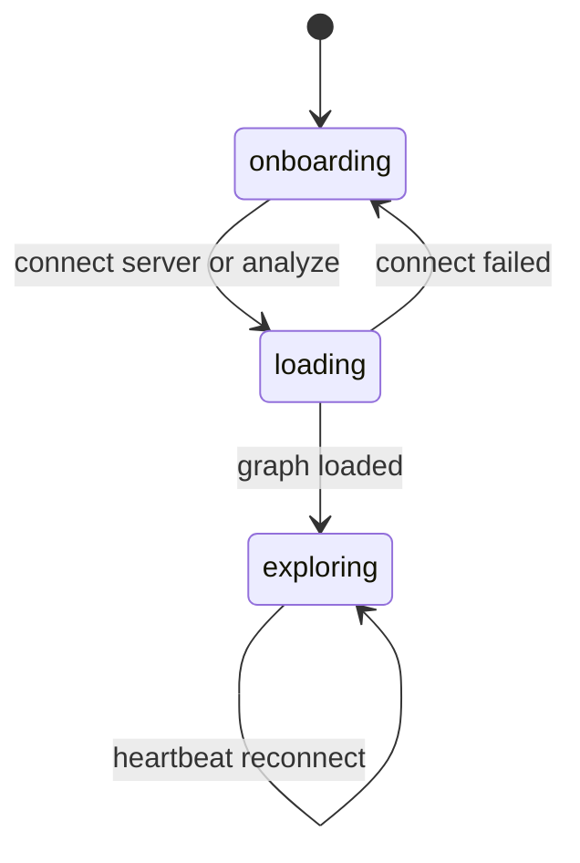

# Web UI 前端组件与图可视化实现

GitNexus Web UI 是一个 React/Vite SPA，通过 `gitnexus serve` 的 HTTP API 读取 LadybugDB 图谱，并用 Sigma/Graphology 做可视化，同时提供 AI 聊天和代码引用面板。

## 源码入口

| 文件/目录 | 职责 |
|---|---|
| `gitnexus-web/src/App.tsx` | 应用编排、连接后端、心跳、视图切换 |
| `components/GraphCanvas.tsx` | Sigma 图画布、节点选择、过滤、高亮 |
| `hooks/useSigma.ts` | Sigma 实例和 layout 控制 |
| `lib/graph-adapter.ts` | KnowledgeGraph -> Graphology |
| `services/backend-client.ts` | HTTP API client |
| `hooks/useAppState.tsx` | 全局状态 |
| `components/RightPanel.tsx` | 右侧代码/聊天面板 |
| `components/FileTreePanel.tsx` | 文件树 |
| `core/llm/` | 浏览器端 Graph RAG Agent |

## 页面状态流

## 后端连接流程

`App.tsx` 的 `handleServerConnect` 会从 server response 取 repo name/path，创建前端内存 `KnowledgeGraph`，把后端返回的 nodes/relationships 加进去，设置 projectName/currentRepo，URL 写入 `?project=` 支持刷新恢复，切到 exploring view。如果配置了 LLM provider，还会初始化 Agent 并触发 embedding fallback 检查。

## GraphCanvas

| 功能 | 实现点 |
|---|---|
| KnowledgeGraph 转图 | `knowledgeGraphToGraphology` |
| Community 上色 | 从 MEMBER_OF 边构造 communityMemberships |
| 节点点击 | 设置 selectedNode 并打开代码面板 |
| hover tooltip | hovered node name |
| 过滤 | `visibleLabels`、`visibleEdgeTypes`、`depthFilter` |
| AI 高亮 | citation/tool/blast radius/animated nodes |
| layout 控制 | startLayout、stopLayout、resetZoom、focusNode |

后端传来的图谱是 GitNexus `GraphNode` / `GraphRelationship`，Sigma 使用 Graphology 图，所以 `graph-adapter.ts` 做中间适配。

## 心跳与断线提示

`App.tsx` 在 exploring 模式下调用 `connectHeartbeat`，连接 `/api/heartbeat` 的 SSE。onopen 表示连接正常，onerror 设置 serverDisconnected，UI 显示 reconnecting banner，并通过指数退避重试，避免本地 serve 停止时 Web UI 静默卡死。

## 前端 AI 与图谱的关系

Web UI 不直接读 LadybugDB，它通过 HTTP API 调用 `/api/query`、`/api/search`、`/api/grep`、`/api/file`、`/api/graph`、`/api/mcp`。浏览器端 Agent 的 tools 也通过 `backend-client` 访问这些接口。

## 讲解抓手

> Web UI 是 GitNexus 图谱的可视化和交互层：后端负责图谱查询，前端负责图数据适配、Sigma 渲染、节点/边过滤、AI 高亮和聊天交互。
