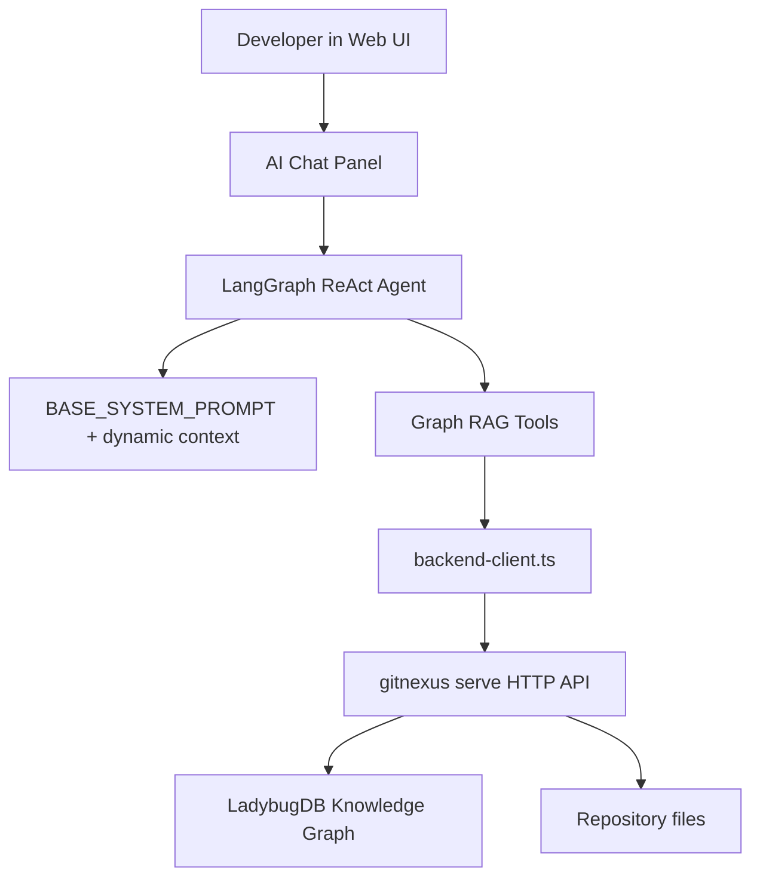
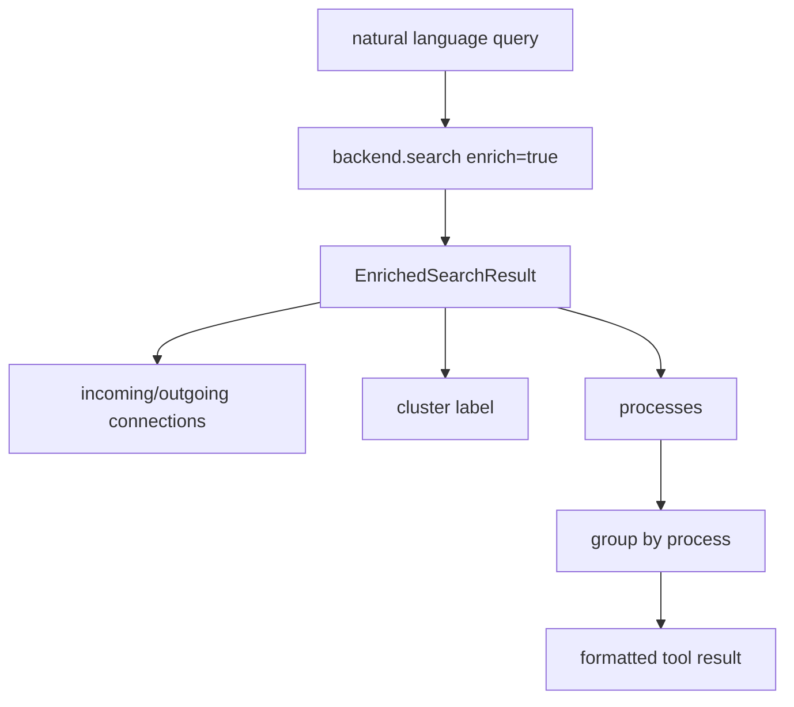

---
type: implementation-note
status: codex-generated
source:
  - gitnexus-web/src/core/llm/agent.ts
  - gitnexus-web/src/core/llm/tools.ts
  - gitnexus-web/src/core/llm/context-builder.ts
  - gitnexus-web/src/services/backend-client.ts
tags:
  - gitnexus
  - web-ui
  - graph-rag
  - langchain
  - agent
---

# 浏览器端 Graph RAG Agent

> 关联：[[HTTP API 与 Serve 后端实现]]、[[Web UI 实现原理]]、[[Query 与 Context 如何实现]]、[[工具层如何设计 Prompt]]

GitNexus 有两类 Agent 入口：一种是编辑器通过 MCP 调用 `query/context/impact`；另一种是 Web UI 内置的浏览器端 Graph RAG Agent。后者运行在 React 应用中，通过 HTTP API 调用本地 `gitnexus serve`，用 LangChain/LangGraph 创建一个代码分析 Agent。

## 一句话定义

浏览器端 Graph RAG Agent 是 GitNexus Web UI 中的代码分析助手：它使用 LangGraph ReAct Agent，把 search、cypher、grep、read、overview、explore、impact 等工具绑定到 HTTP 后端，并通过 grounding prompt 强制回答必须有代码或图谱证据。

## 源码入口

核心文件：

```text
gitnexus-web/src/core/llm/agent.ts
gitnexus-web/src/core/llm/tools.ts
gitnexus-web/src/core/llm/context-builder.ts
gitnexus-web/src/core/llm/types.ts
gitnexus-web/src/services/backend-client.ts
```

相关 UI：

```text
gitnexus-web/src/components/QueryFAB.tsx
gitnexus-web/src/components/ToolCallCard.tsx
gitnexus-web/src/components/RightPanel.tsx
gitnexus-web/src/components/SettingsPanel.tsx
```

## 整体架构



这和 MCP Agent 的差异是：

- MCP Agent 在编辑器或 Codex/Claude 中运行。
- Web Agent 在浏览器 UI 中运行。
- MCP 走 JSON-RPC tool call。
- Web Agent 走 HTTP REST API。
- 两者都使用图谱能力。

## Agent 创建

`agent.ts` 中使用：

```text
createReactAgent
```

并根据 provider 创建不同 chat model：

```text
OpenAI
Azure OpenAI
Google Gemini
Anthropic
Ollama
OpenRouter
MiniMax
GLM
```

`createChatModel(config)` 会根据 `config.provider` 分支创建模型实例，并启用 streaming。

## Base System Prompt 的设计

`BASE_SYSTEM_PROMPT` 是 Web Agent 的核心行为约束。

它强调几条规则：

### 1. Grounding

每个事实声明必须有引用：

```text
File refs: [file path plus line range], for example src/auth.ts:45-60
No citation = no claim
```

这和普通聊天助手不同。它要求 Agent 不要凭名字猜，而要把结论落到文件、行号或图谱节点。

### 2. Validation

每个输出都必须验证：

```text
Use cypher to validate the results and confirm completeness
```

这使 Web Agent 更像“代码调查员”，不是一次 search 后直接回答。

### 3. Core protocol

Prompt 中定义了工作步骤：

```text
Search
Read
Trace
Cite
Validate
```

这个流程和我们给 MCP Agent 设计的 `query -> context -> impact` 思路类似，只是 Web 端工具名字不同。

### 4. Mermaid 优先

Web Agent 被要求优先使用表格和 Mermaid 图。这和 Web UI 的可视化能力匹配。

## Dynamic context 注入

`context-builder.ts` 会为当前加载代码库生成动态上下文。

包含：

```text
CodebaseStats
Hotspots
Folder tree
```

### CodebaseStats

通过 Cypher 统计：

```cypher
MATCH (n:File) RETURN COUNT(n)
MATCH (n:Function) RETURN COUNT(n)
MATCH (n:Class) RETURN COUNT(n)
MATCH (n:Interface) RETURN COUNT(n)
MATCH (n:Method) RETURN COUNT(n)
```

### Hotspots

查连接最多的节点：

```cypher
MATCH (n)-[r:CodeRelation]-(m)
WHERE n.name IS NOT NULL
WITH n, COUNT(r) AS connections
ORDER BY connections DESC
LIMIT N
```

### Folder tree

查询所有 `File.filePath`，然后渲染成缩进树。它不用复杂 ASCII 框线，而是用更 token-efficient 的缩进格式。

## Graph RAG Tools

`tools.ts` 创建 7 个工具：

```text
search
cypher
grep
read
overview
explore
impact
```

所有工具都通过 `GraphRAGBackend` 接口访问后端：

```text
executeQuery
search
grep
readFile
```

这使工具层不直接依赖 fetch 细节，便于测试和替换后端。

## search 工具

search 是 Web Agent 最常用工具。

流程：



search 返回信息：

- nodeId。
- label。
- name。
- filePath。
- startLine/endLine。
- sources。
- score。
- cluster。
- incoming/outgoing connections。
- processes。

默认会按 process 分组。这和 MCP `query` 的思想一致：Agent 不只拿文件列表，而是拿流程上下文。

## cypher 工具

`cypher` 工具允许 Agent 直接查图。

它有一个特殊功能：

如果 Cypher 中包含：

```text
{{QUERY_VECTOR}}
```

就不直接执行 Cypher，而是要求传入自然语言 `query`，然后路由到 backend semantic search。

如果没有向量占位符，则执行普通 Cypher。

这个设计让 Agent 可以在 prompt 中表达“我要语义搜索”，但实际 embedding 仍由后端处理，浏览器不需要自己生成向量。

## grep 工具

grep 用于精确模式搜索：

- 错误码。
- TODO。
- 常量名。
- 具体字符串。
- 框架注解。

它和 search 的区别：

- search 适合概念。
- grep 适合字面值。

## read 工具

read 通过后端读取文件内容。Prompt 强调“Read before concluding”，所以 search/cypher 后通常应接 read。

这解决了一个常见问题：搜索结果只给片段或图谱信息，不足以支持最终代码解释。

## overview 工具

overview 提供代码库地图：

- clusters。
- processes。
- hotspots。
- folder tree。

适合回答“这个项目整体怎么组织”。

## explore 工具

explore 是深挖工具，面向：

- symbol。
- cluster。
- process。

它对应 MCP 里的 `context` 和资源读取能力。

## impact 工具

impact 用于修改前影响分析。

Web Agent prompt 中有一条特殊规则：

```text
impact output is trusted. Do NOT re-validate with cypher.
```

这说明 impact 被视为后端封装好的高阶图算法，不要求 Agent 再用低阶 Cypher 重做。

## backend-client 的作用

`backend-client.ts` 是前端到后端的统一 HTTP 客户端。

它提供：

- backend URL 配置。
- URL scheme 安全校验。
- resilient fetch。
- SSE stream。
- typed API response。
- graph/search/grep/file/analyze/embed 操作。

### URL 安全校验

`validateBackendUrl()` 只允许：

```text
http:
https:
```

拒绝：

```text
javascript:
data:
file:
```

这是浏览器端 SSRF/CSRF 类风险的基本防线。

## SSE stream

`streamSSE()` 使用 fetch + ReadableStream 读取 SSE。

特性：

- 支持 `Last-Event-ID`。
- 支持 message/complete/failed。
- 自动跳过 SSE comment heartbeat。
- 网络错误后最多重试 3 次。
- 指数退避。
- 返回 AbortController 供 UI 取消。

这被 analyze/embed job progress 使用。

## 和 MCP Agent 的对比

| 维度 | Web Graph RAG Agent | MCP Agent |
|---|---|---|
| 运行位置 | 浏览器/React | 编辑器或 Codex/Claude |
| 协议 | HTTP REST | MCP JSON-RPC |
| 工具名 | search/cypher/grep/read/explore/impact | query/context/impact/detect_changes |
| 上下文 | dynamic system prompt | AGENTS.md/CLAUDE.md/Skill |
| 文件读取 | `/api/file` | 本地工具或编辑器 |
| 修改代码 | 通常不直接修改 | 可以直接编辑 |

两者的共性：

- 都强调 grounding。
- 都通过工具访问图谱。
- 都避免纯 LLM 猜测。
- 都把 Process/Community 作为上下文组织方式。

## 设计亮点

### 1. 工具返回已经 enrich

Web search 不是只返回搜索命中，而是提前关联 connections、cluster、processes。这减少了 Agent 的工具调用轮数。

### 2. Prompt 明确要求 citation

“No citation = no claim” 是比普通“请基于上下文回答”更强的约束。

### 3. Cypher 作为验证工具

Agent 可以先 search，再 cypher 验证图关系，最后 read 源码。这是 Graph RAG 和普通 RAG 的区别。

### 4. 前端不直接碰 LadybugDB

浏览器只走 HTTP API，所有 DB、文件系统、embedding 都留在本地后端。

## 边界

1. 浏览器 Agent 依赖后端 `gitnexus serve` 在线。
2. 它适合代码理解和问答，不等价于编辑器 Agent 的自动修改能力。
3. citation 规则依赖工具返回 file/line 信息，某些图节点可能缺少精确范围。
4. 模型 provider 配置和 API key 管理是前端体验的一部分，需要用户正确配置。

## 技术分享讲法

可以这样讲：

> Web Graph RAG Agent 是 GitNexus 的“可视化问答入口”。它不是直接把代码丢给浏览器里的模型，而是通过 HTTP 后端调用图谱搜索、Cypher、grep、read 和 impact。它的 Prompt 强制 grounding 和 validation，工具返回又提前带上流程、社区和一跳关系，所以它更像一个基于 KnowledgeGraph 的代码调查员。