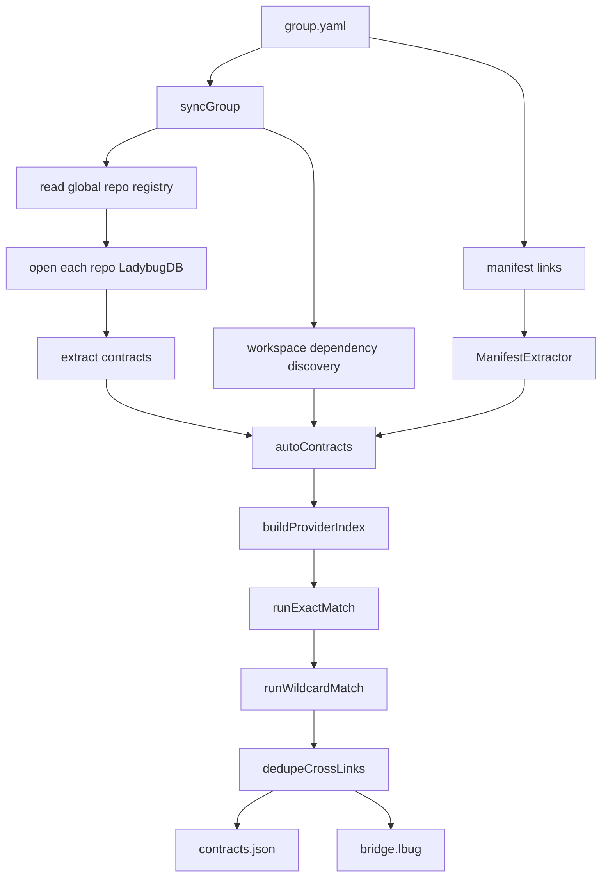

---
type: implementation-note
status: codex-generated
source:
  - gitnexus/src/core/group/sync.ts
  - gitnexus/src/core/group/types.ts
  - gitnexus/src/core/group/matching.ts
  - gitnexus/src/core/group/bridge-db.ts
  - gitnexus/src/core/group/cross-impact.ts
  - gitnexus/src/core/group/extractors/http-route-extractor.ts
  - gitnexus/src/core/group/extractors/grpc-extractor.ts
  - gitnexus/src/core/group/extractors/manifest-extractor.ts
  - gitnexus/src/core/group/extractors/workspace-extractor.ts
tags:
  - gitnexus
  - group
  - contract
  - cross-repo
---

# Group Contract Pipeline 实现

> 关联：[[Group 实现原理]]、[[Bridge DB]]、[[Contract Extraction]]、[[Cross Repo Impact]]、[[Impact 影响分析实现]]

Group 是 GitNexus 的跨仓库代码智能能力。它不是把多个仓库简单合成一个大图，而是让每个仓库保持独立索引，再通过 Contract Registry 和 Bridge DB 建立跨仓库契约链接。

## 一句话定义

Group Contract Pipeline 是 GitNexus 的跨仓库桥接管线：从 `group.yaml` 读取仓库列表和显式契约，打开每个仓库的 LadybugDB 抽取 provider/consumer contracts，执行 exact/wildcard/manifest/workspace dependency 匹配，写出 `contracts.json` 和 `bridge.lbug`，最后让 `impact/query/context` 可以通过 `repo: "@group"` 跨仓库扇出。

## 源码入口

核心文件：

```text
gitnexus/src/core/group/sync.ts
gitnexus/src/core/group/types.ts
gitnexus/src/core/group/matching.ts
gitnexus/src/core/group/bridge-db.ts
gitnexus/src/core/group/cross-impact.ts
gitnexus/src/core/group/service.ts
```

Extractor：

```text
gitnexus/src/core/group/extractors/http-route-extractor.ts
gitnexus/src/core/group/extractors/grpc-extractor.ts
gitnexus/src/core/group/extractors/thrift-extractor.ts
gitnexus/src/core/group/extractors/topic-extractor.ts
gitnexus/src/core/group/extractors/include-extractor.ts
gitnexus/src/core/group/extractors/manifest-extractor.ts
gitnexus/src/core/group/extractors/workspace-extractor.ts
```

## 数据结构

核心类型在 `types.ts`。

### ContractType

```text
http
grpc
thrift
topic
lib
custom
include
```

### MatchType

```text
exact
manifest
wildcard
bm25
embedding
```

当前源码里主要实现的是 exact、manifest、wildcard；bm25 和 embedding 是类型层预留或后续扩展方向。

### StoredContract

一个 contract 代表某个仓库暴露或消费的边界：

```text
repo
contractId
type
role: provider | consumer
symbolUid
symbolRef: { filePath, name }
symbolName
confidence
service?
meta
```

### CrossLink

跨仓库链接：

```text
from: consumer endpoint
to: provider endpoint
type
contractId
matchType
confidence
```

## 整体 Pipeline



## group.yaml 的作用

`GroupConfig` 包含：

```text
version
name
description
repos
links
packages
detect
matching
```

### repos

把 group 内部路径映射到全局 registry 里的仓库名：

```yaml
repos:
  api-gateway: my-api-gateway
  user-service: my-user-service
```

### detect

控制自动抽取哪些契约：

```text
http
grpc
thrift
topics
shared_libs
embedding_fallback
includes
workspace_deps
```

### matching

控制匹配阈值和噪声过滤：

```text
bm25_threshold
embedding_threshold
max_candidates_per_step
exclude_links_paths
exclude_links_param_only_paths
```

## syncGroup 主流程

入口：

```text
syncGroup(config, opts)
```

主要阶段：

1. 读取全局 registry。
2. 把 group repo path 解析为实际本地 repo handle。
3. 打开每个 repo 的 `.gitnexus/lbug`。
4. 构造 per-repo Cypher executor。
5. 检测 service boundary。
6. 按 detect 配置运行 extractor。
7. 收集 repo snapshot。
8. 关闭所有 LadybugDB 连接。
9. 发现 workspace dependency links。
10. 处理 manifest links。
11. 匹配 contracts。
12. 写 `contracts.json` 和 `bridge.lbug`。

## RepoHandle 与 stable pool id

`stableRepoPoolId()` 用于为 LadybugDB connection pool 生成稳定 id。

如果多个 registry entry 同名但路径不同，会用 path 的 base64url hash 后缀避免冲突：

```text
name-hash
```

这和 MCP LocalBackend 处理 sibling clone 的思想一致：多 clone 场景必须避免名字冲突。

## Contract Extractor 接口

接口：

```ts
interface ContractExtractor {
  type: ContractType
  canExtract(repo): Promise<boolean>
  extract(dbExecutor, repoPath, repo): Promise<ExtractedContract[]>
}
```

每个 extractor 都负责一种契约类型。

## HTTP Route Extractor

源码：

```text
http-route-extractor.ts
```

它有两种策略：

### Strategy A：Graph-assisted

如果有 per-repo LadybugDB executor，优先查图：

```cypher
MATCH (handlerFile:File)-[r:HANDLES_ROUTE]->(route:Route)
```

provider 来自 `HANDLES_ROUTE`。

consumer 来自：

```cypher
MATCH (callerFile:File)-[r:FETCHES]->(route:Route)
```

这条路径有真实 graph symbol uid，质量高。

### Strategy B：Source-scan supplement

如果图谱没有覆盖某些语言或文件，直接用 tree-sitter 插件扫描源码。

插件目录：

```text
extractors/http-patterns/
```

这个 orchestrator 不导入具体 grammar 或 query；每种语言插件自己负责。

### HTTP path normalization

Provider path：

- strip query string。
- lowercase。
- 去 trailing slash。
- `:id`、`{id}`、`[id]` 归一为 `{param}`。
- root 保留 `/`。

Consumer path 更激进：

- template literal `${x}` -> `{param}`。
- 绝对 URL 去掉协议和 host。
- 数字 segment -> `{param}`。

contract id：

```text
http::METHOD::/path/{param}
```

## gRPC Extractor

源码：

```text
grpc-extractor.ts
```

两部分：

### .proto parsing

优先用 `tree-sitter-proto`。如果 optional dependency 不可用，则 fallback 到字符串 sanitizer + service block parser。

fallback 会：

- 去掉注释。
- 去掉字符串。
- 保留换行和 offsets。
- 找 `service Xxx { ... }`。
- 提取 rpc method。

### Source-scan providers / consumers

交给：

```text
extractors/grpc-patterns/
```

每种语言插件负责识别自身的 gRPC 客户端或服务端代码。

gRPC contract id：

```text
grpc::package.Service/Method
grpc::Service/*
```

## ManifestExtractor

Manifest link 来自 `group.yaml` 的 `links`。

作用：

- 人工声明跨仓库契约。
- 弥补自动抽取无法识别的边界。
- 在匹配中优先级高于自动 exact match。

### resolveSymbol

ManifestExtractor 会尝试用 repo DB executor 解析 manifest 指向的真实符号。

HTTP 类型会查：

```cypher
MATCH (handler)-[r:HANDLES_ROUTE]->(route:Route)
WHERE route.name = $normalized
RETURN handler.id, handler.name, handler.filePath
```

如果解析不到，会生成 synthetic uid：

```text
manifest::<repo>::<contractId>
```

为什么需要 synthetic uid？

- Bridge Contract 节点需要稳定 symbolUid。
- Cross-impact 查询通过 symbolUid join。
- 空 uid 无法区分多个 unresolved manifest contracts。

## Workspace dependency discovery

入口：

```text
discoverWorkspaceLinks()
```

支持生态：

```text
Rust
Node
Python
Go
Java
Elixir
```

它会从 monorepo/workspace/package manager 配置中自动发现跨包依赖，然后转换成 manifest-like links，再合并进 `allLinks`。

这意味着 group 不只适合微服务，也适合多包 workspace。

## Matching 实现

源码：

```text
matching.ts
```

### normalizeContractId

不同类型有不同归一化规则。

HTTP：

```text
method upper-case
path strip trailing slash
```

gRPC / thrift：

```text
service/package lower-case
method case preserved
```

topic：

```text
trim lower-case
```

include：

```text
slash normalized lower-case
```

### noisy contract filter

HTTP 有两类可配置噪声过滤：

1. health/readiness endpoint，比如 `/health`。
2. param-only path，比如 `/{param}`。

这些 contract 仍然被抽取，但不会生成 cross-link，避免 N x M 假阳性。

### Exact match

`runExactMatch()`：

- 只拿 consumer。
- 跳过 service wildcard。
- 跳过 noisy contract。
- 通过 provider index 找相同 normalized contract id。
- 同仓库同 service 的链接会跳过。
- 生成 confidence 1.0 的 CrossLink。

### Wildcard match

`runWildcardMatch()` 处理：

```text
grpc::Service/*
thrift::Service/*
```

它会匹配同类型 provider 的 method-level contract。

对于 thrift bare service，如果匹配多个 FQ service，会跳过，避免歧义。

## contracts.json 与 bridge.lbug

`contracts.json` 是 canonical registry：

```text
version
generatedAt
repoSnapshots
missingRepos
contracts
crossLinks
```

`bridge.lbug` 是查询优化用的桥接数据库。

源码注释明确：如果 `writeBridge` 失败，不应该掩盖 `contracts.json` 写入成功。它会 warning，下一次 sync 可恢复。

## Bridge DB 写入

源码：

```text
bridge-db.ts
```

关键设计：

- 写到 `bridge.lbug.tmp.<random>`。
- 完成后 atomic rename。
- 清理 `.wal` 和 `.shadow` sidecar。
- 写 meta.json 时使用随机 tmp + `wx` + `0o600`。
- Windows 下 rename 有 retry，处理 `EBUSY/EPERM/EACCES`。

### ContractLookupIndex

写 cross-link 时要把 endpoint 解析到 contract node id。

为了避免 N+1 DB 查询，`writeBridge` 会构造内存索引：

```text
byUid
byRef
byFile
```

查找顺序：

1. repo + role + symbolUid。
2. repo + role + filePath + symbolName。
3. 如果同文件只有一个 contract，则用文件 fallback。

## Cross Repo Impact

源码：

```text
cross-impact.ts
```

整体是两阶段：

```text
Phase 1: local impact
Phase 2: bridge fan-out
```

### upstream bridge query

如果本地符号是 provider，找消费者：

```cypher
MATCH (consumer:Contract)-[l:ContractLink]->(provider:Contract)
WHERE provider.repo = $localRepo
  AND provider.symbolUid IN $uids
  AND provider.role = 'provider'
RETURN consumer...
```

### downstream bridge query

如果本地符号是 consumer，找 provider：

```cypher
MATCH (consumer:Contract)-[l:ContractLink]->(provider:Contract)
WHERE consumer.repo = $localRepo
  AND consumer.symbolUid IN $uids
  AND consumer.role = 'consumer'
RETURN provider...
```

### crossDepth

当前最大：

```text
MAX_SUPPORTED_CROSS_DEPTH = 1
```

超过会 clamp，并返回 warning。多跳跨仓库影响是未来扩展。

### timeout

local impact 默认：

```text
DEFAULT_LOCAL_IMPACT_TIMEOUT_MS = 30000
```

上限：

```text
5 minutes
```

每个 fan-out `impactByUid` 都会 race timeout，防止某个邻居仓库卡住整个请求。

## 为什么不用一个巨型多仓库图

GitNexus 选择 contract bridge，而不是把所有仓库合并到一个图。

好处：

- 每个仓库独立 analyze。
- 单仓库索引可独立更新。
- 跨仓库边界只通过 contract 表达。
- 避免不同仓库符号 id 冲突。
- group sync 可以独立重跑。

边界：

- 跨仓库只能追踪被抽取成 contract 的关系。
- 当前 crossDepth 只支持 1。
- 动态 RPC、非标准协议可能需要 manifest link。
- contract matching 有 false positive/false negative，需要噪声过滤和人工 links。

## 技术分享讲法

可以这样讲：

> Group 不是把多个仓库拼成一个超级图，而是在仓库图之间建立一张契约桥。每个仓库独立索引，group sync 抽取 HTTP、gRPC、Thrift、Topic、Include、Workspace dependency 等 contract，再用 exact、manifest、wildcard 匹配生成 ContractLink。跨仓库 impact 时，先做本地 BFS，再通过 bridge.lbug 找到相邻仓库符号并扇出。