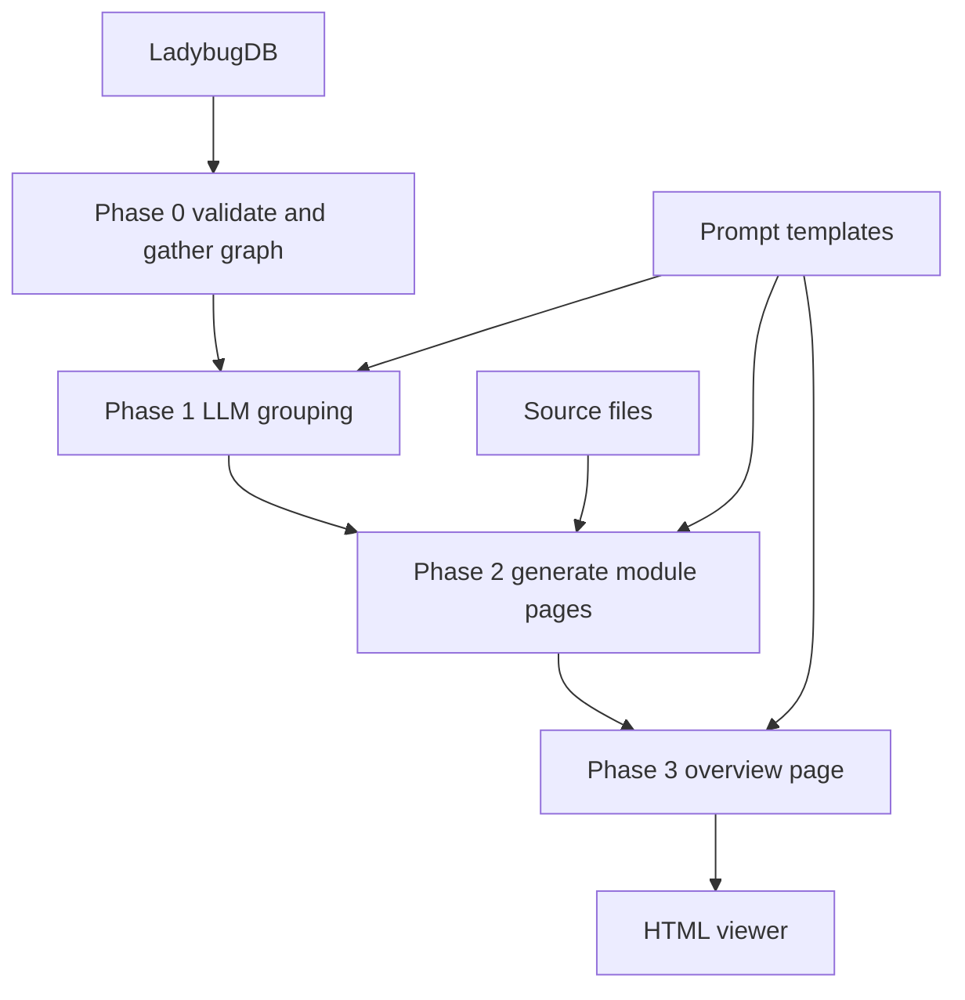

# Wiki 生成 Pipeline 实现

Wiki 生成是 GitNexus 的文档产品层能力。它和核心 analyze 不同：analyze 不调用 LLM，wiki 会读取 LadybugDB 图谱和源码，再调用 LLM 生成模块文档。

## 源码入口

| 文件 | 职责 |
|---|---|
| `gitnexus/src/cli/wiki.ts` | CLI 参数、provider/model 配置 |
| `core/wiki/generator.ts` | WikiGenerator 主编排 |
| `core/wiki/graph-queries.ts` | 从 LadybugDB 查询文件、导出、调用边、流程 |
| `core/wiki/prompts.ts` | grouping/module/parent/overview prompts |
| `core/wiki/llm-client.ts` | OpenAI-compatible LLM 调用 |
| `core/wiki/cursor-client.ts` | Cursor provider 调用 |
| `core/wiki/html-viewer.ts` | 生成可浏览 HTML viewer |
| `core/wiki/mermaid-sanitizer.ts` | Mermaid 输出清洗 |

## 总体 Pipeline

## Phase 0：准备材料

WikiGenerator 会创建 `.gitnexus/wiki` 目录，读取 wiki meta 判断是否 up-to-date，初始化 Wiki DB 连接，查询 `getFilesWithExports`、`getAllFiles`、processes、call edges，并根据 ignore 规则过滤不该进入文档的文件。

## Phase 1：LLM 分组

使用 `GROUPING_SYSTEM_PROMPT` / `GROUPING_USER_PROMPT`，让 LLM 根据文件列表和导出符号生成 module tree。输出结构是 `ModuleTreeNode`，包含 name、slug、files、children。如果用户传 `--review`，会停在分组阶段，方便人工检查模块结构。

## Phase 2：模块页生成

模块页生成是 bottom-up：叶子模块可以并发生成，默认 concurrency=3；父模块依赖子模块摘要和跨模块调用关系；每个模块 prompt 会包含文件内容、导出符号、内部调用边、相关流程；输出 markdown 后会做 Mermaid sanitizer。

## Phase 3：overview

总览页输入模块摘要、模块间调用边、Top processes、module tree，输出 `overview.md`，作为 Wiki 入口。

## 增量更新

Wiki meta 保存 `fromCommit`、`generatedAt`、`model`、`lang`、`moduleFiles`、`moduleTree`。如果 commit 没变且 lang 没变，直接 up-to-date；否则可以基于 git diff 做增量模块更新。

## 讲解抓手

> Wiki Generator 是“图谱辅助 LLM 文档生成”：先用 LadybugDB 取结构化事实，再让 LLM 分组、写模块页和总览页。它不是索引核心，而是图谱的产品化消费场景。
