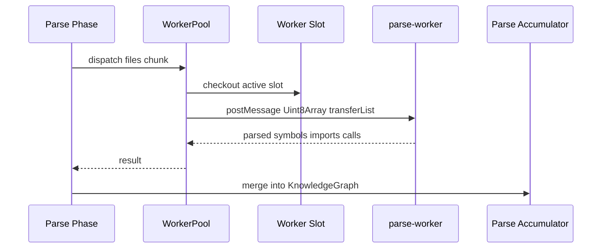

# Worker Pool 并行解析与 Quarantine 机制

Parse 阶段是 GitNexus analyze 中最重的阶段之一。Worker Pool 的目标是把大仓库解析拆成并行任务，同时避免某个坏文件、坏 grammar、native parser 崩溃拖垮整次分析。

## 源码入口

| 文件 | 职责 |
|---|---|
| `gitnexus/src/core/ingestion/workers/worker-pool.ts` | worker 池、dispatch、超时、respawn、quarantine |
| `parse-worker.ts` | worker 内实际解析入口 |
| `pipeline-phases/parse-impl.ts` | parse 阶段调用 worker pool |
| `cli/index.ts` | `--workers`、worker timeout 等参数 |

## Worker Pool 为什么复杂

Tree-sitter grammar 和 native binding 在真实仓库里可能遇到单个文件解析超时、某语言 grammar 崩溃、worker 线程挂死、大文件传输导致内存复制过多、少数坏文件不断重试拖慢整个仓库。因此 worker pool 不只是 `Promise.all`，而是一个带故障隔离的调度器。

## 总体流程



## 零拷贝传输思路

`worker-pool.ts` 使用 `TextEncoder.encode` 把文件内容转成 `Uint8Array`，再通过 `postMessage` 的 `transferList` 传给 worker。这样可以避免 Node Buffer slab 导致潜在共享/复制问题，大仓库里传输大量文本时更省内存。

## WorkerPool 接口

| 方法 | 作用 |
|---|---|
| `dispatch` | 提交解析任务 |
| `terminate` | 停止 worker pool |
| `size` | 当前池大小 |
| `getQuarantinedPaths` | 获取被隔离的文件 |
| `getStats` | 获取 activeSlots、droppedSlots、quarantined、poolBroken 等 |

## 超时和重试

可配置项包括 subBatch size/bytes、idle timeout、timeout retries/backoff、maxRespawnsPerSlot、maxCumulativeTimeoutMs、consecutiveFailureThreshold。CLI 和环境变量暴露了 `--worker-timeout`、`--workers`、`GITNEXUS_WORKER_SUB_BATCH_TIMEOUT_MS`、`GITNEXUS_WORKER_SUB_BATCH_MAX_BYTES`、`GITNEXUS_WORKER_POOL_SIZE`、`GITNEXUS_WORKER_MAX_RESPAWNS_PER_SLOT`、`GITNEXUS_WORKER_CONSECUTIVE_FAILURE_THRESHOLD` 等入口。

## Quarantine 机制

如果某些文件导致 worker 反复失败，不应该让整个 analyze 失败或无限重试。

```text
file causes timeout/crash
  -> retry with backoff
  -> slot respawn if needed
  -> still failing
  -> mark file path quarantined
  -> continue remaining files
```

这是一个真实工程工具必须有的局部失败隔离。最终图谱可能少量缺失，但分析流程可以完成，并向用户报告被隔离文件。

## 与 sequential fallback 的关系

Worker pool 不是唯一解析路径。小仓库或禁用 worker 时可以走顺序解析。某些失败场景也可能降级到主线程/顺序路径，保证尽量产出结果。

## 讲解抓手

> Worker Pool 是 GitNexus 面向大仓库的吞吐层；Quarantine 是面向真实脏代码和 native parser 风险的容错层。
