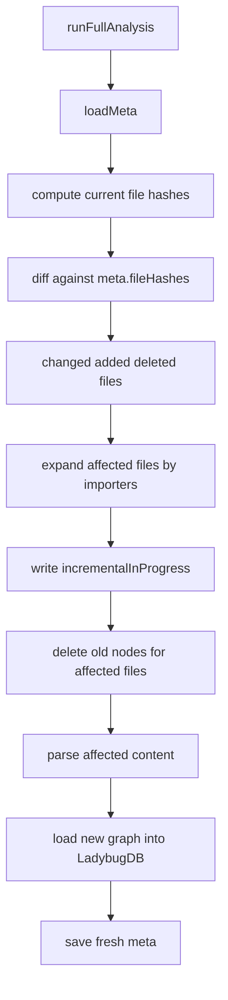

# 增量索引与 Parse Cache 实现

GitNexus 的 analyze 要能跑在真实仓库上，关键不是“能全量解析一次”，而是后续修改后不要重复做所有工作。增量索引和 parse cache 是两个不同层面的优化：增量索引根据文件 hash / git commit 判断哪些文件需要替换图谱子图；Parse Cache 按 chunk 的内容 hash 缓存 parse 输出，避免内容没变的文件重新 AST 解析。

## 源码入口

| 模块 | 文件 |
|---|---|
| meta / registry | `gitnexus/src/storage/repo-manager.ts` |
| file hash | `gitnexus/src/storage/file-hash.ts` |
| parse cache | `gitnexus/src/storage/parse-cache.ts` |
| analyze 编排 | `gitnexus/src/core/run-analyze.ts` |
| incremental DB 删除 | `gitnexus/src/core/lbug/lbug-adapter.ts` 的 `deleteNodesForFile` |
| importers | `queryImporters` |

## meta.json 保存什么

`RepoMeta` 中和增量最相关的字段：

| 字段 | 用途 |
|---|---|
| `lastCommit` | 早期返回和 stale 检查 |
| `indexedAt` | 展示和 registry |
| `stats` | 文件数、节点数、边数、community、process 等 |
| `schemaVersion` | 增量不兼容时强制 full rebuild |
| `fileHashes` | 上次成功索引时每个文件的内容 hash |
| `incrementalInProgress` | 崩溃恢复 dirty flag |

`saveMeta` 使用 tmp-file + rename 原子写，避免 crash 时 meta 损坏导致丢失 dirty flag。

## 增量索引基本流程



增量不是只处理改动文件。调用关系、import、类型传播会让影响扩散，所以实现中会根据 importer 关系做扩展，避免下游文件还保留旧解析结果。

## Parse Cache 的设计

`parse-cache.ts` 是 chunk-level content-addressed parse cache。缓存 key 是一个 chunk 内所有文件的 `filePath:contentHash` 排序后计算 sha256。内容没变，key 不变；文件顺序不稳定时，排序保证 key 稳定；chunk 粒度比单文件更适合 worker 批处理输出。

缓存目录示例：

```text
.gitnexus/
  parse-cache/
    index.json
    abcd1234.json
    efgh5678.json
```

Parse Cache 会根据 schema bump 和 package version 判断是否失效。这样当 AST 输出结构、边构建语义变化时，不会复用旧缓存造成图谱不一致。

## JSON replacer / reviver

parse 输出中包含 Map、Set 等结构，不能直接 `JSON.stringify` 保留语义。实现里提供 replacer/reviver，把这些结构序列化为可恢复形态。缓存的不是普通字符串，而是中间结构化解析产物。

## usedKeys 与 prune

每次 analyze 会记录本轮命中过或写入过的 cache key。结束后可以删除未使用的旧 cache 文件，避免 `.gitnexus/parse-cache` 无限增长。

## 增量与 cache 的区别

| 维度 | 增量索引 | Parse Cache |
|---|---|---|
| 目标 | 少更新 LadybugDB 图谱 | 少做 AST parse |
| 粒度 | 文件及受影响文件集合 | chunk |
| 依据 | meta.fileHashes、importers、schemaVersion | chunk content hash、cache schema、package version |
| 结果 | 删除/重写 DB 中部分节点边 | 复用 parse 输出 |

## 边界

动态调用、反射、运行时注册仍然可能超出静态分析能力。增量必须保守，宁可多重建，不应少重建。schemaVersion 不兼容时必须 full rebuild。crash 中途的 `incrementalInProgress` 会导致下次强制 full rebuild，优先恢复正确性。

## 讲解抓手

> 增量索引解决“哪些图谱子图需要替换”，Parse Cache 解决“哪些文件不必重新解析”。一个保证图谱新鲜度，一个保证解析吞吐。
