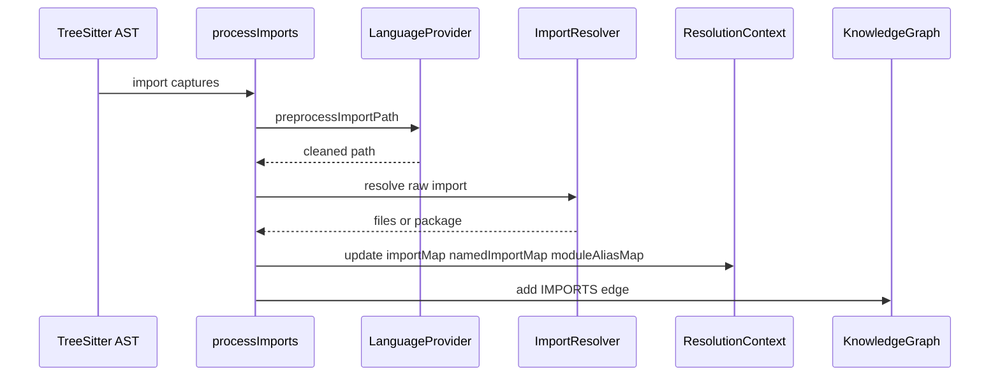

# Import 解析系统实现

Import 解析系统负责把源码里的 import/include/use/require 等语句解析为图谱中的 `IMPORTS` 边，并生成后续调用解析需要的 `importMap`、`namedImportMap`、`moduleAliasMap`。

## 源码入口

| 文件 | 职责 |
|---|---|
| `core/ingestion/import-processor.ts` | 主处理器，遍历 AST import capture |
| `import-resolvers/types.ts` | ImportResult、ResolveCtx、strategy 类型 |
| `import-resolvers/resolver-factory.ts` | ordered strategy chain |
| `import-resolvers/standard.ts` | relative path、alias、suffix resolution |
| `import-resolvers/{python,rust,go,jvm,csharp,php,ruby}.ts` | 语言特定解析 |
| `named-bindings/` | named import binding 提取 |
| `language-config.ts` | tsconfig paths 等项目配置 |

## 主数据结构

| 数据结构 | 类型 | 用途 |
|---|---|---|
| `ImportMap` | `Map<FilePath, Set<ResolvedFilePath>>` | 文件级 import 关系 |
| `PackageMap` | `Map<FilePath, Set<PackageDirSuffix>>` | Go package 等不展开成 N 条边的包级关系 |
| `NamedImportMap` | `Map<FilePath, Map<local, {sourcePath, exportedName}>>` | 精准符号绑定 |
| `ModuleAliasMap` | `Map<FilePath, Map<alias, resolvedFile>>` | `import X as Y`、Python namespace |
| `ImportResolutionContext` | all files、suffix index、resolve cache | 路径解析上下文 |

## 解析流程

## Resolver Factory：策略链

`createImportResolver(config)` 接受 ordered strategies。每个 strategy 可以返回 null 表示没处理并继续下一个 strategy，也可以返回 files/package 结果。空 files 表示已处理但无法解析，会停止链路。

## standard resolver 做了什么

| 规则 | 说明 |
|---|---|
| relative import | `./`、`../` 按当前文件目录解析 |
| TS/JS path alias | 根据 tsconfig paths/baseUrl 改写 |
| TS ESM extension | `.js` import 回退到 TS 源文件 |
| Rust module path | `crate::`、`self::`、`super::` 特殊处理 |
| suffix matching | 包名/绝对路径按 suffix index 匹配 |
| resolve cache | `currentFile::importPath` 缓存，100K 上限并淘汰最老 20% |

## named binding 的价值

文件级 `IMPORTS` 只能说明 A 文件依赖 B 文件；调用解析还需要知道 `import { validateUser as validate } from './auth'` 中 local `validate` 对应 source `validateUser`。`namedImportMap` 正是这个映射。

## Registry-primary 语言的特殊处理

`createImportEdgeHelpers` 中对 registry-primary 语言会跳过某些 legacy IMPORTS 图边写入，因为这些语言的引用解析由 Scope Resolution pipeline 接管。这样避免两套解析路径重复或产生冲突。

## 讲解抓手

> Import 解析系统不是简单字符串拼路径，而是“语言策略链 + 文件索引 + named binding + module alias”的组合。它是跨文件调用解析、crossFile 传播和依赖图的基础。
