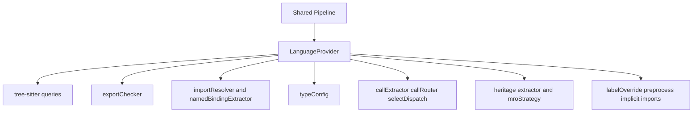

# LanguageProvider 与多语言 Extractor 体系

GitNexus 支持多语言，但核心管线不应该到处写 `if language === Python`。它把语言差异收敛到 `LanguageProvider` 和各类 extractor / resolver / hook 中。

## 源码入口

| 文件/目录 | 职责 |
|---|---|
| `core/ingestion/language-provider.ts` | 语言能力接口 |
| `core/ingestion/languages/index.ts` | provider 注册表 |
| `core/ingestion/languages/*` | 各语言 provider |
| `class-extractors/`、`method-extractors/`、`field-extractors/` | 语言特定提取器 |
| `import-resolvers/` | import path resolution |
| `call-extractors/`、`call-routing.ts` | 调用形态和路由 |
| `type-extractors/` | 类型绑定、return type、literal type |

## Provider 总体模型

## Provider 的核心字段

| 能力        | 字段                                                         |
| --------- | ---------------------------------------------------------- |
| 语言身份      | `id`、`extensions`                                          |
| 解析方式      | `parseStrategy`、`treeSitterQueries`、`preprocessSource`     |
| 类型提取      | `typeConfig`                                               |
| export 判断 | `exportChecker`                                            |
| import 解析 | `importResolver`、`namedBindingExtractor`、`importSemantics` |
| 隐式 import | `implicitImportWirer`                                      |
| owner 查找  | `resolveEnclosingOwner`、`enclosingFunctionFinder`          |
| 函数/方法标签   | `labelOverride`                                            |
| 继承/MRO    | `heritageDefaultEdge`、`interfaceNamePattern`、`mroStrategy` |
| 调用解析      | `inferImplicitReceiver`、`selectDispatch`、`callRouter`      |

## Strategy pattern

`languages/index.ts` 中的 providers 表使用 `satisfies Record<SupportedLanguages, LanguageProvider>`。新增 SupportedLanguages 时必须新增 provider，provider 缺字段会在编译期暴露，共享管线只依赖接口，不依赖具体语言。

## importSemantics 的重要性

| tag | 机制 | 代表语言 |
|---|---|---|
| `named` | 逐符号 import | TS/JS、Java、C#、Rust、PHP、Kotlin |
| `wildcard-transitive` | include 传递展开 | C、C++ |
| `wildcard-leaf` | whole-module direct import | Go、Ruby、Swift、Dart |
| `namespace` | qualified namespace | Python |
| `explicit-reexport` | 预留给 re-export DAG | 未来 TS/Rust |

这个字段会影响 `wildcard-synthesis` 和后续 namedImportMap 构建。

## Hook 设计思想

| hook                     | 解决的问题                             |
| ------------------------ | --------------------------------- |
| `preprocessSource`       | C++ Unreal 宏等会干扰 grammar 的内容预处理   |
| `importPathPreprocessor` | Kotlin wildcard 等 import path 变换  |
| `implicitImportWirer`    | Swift target / C header 这类隐式文件可见性 |
| `resolveEnclosingOwner`  | Ruby singleton_class 等特殊 owner    |
| `labelOverride`          | Kotlin/Python 等函数节点归类为 Method     |
| `inferImplicitReceiver`  | Ruby/Python 等隐式接收者                |
| `selectDispatch`         | 语言自定义 free/member/constructor 分发  |

## 与 Call Resolution DAG 的关系

Call Resolution 的共享流程有六步，但第三步和第四步通过 provider hook 注入语言行为：提取调用 -> 分类形式 -> 推断接收者 -> 选择分发 -> 解析目标 -> 发出边。其中 `inferImplicitReceiver` 注入接收者推断，`selectDispatch` 注入分发策略。

## 讲解抓手

> LanguageProvider 是 GitNexus 多语言静态分析的插件边界。共享 Pipeline 负责通用流程，Provider 负责语言策略，二者通过强类型接口连接。
