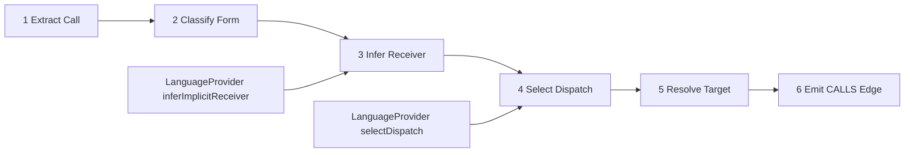

# Legacy Call Resolution DAG 实现

Legacy Call Resolution 是 GitNexus 早期调用图构建核心。虽然部分语言已经迁移到 Scope Resolution pipeline，但旧 DAG 仍然是理解 GitNexus 调用解析思想的重要入口。

## 源码入口

| 文件                                           | 职责                                      |
| -------------------------------------------- | --------------------------------------- |
| `core/ingestion/call-processor.ts`           | 调用处理主流程                                 |
| `core/ingestion/call-types.ts`               | call form、receiver、dispatch decision 类型 |
| `core/ingestion/utils/call-analysis.ts`      | 调用参数、receiver、call form 分析              |
| `core/ingestion/type-env.ts`                 | 局部类型环境                                  |
| `core/ingestion/model/resolution-context.ts` | resolver 所需上下文                          |
| `core/ingestion/model/resolve.ts`            | owner lookup、MRO lookup、candidate 解析    |

## 六阶段 DAG

## 阶段解释

1. Extract Call：从 tree-sitter AST captures 或 worker output 中收集调用点，包括 free call、member call、constructor-like call、mixed chain、framework/fetch/route 相关 call。
2. Classify Form：`inferCallForm` 把调用分成 free、member、constructor。
3. Infer Receiver：对 member call 推断 receiver 类型，来源包括局部变量类型绑定、constructor binding、imported return type、field extractor、provider hook。
4. Select Dispatch：默认规则是 constructor -> constructor，free -> free，member/undefined -> owner-scoped；语言可以通过 `selectDispatch` 覆盖。
5. Resolve Target：owner-scoped 走 MethodRegistry/MRO，free 走 `lookupCallableByName`、named imports、class-target fast path，constructor 走 explicit Constructor 或 instantiable class fallback。
6. Emit Edge：解析成功后写入 caller symbol -> CALLS -> target symbol，边上带 confidence 和 reason。

## 旧 DAG 与 Scope Resolution 的并存

RFC #909 之后，Python、C#、TypeScript 等语言逐步迁移到 registry-primary。迁移语言由 `MIGRATED_LANGUAGES` 控制。未迁移语言仍走 legacy call resolution；迁移语言优先走 Scope Resolution；CI parity gate 会对迁移语言跑两条路径，要求结果保持一致或可解释。

## 为什么 legacy DAG 仍重要

它体现了 GitNexus 的核心思想：调用解析是一条有类型、有阶段、有 hook 的管线。它仍服务未迁移语言，并且新 Scope Resolution 很多概念仍复用 Semantic Model 和 call target 语义。

## 讲解抓手

> Legacy Call Resolution DAG 把“看到一个调用表达式”拆成提取、分类、receiver 推断、dispatch、target resolution、发边六步。语言差异只通过 provider hook 注入，保证共享解析逻辑不被语言分支污染。
