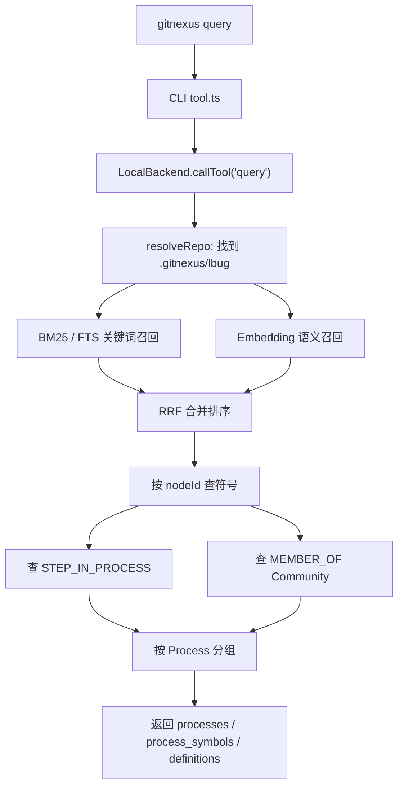

当你输入：

```powershell
gitnexus query "parse worker" --repo GitNexus
```

GitNexus 不是把问题丢给 LLM，也不是简单 grep，而是走了一条本地代码图谱查询链路：



**1. CLI 入口只是薄包装**

源码在 [tool.ts](</E:/test/GitNexus/gitnexus/src/cli/tool.ts:57>)。

`gitnexus query` 会构造参数，然后直接调用：

```ts
backend.callTool('query', {
  query: queryText,
  task_context: options?.context,
  goal: options?.goal,
  limit,
  include_content,
  repo,
});
```

也就是说 CLI 和 MCP 共用同一个后端：`LocalBackend`。区别只是 CLI 直接打印 JSON，MCP 把它作为 tool result 返回给 Agent。

**2. 解析 repo**

`LocalBackend.callTool` 会先根据 `--repo` 找到具体仓库。如果你注册了多个 repo，又没传 `--repo`，就会报：

```text
Multiple repositories indexed. Specify which one with the "repo" parameter.
```

找到 repo 后，它会打开这个仓库的：

```text
.gitnexus/lbug
```

也就是 analyze 预先生成的 LadybugDB 知识图谱。

**3. 执行 query 核心逻辑**

源码在 [local-backend.ts](</E:/test/GitNexus/gitnexus/src/mcp/local/local-backend.ts:900>)。

源码注释已经把 query 分成 4 步：

1. Hybrid search: BM25 + semantic 找匹配符号
2. 通过 [[STEP_IN_PROCESS]] 查这些符号参与哪些执行流
3. 按 process 聚合，并用相关性 + community cohesion 排序
4. 返回 processes / process_symbols / definitions

所以 `query` 的目标不是只返回文件，而是尽量返回“流程化结果”。

**4. BM25 / FTS 关键词召回**

源码在 [bm25-index.ts](</E:/test/GitNexus/gitnexus/src/core/search/bm25-index.ts:61>)。

GitNexus 会查询 5 个 FTS 索引：

```text
File.file_fts
Function.function_fts
Class.class_fts
Method.method_fts
Interface.interface_fts
```

底层执行类似：

```cypher
CALL QUERY_FTS_INDEX('Function', 'function_fts', $query, conjunctive := false)
RETURN node, score
ORDER BY score DESC
LIMIT ...
```

它会把命中的节点按 `filePath` 聚合，并取 top-3 节点分数，避免一个大文件因为很多低质量命中过度加分。

**5. Embedding 语义召回**

如果这个 repo 生成过 embeddings，GitNexus 会把查询文本转成向量，然后查 `CodeEmbedding`。

在 Windows 上 VECTOR index 不可用时，会走 exact-scan fallback。没有 embeddings 时，这一路直接返回空。

所以 query 的召回来源可能是：

```text
BM25 关键词命中
Embedding 语义命中
两者都有
```

**6. RRF 合并排序**

GitNexus 用 Reciprocal Rank Fusion 合并 BM25 和 semantic 结果：

```ts
const rrfScore = 1 / (60 + i);
```

含义是：不直接比较 BM25 分数和向量距离，而是按各自排名合并。这样可以避免不同检索系统分数尺度不一致。

**7. 从候选符号回到图谱**

召回到候选节点后，GitNexus 会继续查图谱关系。

查这个符号参与了哪些流程：

```cypher
MATCH (n {id: $nodeId})-[r:CodeRelation {type: 'STEP_IN_PROCESS'}]->(p:Process)
RETURN p.id, p.label, p.heuristicLabel, p.processType, p.stepCount, r.step
```

查它属于哪个社区模块：

```cypher
MATCH (n {id: $nodeId})-[:CodeRelation {type: 'MEMBER_OF'}]->(c:Community)
RETURN c.cohesion, c.heuristicLabel
LIMIT 1
```

这一步就是 GitNexus 和普通搜索的关键区别：它会把“文本命中的符号”重新挂回执行流和功能模块里。

**8. 最终返回结构**

结果通常是：

```json
{
  "processes": [],
  "process_symbols": [],
  "definitions": [],
  "timing": {}
}
```

含义是：

| 字段 | 含义 |
|---|---|
| `processes` | 命中的执行流，按优先级排序 |
| `process_symbols` | 每个流程里相关的符号 |
| `definitions` | 没挂到任何 Process 的独立符号/文件 |
| `timing` | bm25、vector、merge、symbol_lookup、ranking 等耗时 |
| `warning` | FTS 缺失等降级提示 |

一句话总结：

> `gitnexus query` 是“搜索入口 + 图谱回填”：先用 BM25/Embedding 找候选，再用 LadybugDB 里的 `STEP_IN_PROCESS`、`MEMBER_OF` 等关系把候选组织成流程、模块和符号结果。