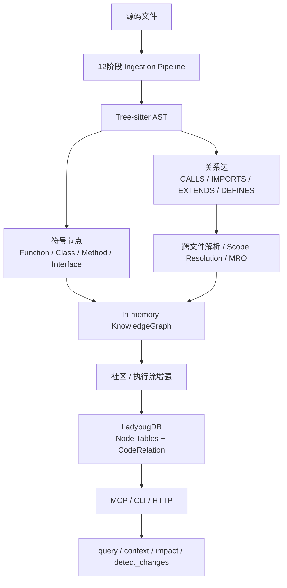

GitNexus 的“知识图谱效果”本质上不是 UI 画出来的，而是它在 `analyze` 阶段把代码库预计算成了：

```text
节点 Node：文件、函数、类、方法、路由、工具、社区、流程
边 Relation：包含、定义、调用、导入、继承、实现、成员归属、流程步骤
```

然后存进 LadybugDB，用 Cypher / MCP 工具去查询和遍历。

可以用这张图理解：



**第一步：定义图谱 Schema**

GitNexus 先规定图里能有什么。源码在：

[gitnexus-shared/src/graph/types.ts](</E:/test/GitNexus/gitnexus-shared/src/graph/types.ts:1>)  
[gitnexus/src/core/lbug/schema.ts](</E:/test/GitNexus/gitnexus/src/core/lbug/schema.ts:1>)

节点类型包括：

```text
File, Folder, Function, Class, Interface, Method,
Struct, Enum, Trait, Property, Route, Tool,
Community, Process ...
```

关系类型包括：

```text
CONTAINS
DEFINES
CALLS
IMPORTS
EXTENDS
IMPLEMENTS
HAS_METHOD
HAS_PROPERTY
ACCESSES
MEMBER_OF
STEP_IN_PROCESS
HANDLES_ROUTE
FETCHES
HANDLES_TOOL
```

LadybugDB 里是“多节点表 + 单关系表”的设计：

```text
File / Function / Class / Method ... 是不同 NODE TABLE
所有边统一放在 CodeRelation
用 type 字段区分 CALLS / IMPORTS / DEFINES ...
```

这样查询就很自然：

```cypher
MATCH (a)-[r:CodeRelation {type: 'CALLS'}]->(b)
RETURN a.name, b.name
```

**第二步：分析源码，抽取节点**

`analyze` 会跑 ingestion pipeline。执行器在：

[runner.ts](</E:/test/GitNexus/gitnexus/src/core/ingestion/pipeline-phases/runner.ts:1>)

它用 Kahn 拓扑排序按依赖执行阶段，比如：

```text
scan
structure
markdown
parse
routes
tools
orm
crossFile
scopeRes
mro
communities
processes
```

其中 `parse` 阶段用 tree-sitter 把代码变成 AST，然后抽取：

```text
函数 → Function 节点
类 → Class 节点
方法 → Method 节点
接口 → Interface 节点
字段 → Property 节点
文件 → File 节点
路由 → Route 节点
MCP 工具 → Tool 节点
```

每个节点会带上：

```text
id
name
filePath
startLine
endLine
content
isExported
description
```

**第三步：抽取关系边**

光有节点不叫知识图谱，关键是边。

GitNexus 会把代码里的结构关系转成边：

```text
文件包含函数       File -DEFINES-> Function
文件夹包含文件     Folder -CONTAINS-> File
类拥有方法         Class -HAS_METHOD-> Method
函数调用函数       Function -CALLS-> Function
文件导入文件       File -IMPORTS-> File
类继承类           Class -EXTENDS-> Class
类实现接口         Class -IMPLEMENTS-> Interface
路由处理函数       File/Function -HANDLES_ROUTE-> Route
前端请求接口       File -FETCHES-> Route
```

每条边不是只有 source/target/type，还带：

```ts
confidence
reason
step
evidence
```

也就是说 GitNexus 不只说“有边”，还会记录“为什么认为这条边成立”和置信度。

**第四步：做关系解析，不只是字符串匹配**

这一层是 GitNexus 比普通 grep/RAG 更核心的地方。

看到代码：

```ts
user.getName()
```

它不能只记录“调用了 getName”，还要尽量解析出：

```text
user 是什么类型？
getName 属于哪个 Class？
如果有继承/重写，真正应该连到哪个 Method？
```

所以它会做：

```text
Import 解析
Scope Resolution
Call Resolution
Cross-file Resolution
MRO 方法解析
继承链 / 实现关系补全
```

这一步把“文本上的名字”变成“图里的确定节点”。

**第五步：语义增强，生成 Community 和 Process**

GitNexus 不满足于函数级调用图，还会继续抽象两类高级节点：

```text
Community：功能社区 / 模块聚类
Process：执行流 / 调用流程
```

例如：

```text
Function -MEMBER_OF-> Community
Function -STEP_IN_PROCESS-> Process
```

这就是为什么 `query` 返回的不是零散文件，而是 execution flow。

比如你查：

```powershell
gitnexus query "parse worker" --repo GitNexus
```

它能返回：

```text
processParsingWithWorkers
worker-pool.ts
parse-impl.ts
call-processor.ts
```

因为它背后不是单纯搜文本，而是在“符号 + 调用关系 + 流程 + 模块”上做召回和排序。

**第六步：写入 LadybugDB**

内存里的图结构在：

[graph.ts](</E:/test/GitNexus/gitnexus/src/core/graph/graph.ts:1>)

它内部维护：

```text
nodeMap
relationshipMap
relationshipsByType
edgeIdsByNode
nodeIdsByFile
```

这样在 analyze 过程中可以快速增删节点和边。

最后写入 LadybugDB：

```text
KnowledgeGraph
  → CSV
  → LadybugDB NODE TABLE
  → CodeRelation REL TABLE
  → FTS index
  → optional embeddings
```

所以 `.gitnexus/lbug` 里存的就是这张工程知识图谱。

**第七步：MCP 工具消费图谱**

图谱建好后，Agent 通过 MCP 工具使用它：

```text
query       找相关流程和符号
context     看一个符号的 callers/callees/processes
impact      向上遍历谁依赖它
cypher      直接查图
route_map   看 API 路由和消费者
detect_changes 看本次 diff 影响哪些流程
```

所以 GitNexus 的核心思想可以总结成一句话：

> GitNexus 通过静态分析把源码预计算成“符号节点 + 工程关系边 + 流程/社区语义”的知识图谱，再通过 LadybugDB 和 MCP 让 Agent 可以查询、遍历和评估影响面。