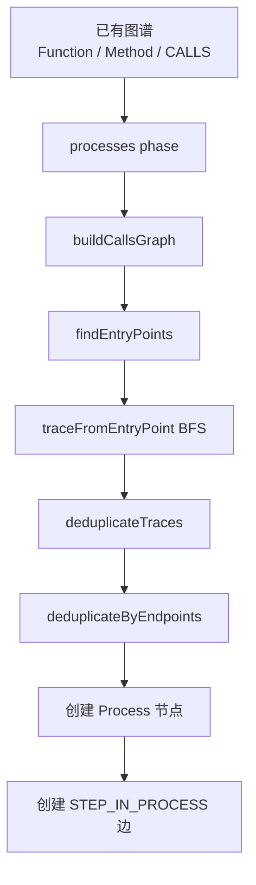

`STEP_IN_PROCESS` 是 GitNexus 用来表示“某个符号是某条执行流的第几步”的关系边。

它不是 `query` 时临时生成的，而是在 `gitnexus analyze` 的 `processes` 阶段预先写进知识图谱的。

核心结构是：

```text
Function/Method  -[:CodeRelation {type: "STEP_IN_PROCESS", step: 1}]->  Process
Function/Method  -[:CodeRelation {type: "STEP_IN_PROCESS", step: 2}]->  Process
Function/Method  -[:CodeRelation {type: "STEP_IN_PROCESS", step: 3}]->  Process
```

举个例子：

```text
loginController -> validateUser -> createSession
```

会变成：

```text
loginController -STEP_IN_PROCESS(step=1)-> LoginFlow
validateUser    -STEP_IN_PROCESS(step=2)-> LoginFlow
createSession   -STEP_IN_PROCESS(step=3)-> LoginFlow
```

**源码位置**

主要在两个文件：

[processes.ts](</E:/test/GitNexus/gitnexus/src/core/ingestion/pipeline-phases/processes.ts:1>)  
[process-processor.ts](</E:/test/GitNexus/gitnexus/src/core/ingestion/process-processor.ts:1>)

`processes.ts` 是 pipeline 阶段包装器，负责把检测结果写回图谱。

`process-processor.ts` 是真正的执行流检测算法。

**整体流程**



**1. processes 阶段什么时候执行**

`processesPhase` 依赖：

```ts
deps: ['communities', 'routes', 'tools', 'structure']
```

也就是说，它是在代码符号、调用关系、社区聚类、路由和工具节点都准备好之后执行的。

它的职责写得很清楚：

```ts
/**
 * Detects execution flows (processes) and creates Process nodes +
 * STEP_IN_PROCESS edges. Also links Route/Tool nodes to processes.
 */
```

**2. 先从 CALLS 边构造调用图**

`process-processor.ts` 里会遍历已有图谱关系，只取高置信度 `CALLS` 边：

```ts
const MIN_TRACE_CONFIDENCE = 0.5;

if (rel.type === 'CALLS' && rel.confidence >= MIN_TRACE_CONFIDENCE) {
  adj.get(rel.sourceId)!.push(rel.targetId);
}
```

这一步得到：

```text
source function -> callee functions[]
```

也就是执行流追踪的基础。

**3. 找入口函数 Entry Point**

GitNexus 不会从每个函数都开始追踪，否则流程会爆炸。它只找比较像入口点的函数/方法。

入口点要求：

```text
必须是 Function / Method
不能在 test 文件里
必须至少调用了别人
会根据名字、导出状态、调用比例、框架特征打分
```

源码里：

```ts
const symbolTypes = new Set<NodeLabel>(['Function', 'Method']);

if (!symbolTypes.has(node.label)) continue;
if (isTestFile(filePath)) continue;
if (callees.length === 0) continue;
```

然后调用：

```ts
calculateEntryPointScore(...)
```

这个评分会考虑：

```text
handle*
on*
*Controller
是否 exported/public
调用别人多不多
被别人调用少不少
框架 AST 标记
```

最后只取 top 200，防止流程检测爆炸：

```ts
return sorted.slice(0, 200).map((c) => c.id);
```

**4. 从入口点 BFS 追踪执行流**

核心函数是：

```ts
traceFromEntryPoint(entryId, callsEdges, cfg)
```

它做的是 BFS 路径追踪：

```text
入口函数
  -> 被它调用的函数
    -> 再调用的函数
      -> ...
```

默认配置：

```ts
maxTraceDepth: 10
maxBranching: 4
maxProcesses: 75
minSteps: 3
```

含义是：

| 参数 | 作用 |
|---|---|
| `maxTraceDepth` | 最多追 10 层 |
| `maxBranching` | 每个节点最多跟 4 个分支 |
| `maxProcesses` | 最多生成多少条流程 |
| `minSteps` | 至少 3 步才算真正流程 |

这也解释了为什么两步调用：

```text
A -> B
```

通常不会被当成 Process。GitNexus 更想保留：

```text
A -> B -> C
```

这种真正的多跳流程。

**5. 去重**

追踪出来的路径可能很多，所以会做两层去重。

第一层：去掉子路径。

```text
A -> B -> C -> D
A -> B -> C
```

保留更长的：

```text
A -> B -> C -> D
```

第二层：同一个入口和终点，只保留最长路径。

```text
A -> B -> D
A -> C -> D
A -> B -> C -> D
```

如果入口都是 A、终点都是 D，会优先保留最长路径。

**6. 创建 Process 节点**

每条最终 trace 会变成一个 `Process` 节点：

```ts
processes.push({
  id: processId,
  label: heuristicLabel,
  heuristicLabel,
  processType,
  stepCount: trace.length,
  communities,
  entryPointId,
  terminalId,
  trace,
});
```

Process 节点记录：

```text
id
label
heuristicLabel
processType: intra_community / cross_community
stepCount
communities
entryPointId
terminalId
```

`processType` 根据这条 trace 跨了几个 Community 判断：

```ts
communities.length > 1 ? 'cross_community' : 'intra_community'
```

**7. 创建 STEP_IN_PROCESS 边**

真正写 `STEP_IN_PROCESS` 的地方在 [processes.ts](</E:/test/GitNexus/gitnexus/src/core/ingestion/pipeline-phases/processes.ts:83>)：

```ts
processResult.steps.forEach((step) => {
  ctx.graph.addRelationship({
    id: `${step.nodeId}_step_${step.step}_${step.processId}`,
    type: 'STEP_IN_PROCESS',
    sourceId: step.nodeId,
    targetId: step.processId,
    confidence: 1.0,
    reason: 'trace-detection',
    step: step.step,
  });
});
```

注意几个字段：

```text
sourceId = 符号节点
targetId = Process 节点
type = STEP_IN_PROCESS
step = 第几步
confidence = 1.0
reason = trace-detection
```

这就是 query 后面能查到“某个符号属于哪个执行流、第几步”的原因。

**8. query 如何使用它**

当你执行：

```powershell
gitnexus query "parse worker" --repo GitNexus
```

命中某个符号后，GitNexus 会查：

```cypher
MATCH (n {id: $nodeId})-[r:CodeRelation {type: 'STEP_IN_PROCESS'}]->(p:Process)
RETURN p.id, p.label, p.heuristicLabel, p.processType, p.stepCount, r.step
```

所以 query 返回的 `processes` 不是搜索时猜的，而是 analyze 阶段已经预计算好的流程节点。

**一句话总结**

> `STEP_IN_PROCESS` 是 GitNexus 在 analyze 的 processes 阶段，通过高置信度 `CALLS` 边从入口函数向前 BFS 追踪执行路径，再把路径中的每个符号按顺序连接到一个 `Process` 节点上形成的关系。它让 Agent 不只看到“哪些函数相关”，还能看到“这些函数在一个执行流里如何串起来”。