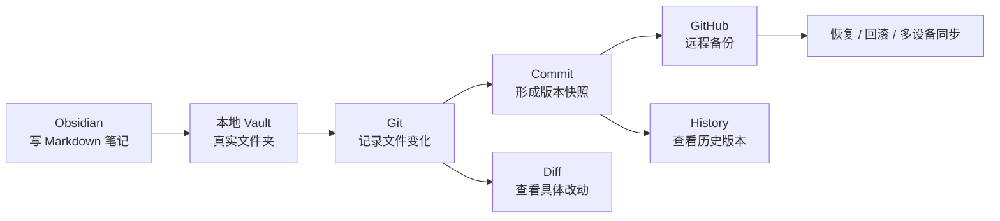

Obsidian 是一个本地优先、可版本化、可长期维护的 Markdown 知识库。

本地优先的意思是：我现在写的这篇文档，并不是先存到某个平台的云数据库里，而是直接保存在电脑本地的一个 `.md` 文件中。

这带来一个很重要的好处：它天然可以被 Git 管理。

## 1. Obsidian 负责写作

在 Obsidian 中，我们看到的是一个知识库界面：

- 左侧是文件和目录
- 中间是正在编辑的 Markdown 文档
- 每一篇笔记本质上都是一个 `.md` 文件
- 图片、附件、配置也都存在本地文件夹中

也就是说，Obsidian 提供的是写作、链接、搜索、图谱这些体验。

## 2. Git 负责记录变化

当我修改这篇文档时，Git 可以检测到这个文件发生了变化。

例如我把：

> Obsidian 是一个本地优先的 Markdown 知识库。

改成：

> Obsidian 是一个本地优先、可版本化的 Markdown 知识库。

Git 不只是知道“文件变了”，它还能精确知道是哪一行发生了变化。

这就是版本化文档库的核心价值：  
每一次修改都可以被记录，每一次提交都相当于给知识库打了一个时间快照。

## 3. GitHub 负责远程备份

本地 Git 记录的是我电脑上的历史版本。

但如果电脑损坏、误删文件，或者我想在另一台电脑继续使用，就需要远程仓库。

所以我们把这个 Obsidian Vault 推送到 GitHub：

- 本地 Vault：保存正在写的知识库
- Git：保存每次修改历史
- GitHub：保存远程备份

这样，即使本地文件丢失，也可以从 GitHub 重新克隆回来。

## 4. Obsidian Git 插件负责自动化

正常情况下，Git 需要手动执行命令：

```bash
git add .
git commit -m "vault backup"
git push
```




