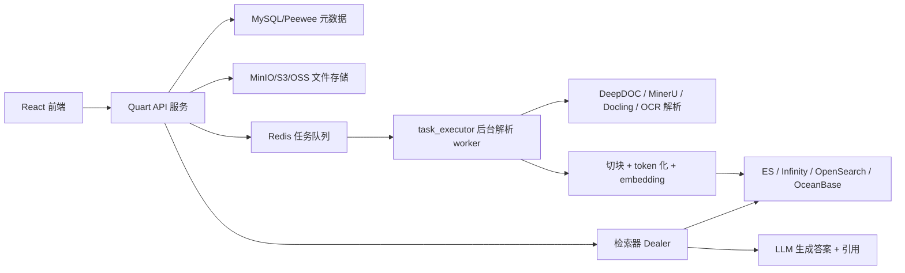

```mermaid
flowchart LR
  Web["React 前端"] --> API["Quart API 服务"]
  API --> DB["MySQL/Peewee 元数据"]
  API --> Storage["MinIO/S3/OSS 文件存储"]
  API --> Redis["Redis 任务队列"]
  Redis --> Worker["task_executor 后台解析 worker"]
  Worker --> DeepDoc["DeepDOC / MinerU / Docling / OCR 解析"]
  Worker --> Chunk["切块 + token 化 + embedding"]
  Chunk --> DocStore["ES / Infinity / OpenSearch / OceanBase"]
  API --> Retrieval["检索器 Dealer"]
  Retrieval --> DocStore
  Retrieval --> LLM["LLM 生成答案 + 引用"]
```
